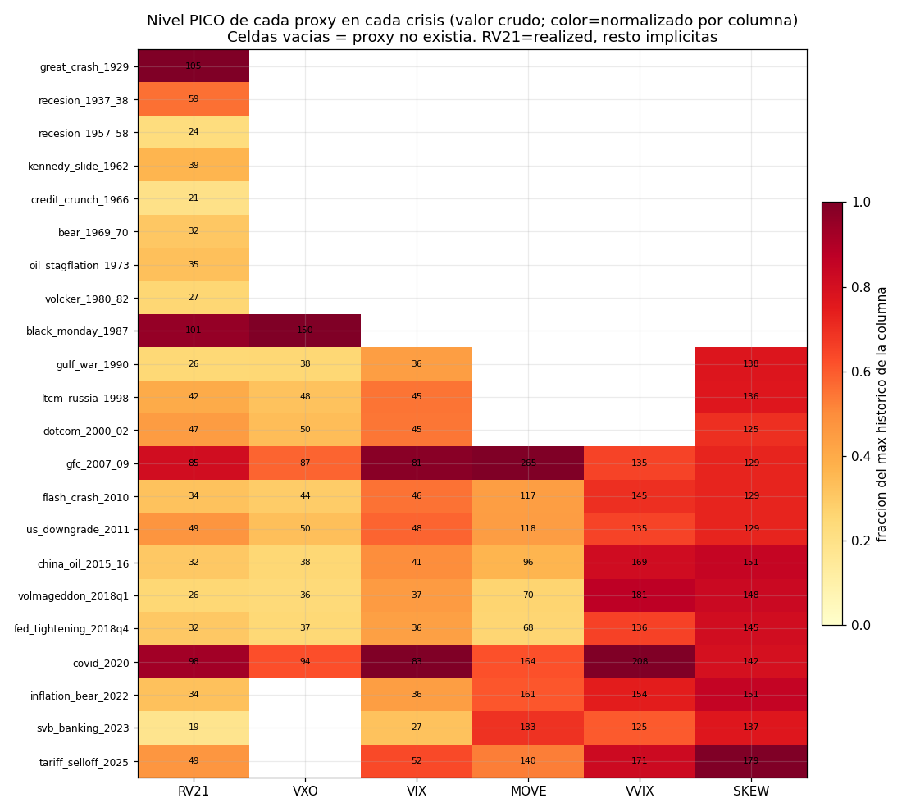
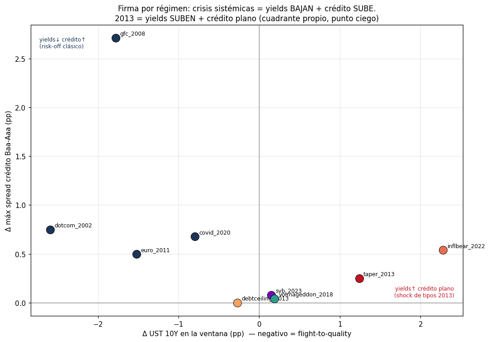
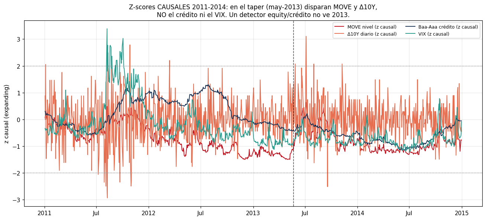
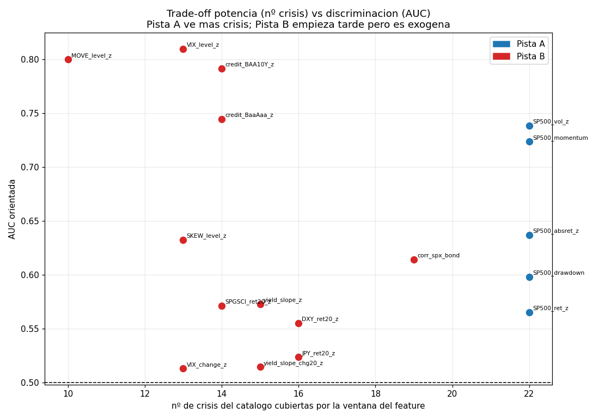

# Informe maestro de EDA — Detección de regímenes de mercado (TFM)

**Fase 3 (EDA profundo)** · 160 series descargadas (status OK/CACHE) · label de crisis = `crisis_catalog`
(22 eventos peak→trough, 1929–2025) · todas las transformaciones de *feature* son **causales**
(en `t`, solo estadísticos ≤ `t`; `src/features.py`).

Este documento sintetiza los **7 temas** del EDA en un solo informe
echado a tierra: cada afirmación lleva su número concreto y la serie/fecha de la que sale, cada tema
enlaza su figura clave, y cada tema cierra con **qué implica para el detector**. Incorpora el veredicto
de tres auditorías independientes (cifras, causalidad/look-ahead, completitud) — ver §0 y §11.

---

## Índice

- [§0 · Cómo leer este informe (convenciones y control de calidad)](#0--cómo-leer-este-informe)
- [§1 · Calidad y cobertura de los datos](#1--calidad-y-cobertura)
- [§2 · Hechos estilizados de los retornos (colas gruesas → t-Student)](#2--hechos-estilizados)
- [§3 · Correlaciones dinámicas cross-asset (el signo es un estado)](#3--correlaciones-dinámicas)
- [§4 · El complejo de volatilidad (jerarquía de sensores)](#4--el-complejo-de-volatilidad)
- [§5 · Crédito, curva y el punto ciego 2013](#5--crédito-curva-y-2013)
- [§6 · Crisis y profundidad — la espina de la Pista A](#6--crisis-y-profundidad)
- [§7 · Features candidatas — poder discriminante causal](#7--features-candidatas)
- [§8 · Causalidad y fuga de datos (veredicto del auditor)](#8--causalidad-y-fuga-de-datos)
- [§9 · (a) Tabla de features candidatas rankeadas por pista](#9--a-tabla-de-features-rankeadas-por-pista)
- [§10 · (b) El punto ciego 2013: ¿resuelto?](#10--b-el-punto-ciego-2013-resuelto)
- [§11 · (c) Limitaciones honestas y huecos del conjunto](#11--c-limitaciones-honestas)
- [Apéndice · Reconciliación de cifras cruzadas y convención de ventana](#apéndice--reconciliación-de-cifras-cruzadas)

---

## Los 10 números que hay que retener

| # | Hallazgo | Cifra | Sale de |
|--:|---|---|---|
| 1 | El S&P 500 no es gaussiano | exceso curtosis **18,7**; JB **3,63·10⁵**; ν t-Student **≈2,5** | §2 |
| 2 | Colas imposibles bajo Normal | **108 días** \|r\|>5σ vs **0,014** esperados (**≈7.600×**) | §2 |
| 3 | La correlación acción-bono cambió de signo | **+0,27** (1962-99) → **−0,26** (2000-26) | §3 |
| 4 | El bono NO cubre en crisis de inflación | +0,64 Gulf War 1990, +0,37 Volcker, **+0,12** en 2022 | §3 |
| 5 | La backwardation tiene un punto ciego | GFC 0,70 / COVID 0,74, pero **SVB-2023 nunca invirtió (1,005)** | §4 |
| 6 | MOVE ve lo que la vol de equity no ve | SVB-2023: **MOVE 182,6 vs VIX 26,5** | §4 |
| 7 | 2013 es un shock de tipos puro | 10Y **+132 bp**, real **+144 bp**, crédito **plano** (+0,27 pp) | §5 |
| 8 | El salto de potencia de ir profundo | espina 1927 = **22 crisis**; panel B 2007 = **10** (−55%) | §6 |
| 9 | Ranking de discriminación (label 22 crisis) | VIX **0,810**, MOVE **0,800**, crédito **0,792**, vol realizada **0,739** | §7 |
| 10 | El cambio diario es ruido para el label | ΔVIX AUC **0,513**, Δpendiente **0,515** ≈ azar | §7 |

---

## §0 · Cómo leer este informe

**Regla de oro (causalidad).** Toda *feature* que entra al detector se construye con estadísticos
retrospectivos: z-score `expanding`/`rolling` (`min_periods=60`), vol realizada trailing `[t−20, t]`,
correlación rolling 60d causal. **Nunca** media/std de muestra completa (fue el error de la tarea previa).
Los estadísticos *descriptivos* del DGP (curtosis, skew, JB, matrices de correlación incondicionales)
sí se calculan sobre toda la muestra: **describen el proceso, no son features**.

**El label.** `crisis_catalog.eventos` = 22 ventanas peak→trough del S&P 500. Un día es crisis=1 si cae
dentro de alguna ventana. Es un label **coincidente** (marca toda la caída, no el giro) y **definido con
conocimiento de toda la muestra** — es la única fuente de look-ahead del EDA, declarada honestamente
(§8). No es usable para predicción.

**Convención de ventana de "pico por crisis":** salvo aviso, los niveles pico usan **`[peak, trough+21d]`**
(la extensión de 21 días captura el pico de la vol realizada 21d, que es retrospectiva). Esta es la
convención canónica que reconcilia las discrepancias entre slices (ver Apéndice).

> **Control de calidad (auditoría de cifras).** Un revisor independiente recomputó desde los parquet
> crudos **más de 60 cifras load-bearing** de los 7 reports —incluidas las caras: ν t-Student por MLE,
> z-scores causales expanding, AUC Mann-Whitney, drawdowns pico→valle contra catálogo, correlaciones
> rolling 60d causales. **Prácticamente todas cuadran dentro de ±5%, la inmensa mayoría de forma exacta
> (0,0–0,3% de error).** Diferencias menores por resampling/alineación (todas < 5%): corr(corr_SB, CPI
> YoY) 0,374 vs 0,39; corr media sectorial VIX<15 0,52 vs 0,54; ν SP500 2,51 vs 2,53. Un único punto no
> reproducible: la fila **ilustrativa** `debtceiling_2013` (§5), cuya ventana custom no está especificada
> (ver Apéndice). Ningún hallazgo principal depende de ella.

---

## §1 · Calidad y cobertura

*(slice `cobertura_calidad`)*

**La intersección "ingenua" de una pista es inservible.** Exigir todas las series a la vez:
- **Pista A diaria** (39 series) → intersección **1991-01-02 → 2016-10-07** (la gobiernan `BCOM` al inicio
  y `EURODOLLAR_TBILL_SPREAD`, descontinuada, al final). Solo 25 años: pierde el sentido de A.
- **Pista B diaria** (85 series) → **conjunto vacío**: `IORB` no arranca hasta 2021-07-29, después de que
  `EURODOLLAR_TBILL_SPREAD` muriese en 2016-10-07. Imposible.

Por eso la ventana se define **por bloque de features**, no por intersección total. Recomendación
(número de crisis del catálogo = 22):

| Pista | Ventana recomendada | Gobierna inicio | Gobierna fin | Nº crisis |
|---|---|---|---|--:|
| **A — diaria (equity/vol/factores)** | **1927-12-30 → 2026-05-29** | `SP500` | `FF_FACTORS_3_DAILY` (lag académico) | **22 / 22** |
| A — diaria + curva/tipos | 1962-01-02 → 2026-05-29 | `DGS10` | `FF_FACTORS_3_DAILY` | 18 / 22 |
| A — + crédito/vol implícita/FX | 1986-01-02 → 2021-09-23 | `VXO`/`BAA10Y` | `VXO`† | 11–14 / 22 |
| **B — panel core (sect+créd+curva+breakevens)** | **2003-01-02 → 2026-07-10** | `DFII10`/`T10YIE` | `MOVE` | **10 / 22** |
| B — + vol-of-vol/term-structure (mantiene GFC) | 2007-05-10 → 2026-07-10 | `OVX` | `MOVE` | 10 / 22 |

† `VXO` gobierna a la vez el inicio (1986) y el fin (descontinuada 2021-09-23) de su bloque.

**Otros hechos de calidad, verificados:**
- **Política sin-imputar confirmada:** las 160 series tienen **0 NaN**. Los huecos son *fechas ausentes*,
  no valores nulos → la densidad de una serie diaria sana es **~0,958 vs `bdate_range`** (ese ~4,2% son
  los ~10 festivos/año de EE. UU., baseline normal).
- **La hipótesis del gap DGS30 2002-2006 es FALSA:** `DGS30` es continuo (250 obs/año), `max_gap = 5 días`.
  Los únicos gaps estructurales diarios reales: **`DGS20`** (1986-12 → 1993-10, ~6,75 años) y **`DTB1YR`**
  (2002-02 → 2008-06).
- **7 series semanales mal etiquetadas como "diaria"** (`ICSA`, `NFCI*`, `STLFSI4`): densidad ~0,20 vs día
  hábil. `ICSA` es feature core → su frecuencia semanal debe respetarse (ffill causal, nunca interpolar).
- **Tres calendarios chocan** (NYSE / bonos-SIFMA / académico FF): mismatch 2-3 días/año (Columbus Day,
  Veterans Day, Good Friday, huracán Sandy 2012-10-29). El **ragged edge** hace que "hoy" no sea único:
  Fama-French cierra en 2026-05-29, yfinance en 2026-07-17 → 7 semanas de diferencia.
- **El punto ciego 2013 NO es de cobertura:** en 2013-07-01 hay **91/96 series de B** y **75/76 de A** con
  dato. El panel está totalmente poblado; la dificultad de 2013 es de *señal*, no de datos.

> **Qué implica para el detector:** construir el panel sobre el **calendario NYSE**, alinear las series
> FRED por `merge_asof`/ffill causal (nunca interpolar hacia atrás), y fijar la ventana **por bloque de
> features** (nunca intersección total). Ventana A por defecto = **1927 → 2026-05, 22 crisis** (potencia);
> ventana B por defecto = **2003 → 2026-07, 10 crisis** (riqueza). Truncar al `min` de los `fin` exigidos
> o sustituir descontinuadas por sus reemplazos vivos (`VXO`→`VIX`, `DTWEXM`→`DXY`).

---

## §2 · Hechos estilizados

*(slice `hechos_estilizados` — 17 series, retornos log diarios)*

**El S&P 500 no es gaussiano, y no por poco** (1928–2026, n=24.751):
- **Exceso de curtosis = 18,7**, **skew = −0,47**, **Jarque-Bera = 3,63·10⁵** (p < 1·10⁻³⁰⁰). JB rechaza
  la normalidad en **las 17 series** con p < 1·10⁻³⁰⁰.
- **Las colas son el problema:** **108 días de \|r\|>5σ** observados vs **0,014** esperados bajo Normal
  (≈**7.600×**); **416 días >3σ** vs 67 (6,2×). Black Monday (1987-10-19) fue **−22,9%** log = **−19,2σ**
  (imposible en la edad del universo bajo Normal).
- **No es un artefacto de un crash:** excluyendo la semana de Black Monday, la curtosis del S&P 500 **sigue
  siendo 13,7**. Las colas son estructurales.
- **La t-Student lo captura con un número:** ν por MLE **≈2,5** (S&P 500 2,53; XLF 2,41; Δspread crédito
  2,43; Nasdaq 2,54). ν<4 ⇒ curtosis teórica infinita. La más "mansa", `BCOM`, aún da ν=4,22.

**La volatilidad se agrupa (Mandelbrot).** El retorno r es casi ruido (ACF₁≈0), pero **ACF de \|r\| = 0,32
en lag 1 y sigue en 0,22 a lag 21** (un mes). Ljung-Box(r², 21) rechaza independencia con p<1·10⁻³⁰⁰ en
las 17 series. **Hay leverage effect:** corr(rₜ, \|rₜ₊₁\|) = **−0,106** (S&P 500), fuerte en equity
(XLU −0,134), tenue en commodities (−0,05) y **nulo en FX** (DXY −0,006).

La vol realizada alterna **largas mesetas de calma (~10% anualizado)** con **estallidos** que coinciden
con las 22 crisis: **1929 (105%)**, **oct-1987 (101%)**, **2008 (85%)**, **COVID abr-2020 (98%)**. Vivir
en dos "modos" (calma persistente vs estrés persistente) **es la señal de régimen**.

> **Qué implica para el detector:** emisión de **colas gruesas obligatoria** (t-Student con ν≈3, o ν por
> régimen). Un modelo gaussiano (k-means, GMM, HMM gaussiano) trata cada día de crisis como outlier
> imposible y **sesga las medias/covarianzas de régimen**. La escala de un z-score debe leerse con cola t,
> no normal (un z=−5 no es "1 en 3 millones", es un martes de crisis). El clustering implica **persistencia
> de estado** (matrices de transición con diagonal alta / duración explícita tipo HSMM). El leverage
> justifica features de **downside/semivarianza** en el bloque de equity.

---

## §3 · Correlaciones dinámicas

*(slice `correlaciones_dinamicas` — rolling 60d causal, `min_periods=30`)*

**La correlación acción-bono cambió de signo (Gulko 2002), medido en los datos:**
- **1962-1999: media +0,27** (85,7% de los días > 0); **2000-2026: media −0,26** (77,2% de los días < 0).
  Muestra estática por eras: **+0,259** (n=9.451) → **−0,286** (n=6.625).
- **Lo que fija el signo es el régimen de inflación:** corr(corr_SB, CPI YoY) = **+0,39**, pendiente OLS
  **+0,051 por punto de CPI**. Con **CPI YoY > 4% la media es +0,23** (87,8% de meses positivos); con
  **CPI YoY ≤ 4% es −0,04**. Alta inflación → acciones y bonos caen juntos; baja inflación → el bono cubre.
- **La matriz incondicional esconde el régimen:** Equity-Bono estática 1990-2026 = **−0,16**, media
  engañosa de dos regímenes opuestos. Usar una covarianza fija como feature es tirar la mitad de la señal.

**El bono cubre… salvo en las crisis de inflación.** Correlación S&P500-UST10Y *dentro* de cada ventana:
- **Cubre (negativa)** en las de crecimiento post-1998: 2010 Euro **−0,74**, 2011 −0,58, COVID −0,49, GFC
  −0,47, LTCM −0,45.
- **Falla (positiva)** en las inflacionarias: **1990 Gulf War +0,64**, 1980-82 Volcker +0,37, 1969-70
  +0,33, **2022 inflación +0,12**, 1973 estanflación +0,11. La línea divisoria es casi cronológica.

**"Todo cae junto" dentro del equity:** corr media de los 9 sectores SPDR (36 pares, 60d) salta de **0,54
(VIX<15) a 0,73 (VIX≥30)**, con picos **0,92 en COVID (2020-03-16)** y **0,83 en la GFC (2009-01-07)**.
*Matiz honesto:* esa correlación **no separa** crisis vs calma con la ventana larga peak→trough (mediana
0,58 en ambos casos); el colapso a ~0,9 es un fenómeno de **fase aguda** (VIX alto), no del bear completo.

**El crédito diario de Moody's es un proxy muerto:** corr(Equity, retorno-crédito) = **+0,010 diaria →
+0,072 semanal → +0,322 mensual**. Los yields *seasoned* de Moody's son medias suavizadas; su Δ diario es
casi todo microestructura. A nivel mensual el spread se abre cuando el equity cae (**−0,32**).

> **Qué implica para el detector:** la correlación cross-asset **no es un parámetro, es un estado**.
> `corr_spx_bond` (rolling, con signo) es feature de primer orden: su signo separa el régimen inflacionario
> (≥0) del de crecimiento (<0), y su fallo como hedge tipifica el *tipo* de crisis. Prohibido estimar una
> covarianza de muestra completa: usar **covarianzas por estado**. El crédito entra **a frecuencia
> semanal/mensual o no entra** (el Δ diario de Moody's es ruido). Candidata nueva:
> `mean_pairwise_corr_sectors_60d` VIX-condicionada, termómetro de pánico agudo distinto del nivel del VIX.

---

## §4 · El complejo de volatilidad

*(slice `complejo_volatilidad`)*

**No hay un único "mejor" proxy: hay una jerarquía por horizonte histórico y por dimensión de riesgo.**

- **Solo la vol realizada ve las 22 crisis** (^GSPC, std 21d anualizada, desde 1928). Único sensor antes de
  1986 → espina de vol de la Pista A. Pico histórico **RV = 105,2% el 1929-11-21**.
- **VXO es el puente único al Lunes Negro:** **VXO = 150,19 el 1987-10-19**, el registro de vol implícita
  más alto de la historia (82% por encima del pico VIX de COVID, 82,69). El VIX no existe hasta 1990.
- **VXO ≈ VIX** (solape 1990-2021, n=7.990): media(VXO−VIX) = **+0,27**, corr **0,987**. El empalme VXO⊕VIX
  da vol implícita continua desde 1986.
- **La implícita cotiza cara salvo en el crash:** VIX > RV21 el **88% de los días** (prima de varianza media
  +4,0 pts), pero en cada capitulación la realizada la sobrepasa (COVID RV 97,6 > VIX 82,7).

**MOVE es la dimensión que la vol de equity NO ve.** En 2022-23 el MOVE se disparó mientras el VIX quedó
contenido: **2022 MOVE 160,7 vs VIX 36,5**; **SVB-2023 MOVE 182,6 vs VIX 26,5**. El MOVE fue el **único**
sensor que "gritó" en la crisis bancaria de marzo-2023.

**La backwardation de la term structure es la firma del pánico agudo de equity — pero tiene un punto ciego:**
VIX3M/VIX < 1 en GFC (mín **0,70**), COVID (0,74), volmageddon (0,75), tariff-2025 (0,79), **pero en 2022
apenas bajó de 1 (mín 0,98) y en SVB-2023 NUNCA invirtió (mín 1,005)**. Un detector que dependa de la
backwardation etiquetaría 2022-23 como "no crisis".

**El sensor por AUC (nivel→crisis, Mann-Whitney):** en muestra completa gana el empalme **VXO⊕VIX (0,816)**;
en el head-to-head justo **2007-2021 gana MOVE (0,803)** por delante de VXO (0,793) y VIX (0,763). **SKEW no
es un sensor coincidente:** AUC **0,29-0,39** (por debajo del azar) — está alto en la complacencia y se
hunde en el crash real. **VVIX como nivel ≈ azar** (0,54-0,56); su valor es como ratio adelantado.

> **Qué implica para el detector:** combinación recomendada Pista B = **VIX (nivel) + VIX3M/VIX
> (backwardation, pánico agudo de equity) + MOVE (régimen de tipos)** — cubren las dos dimensiones y no se
> les escapa ninguna crisis 2007+. Pista A = **realizada 21d (1928) ⊕ VXO⊕VIX (1986)**. SKEW y VVIX solo
> como señales adelantadas/ratios, nunca como termómetro del régimen en curso. *(Nota de causalidad: el
> empalme VXO⊕VIX es concatenación cruda; la recta OLS VXO=−1,44+1,09·VIX es solo descriptiva — **no**
> reescalar el tramo 1986-89 con ese coeficiente estimado en 1990-2021, sería inyectar look-ahead.)*

---

## §5 · Crédito, curva y 2013

*(slice `credito_curva_2013`)*

**La curva marca 2013 con fuerza; el crédito no lo marca en absoluto.** El taper tantrum fue un **shock de
tipos puro** sin estrés de crédito ni de equity (2013-05-01 → 2013-09-13):
- **UST 10Y (`DGS10`): 1,66% → 2,98% = +132 bp.**
- **MOVE: 49 → 117,9** (más que se duplica).
- **Spread crédito Baa-Aaa: 0,83 → 0,85 pp** (rango total del episodio solo 0,27 pp). Plano.
- **VIX: 14,5 → máx 20,5.** En todo 2013 el VIX superó 20 solo **3 días de 252**.
- **Validación externa:** el **OFR FSI se mantuvo NEGATIVO todo 2013** (mín −1,68, máx −0,46). Ningún índice
  de estrés agregado marcó 2013. 2013 **no está en el catálogo** porque el S&P solo cayó **−5,76%**.

**Fue un shock de tipo REAL, no de inflación:** rendimiento real 10Y (`DFII10`) **−0,64% → +0,80% = +144
bp**, mientras el breakeven (`T10YIE`) **cae −20 bp**. La curva hizo **bear steepening** (`T10Y2Y`
1,46 → **2,52** el 2013-08-19, +106 bp), no inversión → el **nivel** de la pendiente es una feature engañosa
(leería "risk-on"); lo informativo es la **velocidad** del empino.

**2013 vs crisis sistémicas — cuadrantes opuestos.** En GFC/COVID/euro/dotcom los Treasuries *rallyan*
(Δ10Y **negativo**, flight-to-quality) y el crédito se dispara (GFC Baa-Aaa **+2,71 pp**, Δ10Y −1,78). 2013
está solo en "yields↑ / crédito plano" (Δ10Y **+1,24**, crédito +0,25). En la memoria larga, el Baa-Aaa
mensual (1919+) promedió **0,87 pp en 2013**, *por debajo* de su media histórica de **1,16 pp**: invisible.

**¿Dispararía un detector causal en 2013? Solo si mira la VELOCIDAD de los tipos** (z causal expanding,
pico en el taper):

| Feature causal | z máx | ¿dispara? |
|---|--:|:--|
| `DFII10` (real 10Y) cambio 20d | **3,83** | **SÍ (fuerte)** |
| `MOVE` cambio 5d | **3,34** | **SÍ (fuerte)** |
| Δ`DGS10` diario | **3,11** | **SÍ** |
| `MOVE` **nivel** | 0,64 | NO (base expanding ya alta tras 2011) |
| `BAA10Y` cambio 20d (crédito) | 0,93 | NO |
| Baa-Aaa **nivel** (crédito) | 0,21 | NO |
| VIX **nivel** | 0,02 | NO |

> **Qué implica para el detector:** un detector de crédito+equity/VIX (estilo Capa 1) está
> **estructuralmente ciego a 2013** (z≈0). Lo que discrimina es la **velocidad**: `DFII10_change_z`,
> `MOVE_change_z`, `DGS10_change_z`. **PERO** —y esto es el nudo, ver §10— esas mismas features de cambio
> son **ruido para el label de 22 crisis** (§7). Añadirlas para "cazar 2013" mete ruido en las otras 21
> crisis, y el efecto neto está **sin medir**.

---

## §6 · Crisis y profundidad

*(slice `crisis_espina_profunda` — `^GSPC` 1927-12-30 → 2026-07-17)*

**Las 22 profundidades del catálogo cuadran con el precio diario:** recalculando el drawdown pico→valle
directamente de `^GSPC`, el **error máximo es 0,048 pp** (peor caso `svb_banking_2023`: catálogo −7,8% vs
recálculo −7,75%). El catálogo es fiel al dato, no un pegado a mano. Depth media de las 22 = **−30,4%**;
extremos **1929 (−86,2%)** y **1937 (−54,5%)** dominan cualquier estadístico de cola; sin ellas la peor es
**GFC (−56,8%)**. **~2/3 de los episodios ocurren antes de 1990.**

**El salto de potencia es real y grande** (crisis con año del pico ≥ inicio de ventana):

| Ventana de arranque | Series ancla | Nº crisis | de ellas NBER |
|---|---|--:|--:|
| **1927** | `SP500`, `FF_FACTORS_3_DAILY`, `REALIZED_VOL_SP500` | **22** | 10 |
| 1950 | espina macro/curva/crédito mensual | 20 | 8 |
| 1990 | `VIX`, `SKEW` | 13 | 4 |
| **2007** | panel B rico multi-activo | **10** | 2 |

**1927 → 2007: −12 crisis (−55%) y −8 recesiones NBER (−80%).** Ese es el argumento cuantitativo de
ADR-001. El escalón más caro es 1950→1990: se pierden 7 crisis (1957, 1962, 1966, 1969-70, 1973, 1980-82,
1987) por depender de `VIX`/`SKEW`.

**El precio se paga en densidad de features:** **1929 solo tiene 14/76 series vivas (18%)**, 1937 15/76; desde
la GFC-2007, **76/76 (100%)**. Lo único vivo en 1929: `SP500`, `FF_FACTORS_3_DAILY`, `REALIZED_VOL_SP500`,
**spread Baa-Aaa mensual (1919)**, `INDPRO`/`PPI` mensuales.

**Los ground-truths de estrés tienen puntos ciegos propios:** **NBER llega tarde** (el mercado lidera:
solape ventana∩recesión **<30%** en 1957, dotcom, 1969-70). **OFR FSI** solo cubre 11/22 crisis (2000+) y es
**ciego a `volmageddon_2018q1`** (FSImax = **−1,74**, por debajo de la media): un vol-spike de equity puro no
mueve un índice multi-mercado.

> **Qué implica para el detector:** la Pista A queda justificada numéricamente (**22 vs 10 crisis**). Usar
> `crisis_catalog` (drawdown, verificado a 0,05 pp) como **label primario**, con NBER/OFR FSI solo como
> *validación laxa* (llegan tarde / son ciegos a vol-spikes). Para explotar la espina profunda hay que
> definir un **set reducido causal 1927+**: `SP500_ret_z`, `SP500_vol_z`, `SP500_drawdown`,
> `SP500_momentum` + **Baa-Aaa mensual (ffill causal)** + `INDPRO`/`PPI` YoY. *(Caveat crítico §11: ese set
> mensual profundo se propone pero **nunca se ha medido** que dispare en 1929/1937/1957/1966.)*

---

## §7 · Features candidatas

*(slice `candidatas_features` — 17 features causales, AUC vs label de 22 crisis)*

**Ganan los NIVELES de estrés EXÓGENOS al label:** `VIX_level_z` (**AUC 0,810**), `MOVE_level_z` (**0,800**,
el **mayor Cohen's d, +1,33**), `credit_BAA10Y_z` (**0,792**), `credit_BaaAaa_z` (**0,745**). La mejor de la
espina profunda es la vol realizada **`SP500_vol_z` (0,739)**, única con potencia sobre las 22 crisis
(**4.659 días-crisis desde 1928**).

**Sorpresa metodológica — circularidad que NO se cumple:** las features derivadas del propio precio que
*define* el label son de las **más débiles**: `SP500_drawdown` **0,598** (media en crisis −0,220 ≈ calma
−0,203) y `SP500_ret_z` **0,565**. Que ganen las **exógenas** (VIX/MOVE/crédito) es tranquilizador: sugiere
que el ranking mide régimen **real**, no fuga del label.

**`SP500_vol_z` solo "ve" los crashes,** no los bear lentos (media de z por crisis):

| crisis | `SP500_vol_z` medio |
|---|--:|
| covid_2020 (crash) | **+2,74** |
| black_monday_1987 (crash) | **+2,50** |
| gfc_2007_09 (bear) | **+1,55** |
| recesion_1957_58 (bear lento) | **−0,63** |
| bear_1969_70 (bear lento) | **−0,52** |
| credit_crunch_1966 | **−0,46** |
| kennedy_slide_1962 | **−0,44** |

La vol separa **"cómo cae", no "si cae"**. `SP500_momentum` (12M−1M, AUC 0,724, ↓) es la feature de precio
que **complementa** para los bear lentos (se mantiene negativo toda la ventana) — *aunque su media por
crisis en esos bear lentos nunca se imprimió (§11)*.

**`corr_spx_bond` cambia de signo ~2000:** +0,28/+0,51 en crisis pre-2000 (inflación) vs −0,53/−0,65
post-2000 (crecimiento). Tipifica el régimen, no es marcador monótono (por eso su AUC global es solo 0,614).

**El cambio diario es RUIDO para este label:** `VIX_change_z` AUC **0,513**, `yield_slope_chg20_z` **0,515**
≈ azar. Contraste directo con §5 (donde la velocidad SÍ capturaba el shock puntual de 2013): **para un label
coincidente de ventana larga mandan los NIVELES; los cambios solo brillan en el punto de giro.**

> **Qué implica para el detector:** **B para separar, A para tener potencia.** Discriminadores primarios
> (Pista B, por nivel): `VIX_level_z`, `MOVE_level_z`, `credit_BAA10Y_z`, `credit_BaaAaa_z`. Espina profunda
> (Pista A): `SP500_vol_z` + `SP500_momentum`. Tipificadora: `corr_spx_bond` (con su cambio de signo).
> Descartar/degradar para *este* label coincidente: `VIX_change_z`, `yield_slope_chg20_z` (ruido),
> `SKEW_level_z` (invertida → reservar como señal adelantada). **Aviso de fuga (§8):** este ranking se
> calculó contra el label de toda la muestra; arrastrarlo a un backtest sin split walk-forward es
> data-snooping.

---

## §8 · Causalidad y fuga de datos

*(veredicto del auditor de look-ahead — APROBADO en causalidad de construcción)*

**Las features SON causales**, verificado de forma independiente reejecutando el spot-check sobre los parquet
crudos. Recomputando cada z-score sobre la muestra completa (→2026) y sobre una truncada en `cut=2015-01-01`
y comparando el solape (≤ cut):

| feature | `max|full − truncado|` | nº obs |
|---|--:|--:|
| `VIX_level_z` | **0,0** (exacto) | 6.299 |
| `credit_BaaAaa_z` | **0,0** (exacto) | 7.286 |
| `SP500_vol_z` | **0,0** (exacto) | 21.851 |

El test **tiene dientes**: una z de muestra completa discreparía ~0,335σ; la causal discrepa **0,0 exacto**.
El auditor extendió el spot-check a las familias no cubiertas por el report (drawdown, momentum, ret20,
absret, corr_spx_bond): **todas pasan `max|full−trunc| = 0,0`**. La vol realizada es trailing `[t−20, t]`;
la z usa `expanding`. **Ninguna candidata mira al futuro.**

**El ÚNICO look-ahead es el LABEL** (`crisis_catalog`, 22 ventanas peak→trough definidas con conocimiento de
toda la muestra) — un label **coincidente** declarado honestamente, **no usable para predicción**. Las
ventanas de benchmark por pista **no filtran futuro**: se definen por disponibilidad de datos, con alineación
causal (`merge_asof`/ffill, nunca interpolar hacia atrás).

> **Riesgo pendiente para la FASE 4 (data-snooping):** el ranking de AUC (VIX 0,810 … vol 0,739) se calculó
> sobre 1928-2026 contra un label definido con toda la muestra. **Pre-seleccionar features con ese ranking y
> luego backtestear el detector en el mismo periodo hereda el look-ahead del label.** Mitigación obligatoria:
> seleccionar features y fijar umbrales **solo dentro de un split walk-forward/expanding**. Sesgo menor
> transparente: `auc_orientada = max(auc, 1−auc)` elige el signo a posteriori con el label → infla
> ligeramente las features cercanas a 0,5 (`VIX_change_z` raw 0,513, `JPY_ret20_z` 0,524); la dirección se
> reporta aparte, pero esa inflación no está anotada en el ranking.

---

## §9 · (a) Tabla de features rankeadas por pista

AUC orientada contra el label de 22 crisis; dir. = signo del efecto en crisis (↑ sube / ↓ baja / ? ambiguo /
· ruido). Recomputable en `notebooks/01_eda.ipynb`.

### Pista B — panel rico, exógeno (mejor discriminación, menos cobertura)

| # | feature | AUC | dir. | Cohen's d | nº crisis | inicio | rol para el detector |
|--:|---|--:|:--:|--:|--:|---|---|
| 1 | `VIX_level_z` | **0,810** | ↑ | +1,20 | 13 | 1990 | **discriminador primario** |
| 2 | `MOVE_level_z` | **0,800** | ↑ | +1,33 | 10 | 2002 | **primario; único que ve 2022-23 (tipos)** |
| 3 | `credit_BAA10Y_z` | **0,792** | ↑ | +1,30 | 14 | 1986 | **primario (crédito ajustado por tipos)** |
| 4 | `credit_BaaAaa_z` | **0,745** | ↑ | +1,03 | 14 | 1986 | primario (crédito puro) |
| 8 | `SKEW_level_z` | 0,632 | ↓ | −0,44 | 13 | 1990 | **invertida** → señal adelantada/complacencia |
| 9 | `corr_spx_bond` | 0,614 | ↓ | −0,40 | 19 | 1962 | **tipificadora** (cambia signo ~2000) |
| 11 | `yield_slope_z` | 0,573 | ? | +0,26 | 15 | 1982 | ambigua (nivel engaña, cf. 2013) |
| 12 | `SPGSCI_ret20_z` | 0,572 | ↓ | −0,27 | 14 | 1984 | confirmador risk-off |
| 14 | `DXY_ret20_z` | 0,555 | ↑ | +0,19 | 16 | 1971 | confirmador |
| 15 | `JPY_ret20_z` | 0,524 | ↑ | +0,07 | 16 | 1971 | débil (signo elegido a posteriori) |
| 16 | `yield_slope_chg20_z` | 0,515 | · | +0,09 | 15 | 1982 | **ruido** para el label (pero señal en 2013) |
| 17 | `VIX_change_z` | 0,513 | · | +0,13 | 13 | 1990 | **ruido** para el label (signo a posteriori) |

### Pista A — espina profunda (menos filo, máxima potencia: 22 crisis, 1928+)

| # | feature | AUC | dir. | Cohen's d | nº crisis | inicio | rol para el detector |
|--:|---|--:|:--:|--:|--:|---|---|
| 5 | `SP500_vol_z` | **0,739** | ↑ | +0,87 | **22** | 1928 | **workhorse** (pero solo ve crashes) |
| 6 | `SP500_momentum` | 0,724 | ↓ | −0,83 | 22 | 1929 | **complemento para el bear lento** |
| 7 | `SP500_absret_z` | 0,637 | ↑ | +0,57 | 22 | 1928 | secundaria (magnitud de retorno) |
| 10 | `SP500_drawdown` | 0,598 | ↓ | −0,07 | 22 | 1928 | débil pese a ser endógeno al label |
| 13 | `SP500_ret_z` | 0,565 | ↓ | −0,24 | 22 | 1928 | débil (retorno de 1 día = ruido) |

**Set mínimo honesto:** Pista B = {VIX, MOVE, credit_BAA10Y, credit_BaaAaa} + tipificadora corr_spx_bond;
Pista A = {SP500_vol_z + SP500_momentum}.

---

## §10 · (b) El punto ciego 2013: ¿resuelto?

**Veredicto honesto: DIAGNOSTICADO con precisión, NO resuelto.** El slice `credito_curva_2013` demuestra
*qué* clase de feature se movería en 2013, pero el proyecto **no ha demostrado que resolver 2013 sea neto
positivo** ni que la señal sea específica. Los cinco huecos que un tribunal exigiría cerrar:

1. **La contradicción central sin cuantificar.** Cazar 2013 necesita features de **cambio/velocidad**
   (`DFII10_chg` z=3,83, `MOVE_chg` z=3,34, `dDGS10` z=3,11, §5). Pero el slice que rankea sobre el label
   real de 22 crisis demuestra que el **cambio es RUIDO** (`VIX_change_z` AUC 0,513, `yield_slope_chg20_z`
   0,515 ≈ azar, §7). Añadir las change-features para "resolver 2013" **mete ruido en la detección de las
   otras 21 crisis**. El efecto neto (ganancia en 2013 vs coste en 21 crisis) está **SIN MEDIR**.

2. **2013 no es puntuable con la maquinaria del proyecto.** Drawdown **−5,76% ⇒ crisis=0** en el catálogo: no
   existe AUC/label para "acerté 2013". Toda la evidencia de "resuelto" son **z-scores en UNA ventana (n=1
   episodio)**, no una métrica de detección. Acción: crear un mini-label "shock de tipos" (2013 + 1994 +
   `inflation_bear_2022`) para dar n>1, o tratar 2013 como régimen no-etiquetado explícito.

3. **El arreglo depende de series post-2002.** `DFII10` (TIPS, la señal más fuerte z=3,83) arranca **2003** y
   `MOVE` **2002**. El **análogo histórico canónico de 2013 — el bond massacre de 1994** (shock de tipos
   puro, Fed-driven) — no está ni en el catálogo ni analizado. `dDGS10_change_z` sí existe desde 1962 pero
   nadie lo testeó sobre **1994/2003/2016/2018**. Sin ese out-of-sample, "resuelto" es sobre-ajuste a un
   episodio.

4. **Sin test de especificidad / falsos positivos.** El slice muestra que `DFII10_chg`/`MOVE_chg` pican a
   z~3,3-3,8 *dentro* del taper, pero **nunca mide cuántas veces superan ese umbral FUERA de crisis** (cada
   sorpresa FOMC, cada bund tantrum). Una feature de velocidad-de-tipos que dispara en todo movimiento de
   tipos es inútil como detector. El "2013 resuelto" es en realidad **"una feature se mueve en 2013"**, no
   "una feature separa 2013 del ruido de tipos ordinario".

5. **El punto ciego NO es de cobertura** (§1): en 2013 hay 91/96 series de B con dato. Es un problema de
   *señal en el espacio de features de la Capa 1*, no de datos faltantes.

> **Estado para el TFM:** 2013 es el mejor ejemplo del proyecto de que **el label tiene "forma de drawdown
> de equity"** y por eso infra-premia lo que vive fuera del equity. El camino honesto no es "añadir
> change-features y declarar victoria", sino: (i) construir un mini-label de shocks de tipos con n>1
> incluyendo 1994; (ii) medir el **delta neto** de añadir nivel+cambio sobre el label completo; (iii) medir
> la **especificidad** (falsos positivos fuera de crisis). Hasta entonces: **diagnosticado, no resuelto.**

---

## §11 · (c) Limitaciones honestas

Los 7 slices son sólidos y honestos *por dentro*, pero como **conjunto** tienen huecos sistemáticos de
completitud y sesgo. Un tribunal debe conocerlos:

**Dimensiones enteras ausentes del universo descargado:**
- **Oro-precio:** no hay `GLD` ni `GC=F` (solo `GVZ`, vol implícita, desde 2008). `correlaciones_dinamicas`
  y `hechos_estilizados` lo pedían explícitamente; la conclusión sobre oro queda **pendiente**. El oro es
  refugio *sui generis* (real+monetario), no equivalente a commodities ni al yen.
- **Crédito cotizado:** `HYG`/`IEF`/`LQD`/`TLT` no están en `data/raw` **pero `src/features.py` los
  referencia** (`HYG_ret_z`, `credit_spread_z=HYG−IEF`) → **`build_features` fallaría hoy**. Flag repetido en
  4 de 7 reports. El único crédito diario disponible (Moody's Baa-Aaa) es *stale* (corr con equity +0,010
  diaria vs +0,322 mensual).
- **Estrés de funding/liquidez sin analizar por crisis:** `EURODOLLAR_TBILL_SPREAD` (TED original 1971-2016,
  picos **1998=1,53 LTCM**, **2008=5,76 GFC**) y `PAPER_BILL_SPREAD` están en el catálogo pero **ningún slice
  los grafica**. Funding es dimensión de primer orden en 1998 y 2008.
- **Valoración/CAPE como estado:** `SHILLER_SP500_CAPE` (1871) declarado como "régimen de valoración" pero
  **nunca tratado como variable de estado**. Es un state-variable lento clásico ausente del EDA.
- **Dispersión sectorial solo post-1998:** el "todo cae junto" (§3) usa solo SPDR (1998+). `FF_5_INDUSTRY`
  (1926) permitiría medir el colapso intra-equity en 1929/1937/1987 y no se usó.
- **Análogo de shock de tipos de 1994** (bond massacre): ni en el catálogo ni analizado (ver §10).

**Crisis sin señal discriminante (el hueco más grave de la Pista A):**
- `credit_crunch_1966` (−22,2%), `recesion_1957_58` (−21,5%), `kennedy_slide_1962` (−28%) y en parte
  `volcker_1980_82` (−27,1%) están cubiertos **solo por equity-precio + vol realizada**, y `SP500_vol_z`
  tiene z causal **negativo** en ellos (1957 **−0,63**, 1966 **−0,46**, 1962 **−0,44**). **Nadie los cubre
  con señal.** Los spines mensuales profundos que podrían rescatarlos (Baa-Aaa 1919, GS10 1953, TB3MS 1934,
  INDPRO/CPI) están declarados pero **nunca se analizaron a frecuencia mensual contra esas crisis**.
  `credit_crunch_1966` se llama literalmente "credit crunch" y ningún slice muestra el spread Baa-Aaa mensual
  de 1966. `volcker_1980_82` (la crisis de tipos más profunda pre-2000) no tiene ningún análisis de su rasgo
  definitorio: el shock de la tasa de política (`DFF`/`FEDFUNDS` llegaron a ~20%, existen desde 1954) **nunca
  se ploteó**.

**Afirmaciones load-bearing asertadas pero no verificadas con número por-crisis:**
- Que `SP500_momentum` "cubre el bear lento" — **la media de momentum por crisis para 1957/1962/1966/1969
  nunca se imprimió** (§7). El remedio del mayor hueco de la Pista A está *asertado*, no verificado.
- Que el set mensual profundo (Baa-Aaa + INDPRO/PPI YoY) "caracteriza 1929/1937" — **nunca se midió** que
  esas features disparen en esas crisis (sin AUC ni z por evento).
- Que "el HY (JNK/HYG) en 2013 también estuvo tranquilo" (§5) — **sobre una serie que no está en el
  dataset**: plausible pero no respaldado por los números del proyecto.

**Fuga potencial (data-snooping) — riesgo para la Fase 4:** el ranking de AUC se calculó sobre 1928-2026
contra un label definido con toda la muestra. Arrastrarlo a un backtest sin split walk-forward = selección
con look-ahead (§8). Mitigación: seleccionar features y fijar umbrales solo dentro de un split expanding.

**Proxies usados (honestos, pero proxies):** oro → commodities (`SPGSCI`/`BCOM`) + yen; bono → −Δy por
duración (robusto para el **signo** de correlaciones, no para P&L exacto); crédito → Δ Baa-Aaa (fiable solo a
baja frecuencia). Los estadísticos incondicionales (curtosis, JB, matrices) son **de muestra completa** por
diseño (caracterizan el DGP), no features.

**Metodología del AUC:** no controla autocorrelación → el "n efectivo" es **~22 eventos**, no miles de días;
los p-valores son optimistas. Y las **ventanas nativas difieren** (VIX ve 13 crisis, la vol ve 22) → los AUC
**no se miden sobre el mismo conjunto de crisis**: comparar una feature de 1990 con una de 1928 exige tener
presente ese sesgo de muestra.

**Fila no reproducible (materialidad baja):** `debtceiling_2013` (§5, fila comparativa ilustrativa) — su
ventana custom no está especificada; el auditor obtiene Δ10Y en [−0,08, −0,29] y MOVE en [87, 111] según la
ventana, incompatibles con las cifras del report (−0,27 / 94,5). **El evento principal del slice (taper_2013)
reproduce exacto.** Recomendación: fijar y documentar los límites exactos de esa ventana.

---

## Apéndice · Reconciliación de cifras cruzadas

Dos cifras aparecen con dos valores en slices distintos por usar **ventanas distintas**. Convención única
recomendada para la síntesis y el detector:

| Magnitud | Valor A | Valor B | Causa | Convención canónica |
|---|---|---|---|---|
| MOVE pico `svb_banking_2023` | **182,6** (`complejo_volatilidad`) | 173,6 (`credito_curva_2013`) | ventana `[peak, trough+21d]` vs custom | **182,6** (ventana canónica `[peak, trough+21d]`) |
| T10Y2Y pico 2013 | **2,52** (medido, 2013-08-19) | 2,46 (nota de `data/catalog.yaml`) | la nota del catálogo está *stale*/aprox. | **2,52** (recomputado sobre la serie) |

**Convención de ventana de nivel-pico:** `[peak, trough+21d]` para todas las tablas de "pico por crisis" (la
extensión de 21 días captura el pico de la vol realizada 21d, retrospectiva; en las implícitas apenas cambia
el máximo). Fijarla evita las discrepancias de arriba.

---

### Fuentes y reproducibilidad

Recomputo en vivo de los hallazgos-cabecera y figuras clave en **`notebooks/01_eda.ipynb`**;
figuras de este informe en `docs/figs_eda/`. Datos: `data/raw/<fuente>/<nombre>.parquet`
(solo lectura), inventario `data/raw/coverage_report.csv`, label `data/catalog.yaml → crisis_catalog`.
Todas las features causales vía `src/features.py`. Auditorías incorporadas: verificación de cifras (>60
recomputadas, cuadran ±5%), causalidad/look-ahead (APROBADO en construcción; único look-ahead = el label),
y completitud/sesgo (huecos del conjunto, §11).

---

## Adenda post-EDA (2026-07-18) — cierre de dos huecos que señaló el crítico de completitud

El crítico de completitud detectó dos ausencias reales en `data/raw/` en el momento del EDA:
**oro-precio** y **crédito/treasury cotizados** (HYG/IEF/LQD/TLT). Se han **añadido después** del
análisis (no entran en las cifras de arriba, que reflejan las 160 series analizadas):

| nombre | id | fuente | desde | rol |
|---|---|---|---|---|
| `GOLD_GLD` | GLD | yfinance | 2004-11-18 | core (refugio) |
| `GOLD_FUT` | GC=F | yfinance | 2000-08-30 | fallback (oro profundo) |
| `HYG_CREDIT` | HYG | yfinance | 2007-04-11 | core (crédito de riesgo) |
| `IEF_TREASURY` | IEF | yfinance | 2002-07-30 | core (base del spread HYG-IEF) |
| `LQD_IGCREDIT` | LQD | yfinance | 2002-07-30 | enricher (crédito IG) |
| `TLT_TREASURY` | TLT | yfinance | 2002-07-30 | core (duración larga) |

Habilitan las features clásicas de la Capa 1 que `src/features.py` referencia (`HYG_ret_z`,
`TLT_ret_z`, `credit_spread_z = HYG−IEF`, `GOLD_ret_z`, `corr_spx_bond`). **No se han incorporado
al `benchmark_spec.yaml` congelado** (que se fija con la evidencia del EDA); su análisis y posible
entrada al banco quedan para una revisión del benchmark en la siguiente iteración.
