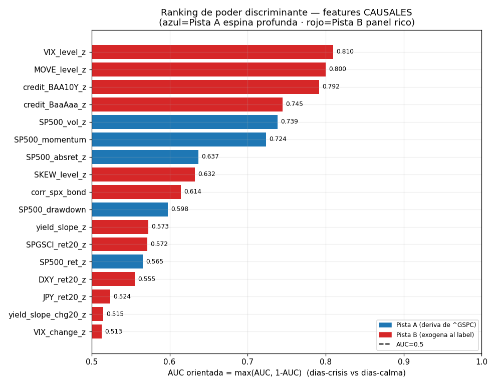
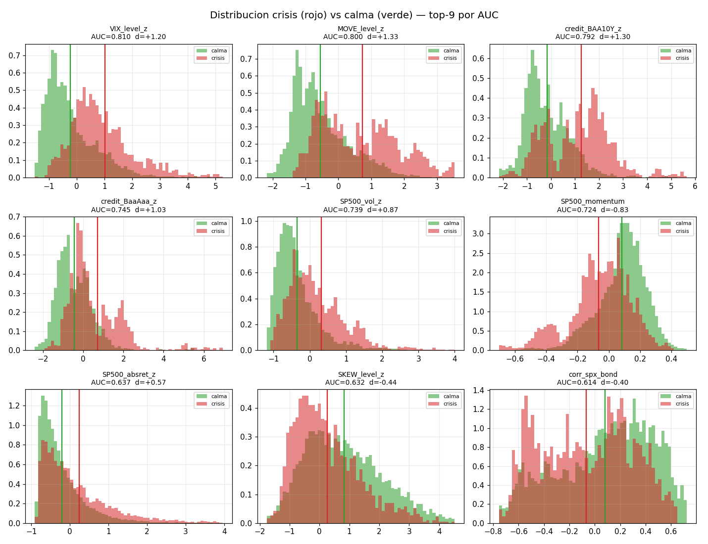
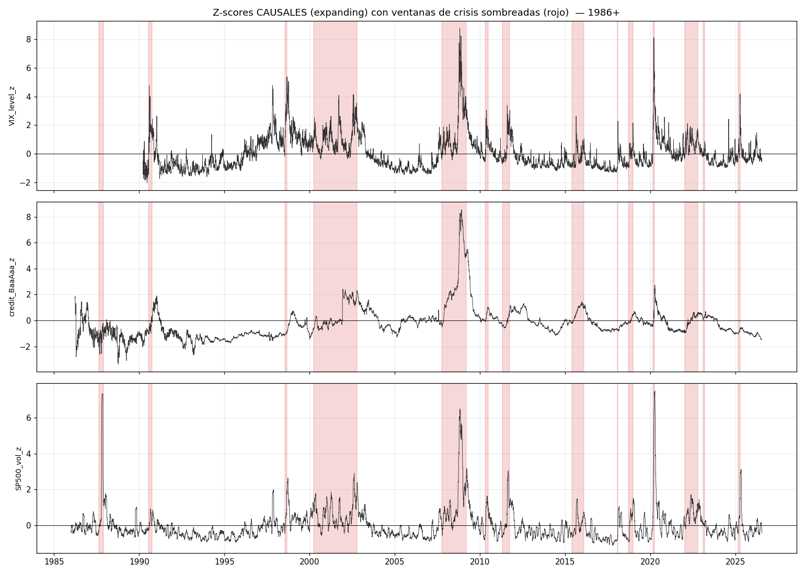
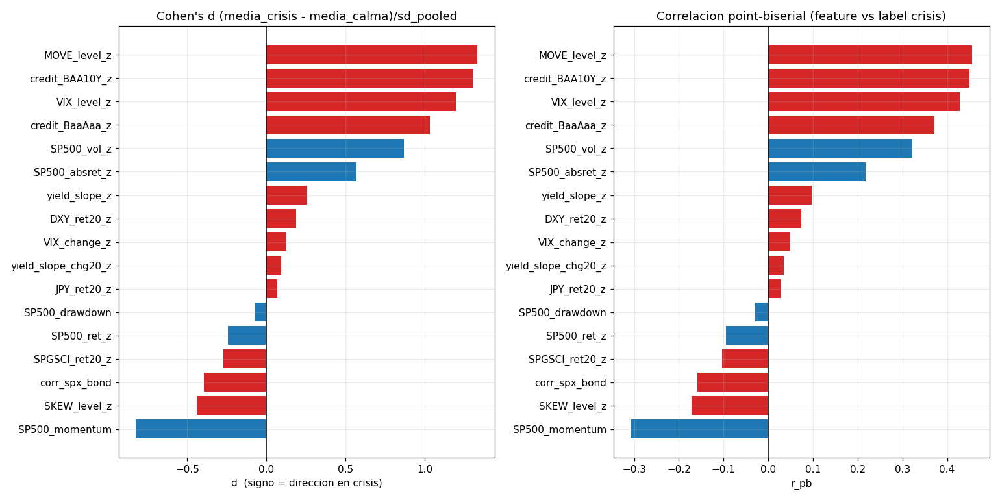
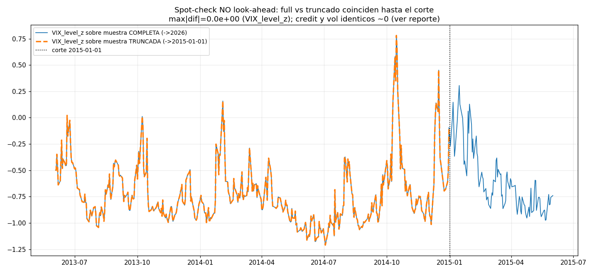

# EDA — Candidatas de FEATURES: poder discriminante CAUSAL (crisis vs calma)

**Slice:** `candidatas_features` · **Fase 3 (EDA profundo)** · datos solo-lectura (`data/raw/`),
transformaciones causales (`src/features.py`: `causal_zscore` expanding, `realized_vol`, `drawdown`,
`momentum`, `rolling_correlation`).

**Pregunta clave:** de una paleta de candidatas causales (retornos, vol, VIX, spreads, curva,
drawdown, momentum, correlación, FX, commodities), **¿cuáles separan mejor los días-crisis de los
días-calma?** Ranking por potencia, con verificación de no look-ahead.

**Respuesta corta:** ganan los **NIVELES de estrés EXÓGENOS al label** — `VIX_level_z`
(**AUC=0.810**), `MOVE_level_z` (**0.800**) y los **spreads de crédito** Baa-10Y / Baa-Aaa (**0.792 /
0.745**). La mejor feature de la **espina profunda** es la **vol realizada del S&P500**
(`SP500_vol_z`, **AUC=0.739**), y es la única con **potencia sobre las 22 crisis** (4 659 días-crisis
desde 1928). Sorpresa metodológica: las features derivadas del propio precio del S&P500 que **define**
el label — **drawdown (0.598) y retorno (0.565)** — son de las **más débiles** como discriminadores
*coincidentes*, pese a su ventaja mecánica. El **cambio diario** (ΔVIX z=0.513, Δpendiente z=0.515) es
**ruido** para este label. La causalidad está verificada: `max|full−truncado| = 0.0` exacto.

---

## 0. Método (label, features, métricas, causalidad)

- **Label de crisis (ground-truth del proyecto).** `data/catalog.yaml → crisis_catalog.eventos` = **22
  crisis** peak→trough del S&P500 (1929→2025). Un día es **crisis=1** si cae dentro de *cualquier*
  ventana `[peak, trough]` (inclusive); resto = **calma=0**. Es un label **coincidente** (marca toda la
  caída, no el punto de giro).
- **17 features CANDIDATAS**, todas **causales**: z-score `expanding` (`min_periods=60`, sin usar
  ningún estadístico de muestra completa) para niveles/retornos, y crudas cuando ya están acotadas
  (`SP500_drawdown` ∈[−1,0], `corr_spx_bond` ∈[−1,1], `SP500_momentum`). Cada una se evalúa **sólo en
  su ventana nativa** (p.ej. VIX 1990+, MOVE 2002+, Baa-Aaa 1986+, S&P500 1928+).
- **Métricas de separación (por feature, sobre crisis vs calma):**
  - **AUC** = `roc_auc_score(label, feature)` = P(feature más alta en día-crisis que en día-calma). Como
    unas features suben y otras bajan en crisis, reporto **AUC orientada = max(AUC, 1−AUC)** para el
    ranking, y la dirección (signo) aparte.
  - **Cohen's d** = (media_crisis − media_calma) / sd_pooled.
  - **Correlación point-biserial** `r_pb` (feature vs label binario) con su p-valor.
- Datos recomputables en `figs/candidatas_features/_ranking.csv`, `_per_crisis_meanz.csv`,
  `_spotcheck.csv`.

---

## 1. Ranking de poder discriminante

| # | feature | pista | categoría | AUC orient. | dir. | Cohen's d | r_pb | nº crisis cubiertas | inicio |
|--:|---|:--:|---|--:|:--:|--:|--:|--:|---|
| 1 | `VIX_level_z` | B | vix | **0.810** | ↑ | +1.20 | +0.43 | 13 | 1990 |
| 2 | `MOVE_level_z` | B | vol tipos | **0.800** | ↑ | +1.33 | +0.46 | 10 | 2002 |
| 3 | `credit_BAA10Y_z` | B | spreads | **0.792** | ↑ | +1.30 | +0.45 | 14 | 1986 |
| 4 | `credit_BaaAaa_z` | B | spreads | **0.745** | ↑ | +1.03 | +0.37 | 14 | 1986 |
| 5 | `SP500_vol_z` | **A** | vol | **0.739** | ↑ | +0.87 | +0.32 | **22** | 1928 |
| 6 | `SP500_momentum` | A | momentum | 0.724 | ↓ | −0.83 | −0.31 | 22 | 1929 |
| 7 | `SP500_absret_z` | A | vol | 0.637 | ↑ | +0.57 | +0.22 | 22 | 1928 |
| 8 | `SKEW_level_z` | B | vix | 0.632 | **↓** | −0.44 | −0.17 | 13 | 1990 |
| 9 | `corr_spx_bond` | B | corr | 0.614 | ↓ | −0.40 | −0.16 | 19 | 1962 |
| 10 | `SP500_drawdown` | A | drawdown | 0.598 | ↓ | −0.07 | −0.03 | 22 | 1928 |
| 11 | `yield_slope_z` | B | curva | 0.573 | ? | +0.26 | +0.10 | 15 | 1982 |
| 12 | `SPGSCI_ret20_z` | B | commodities | 0.572 | ↓ | −0.27 | −0.10 | 14 | 1984 |
| 13 | `SP500_ret_z` | A | retornos | 0.565 | ↓ | −0.24 | −0.09 | 22 | 1928 |
| 14 | `DXY_ret20_z` | B | fx | 0.555 | ↑ | +0.19 | +0.07 | 16 | 1971 |
| 15 | `JPY_ret20_z` | B | fx | 0.524 | ↑ | +0.07 | +0.03 | 16 | 1971 |
| 16 | `yield_slope_chg20_z` | B | curva | 0.515 | · | +0.09 | +0.03 | 15 | 1982 |
| 17 | `VIX_change_z` | B | vix | 0.513 | · | +0.13 | +0.05 | 13 | 1990 |

*(fuente: `figs/candidatas_features/_ranking.csv`; AUC orientada = max(AUC,1−AUC); dir. = signo del
efecto en crisis, ↑ sube / ↓ baja / ? ambiguo.)*

---

## 2. Los NIVELES de estrés EXÓGENOS ganan a las features del propio precio

Las cuatro mejores son todas **Pista B y exógenas** al S&P500 que construye el label:

- **`VIX_level_z`**: media en crisis **+1.03σ** vs **−0.22σ** en calma → **AUC 0.810**, `d=+1.20`. El
  discriminador coincidente más limpio del panel.
- **`MOVE_level_z`** (vol implícita de TIPOS): media **+0.73σ** vs **−0.54σ** → **AUC 0.800**, `d=+1.33`
  (el **mayor Cohen's d** de todos). La vol de tipos separa casi tan bien como la de equity, con panel
  independiente.
- **`credit_BAA10Y_z`** (Baa − Treasury 10Y): **+1.27σ** vs **−0.16σ** → **AUC 0.792**. El spread de
  crédito ajustado por tipos es un termómetro de riesgo de primer orden.
- **`credit_BaaAaa_z`**: **+0.72σ** vs **−0.45σ** → **AUC 0.745**.

El hecho de que estas cuatro batan a `SP500_ret_z`/`SP500_drawdown` — que comparten ADN con el label —
es un argumento **fuerte a favor** de que VIX, MOVE y crédito llevan información de régimen **real**, no
fuga del label (§4).

---

## 3. `SP500_vol_z`: la workhorse de la Pista A (22 crisis) — pero sólo "ve" los CRASHES

`SP500_vol_z` (**AUC 0.739**, `d=+0.87`) es la mejor feature de la **espina profunda**: única con
**4 659 días-crisis** repartidos por las **22 crisis** desde 1928. Es la que da **potencia estadística
secular** a la Pista A. Panel inferior de la figura temporal:

Pero la **media de `SP500_vol_z` por crisis** (`_per_crisis_meanz.csv`) revela un sesgo importante:

| crisis (tipo) | `SP500_vol_z` medio |
|---|--:|
| covid_2020 (crash) | **+2.74** |
| black_monday_1987 (crash) | **+2.50** |
| gfc_2007_09 (bear) | **+1.55** |
| — vs — | |
| recesion_1957_58 (bear lento) | **−0.63** |
| bear_1969_70 (bear lento) | **−0.52** |
| credit_crunch_1966 | **−0.46** |
| kennedy_slide_1962 | **−0.44** |

**La vol realizada dispara en crashes/pánicos y NO en los bear-markets lentos** (1957, 1962, 1966,
1969: caídas de −22% a −36% que se cocinaron con vol *por debajo* de su media expanding). Ésa es la
razón de que el AUC se quede en 0.739 y no más alto: los bear de goteo diluyen la señal de vol. **La
vol separa "cómo cae", no "si cae".** Implicación de diseño: la Pista A necesita, además de vol, una
feature que capture el bear lento (momentum, §4).

---

## 4. Circularidad honesta: drawdown/retorno son ENDÓGENOS al label y aun así son DÉBILES

El label `crisis_catalog` se construyó **a partir del precio del S&P500** (ventanas peak→trough). Por
tanto `SP500_drawdown`, `SP500_ret_z` y `SP500_momentum` tienen una **ventaja mecánica**: no son
predictores exógenos, son casi la definición del label. Y sin embargo:

- **`SP500_drawdown` es de las PEORES (AUC 0.598, `d=−0.07`)**: media en crisis **−0.220** vs en calma
  **−0.203** — **casi idénticas**. Motivo: tras un crash, el mercado pasa **años** por debajo del pico
  anterior (2000-02 y 2008-09 dejaron drawdowns profundos *durante la recuperación*), y esos años se
  etiquetan **calma**. El **nivel** de drawdown confunde "en crisis" con "recuperándose de una". Es un
  mal discriminador *coincidente* pese a su ADN compartido con el label.
- **`SP500_ret_z` (retorno diario) AUC 0.565**: el retorno de *un* día es demasiado ruidoso; en una
  ventana de crisis hay tantos días verdes de rebote como rojos.
- **`SP500_momentum` (12M−1M) es la excepción (AUC 0.724, `d=−0.83`)**: se mantiene **negativo durante
  toda** la ventana de un bear, así que sí marca de forma persistente. Es la feature de precio que
  **complementa** a la vol para los bear lentos del §3.

**Lectura para el TFM:** que las features endógenas al label (drawdown, retorno) **no** dominen el
ranking, y que lo hagan VIX/MOVE/crédito **exógenos**, es tranquilizador — sugiere que el ranking mide
información de régimen genuina y no fuga. También avisa: **el label es "con forma de drawdown de
equity"**, así que infra-premia lo que *precede* (SKEW, curva, §6) y lo que vive fuera del equity.

---

## 5. `corr_spx_bond` CAMBIA DE SIGNO alrededor de 2000 (regime shift acción-bono)

`corr_spx_bond` (corr rolling 60d de retornos S&P500 vs bono, AUC 0.614) baja en crisis **en media**
(−0.066 crisis vs +0.080 calma), pero el promedio **oculta un cambio estructural** — su media por
crisis (`_per_crisis_meanz.csv`):

| crisis | `corr_spx_bond` medio | flight-to-quality |
|---|--:|:--|
| bear_1969_70 | **+0.28** | no (acción y bono caen juntos) |
| volcker_1980_82 | **+0.37** | no |
| black_monday_1987 | **+0.37** | no |
| gulf_war_1990 | **+0.51** | no |
| — giro ~1998-2000 — | | |
| gfc_2007_09 | **−0.54** | **sí** |
| flash_crash_2010 | **−0.65** | **sí** |
| euro_2011 | **−0.58** | **sí** |
| covid_2020 | **−0.53** | **sí** |

**Antes de ~2000 la correlación acción-bono en crisis era POSITIVA** (régimen inflacionario: sube la
inflación → caen acciones *y* bonos juntos); **después de 2000 es fuertemente NEGATIVA** (régimen de
crecimiento: los Treasuries *rallyan* como refugio). Esto es el hallazgo clásico de que **el signo del
hedge acción-bono depende del régimen inflacionario** (Gulko 2002, ya citado en `src/features.py`). Por
eso su AUC global es sólo 0.614: **la misma feature significa cosas opuestas antes y después de 2000**.
Feature valiosísima para *tipificar* la crisis, pero **no** como marcador monótono de riesgo.

---

## 6. Lo que NO discrimina (y por qué es informativo saberlo)

- **`SKEW_level_z` está INVERTIDA (dir. ↓)**: media en crisis **+0.27σ** vs **+0.83σ** en calma → el
  SKEW está **más alto en la CALMA**. El precio del riesgo de cola se paga cuando el mercado está
  **complaciente**; una vez el crash está en marcha, manda la vol realizada y el SKEW se relaja. Es una
  feature **contraria/adelantada**, no coincidente — otro caso que el label coincidente infra-premia.
- **`yield_slope_z` (pendiente 10Y−3M) es AMBIGUA (AUC 0.573, dir. "?")**: su media por crisis va de
  **+1.19** (flash_crash_2010) y **+0.91** (black_monday) a **−2.44** (svb_2023), **−1.49** (ltcm),
  **−1.31** (covid). El **nivel** de la pendiente **no** es un marcador coincidente de crisis (coincide
  con el hallazgo del slice `credito_curva_2013`: la pendiente engaña; en 2013 estaba muy positiva y
  empinándose). El signo depende de si la crisis pilla la curva ya invertida o ya re-empinada.
- **El CAMBIO diario es RUIDO para este label**: `VIX_change_z` **AUC 0.513** y `yield_slope_chg20_z`
  **0.515** ≈ azar. Contraste con el slice `credito_curva_2013`, donde el *cambio* (velocidad) sí
  capturaba el shock puntual de tipos: **para un label coincidente de ventana larga mandan los NIVELES
  persistentes; los cambios sólo brillan en el punto de giro.** Son features complementarias, no
  rivales — dependen de la geometría del label.
- **FX y commodities son débiles-coincidentes**: `DXY_ret20_z` 0.555, `JPY_ret20_z` 0.524 (el yen
  refugio apenas separa en media de 20d), `SPGSCI_ret20_z` 0.572. Útiles como *confirmadores* de
  risk-off, no como discriminadores primarios.

---

## 7. Trade-off de las DOS PISTAS, cuantificado (ADR-001)

El scatter AUC vs nº de crisis cubiertas hace explícita la decisión ADR-001:

- **Pista B (panel rico, exógeno):** las mejores AUC (0.75–0.81) están **arriba-izquierda** — VIX,
  MOVE, crédito discriminan de maravilla **pero cada una sólo ve 10–14 de las 22 crisis** (empiezan en
  1986/1990/2002). Alta discriminación, **poca potencia** (pocos eventos).
- **Pista A (espina profunda):** `SP500_vol_z` está **abajo-derecha** — AUC 0.739 (algo menor) pero
  cubriendo **las 22 crisis** con 4 659 días-crisis desde 1928. Menos filo por feature, **máxima
  potencia** estadística.

Es exactamente la tensión que motiva las dos pistas: **B para separar, A para tener n de crisis
suficiente**. La feature "puente" ideal sería una con AUC alta *y* historia larga; la vol realizada es
la mejor aproximación disponible, pero paga el precio de ser ciega a los bear lentos (§3).

---

## 8. Spot-check de NO look-ahead (causalidad verificada)

Recomputé tres z-scores sobre (a) la muestra **completa** (→2026) y (b) la muestra **truncada** en
`cut=2015-01-01`, y comparé los valores en el solapamiento (≤ cut). Si la feature es causal, el futuro
**no puede** alterar el pasado:

| feature | `max|full − truncado|` | nº obs comparadas |
|---|--:|--:|
| `VIX_level_z` | **0.0** (exacto) | 6 299 |
| `credit_BaaAaa_z` | **0.0** (exacto) | 7 286 |
| `SP500_vol_z` | **0.0** (exacto) | 21 851 |

*(fuente: `figs/candidatas_features/_spotcheck.csv`.)* Discrepancia **cero bit a bit**: el z-score
`expanding` en `t` usa sólo datos `≤ t`, así que truncar el futuro no cambia ni un valor. **Ninguna
candidata usa información futura.** (Réplica del `assert_causal` de `src/features.py`, aplicada a la
paleta ampliada de este slice.)

---

## 9. Candidatas recomendadas y limitaciones honestas

**Recomendadas (por rol):**
- **Discriminadores primarios (Pista B):** `VIX_level_z`, `MOVE_level_z`, `credit_BAA10Y_z`,
  `credit_BaaAaa_z` — AUC 0.74–0.81, todos por **NIVEL** (no cambio).
- **Espina profunda (Pista A):** `SP500_vol_z` (workhorse, 22 crisis) **+** `SP500_momentum` (cubre el
  bear lento que la vol no ve). Juntas son un mínimo honesto para la potencia secular.
- **Tipificadora de régimen, NO marcador monótono:** `corr_spx_bond` — imprescindible para distinguir
  crisis inflacionaria (corr>0, pre-2000) de crisis de crecimiento (corr<0, post-2000), pero hay que
  usarla con su cambio de signo, no como "más riesgo = más alto".
- **Descartar o degradar para este label:** `VIX_change_z`, `yield_slope_chg20_z` (ruido coincidente),
  `SP500_drawdown` y `SP500_ret_z` (débiles pese a ser endógenos), `SKEW_level_z` (invertida →
  reservar para señal *adelantada*, no coincidente).

**Limitaciones:**
- **El label es coincidente y "con forma de drawdown de equity"** (22 ventanas peak→trough del S&P500).
  Infra-premia sistemáticamente lo *adelantado* (SKEW, curva invertida) y lo *no-equity* (funding, FX).
  Un análisis de *lead-time* (feature en t−k vs inicio de crisis) daría otro ranking y es el
  complemento natural a este slice.
- **AUC/point-biserial NO controlan autocorrelación**: los días dentro de una crisis están muy
  correlados, así que el "n efectivo" de crisis es ~22 eventos, no miles de días. Los p-valores de
  `r_pb` son optimistas; la comparación entre features (mismo sesgo) sigue siendo válida, pero **no
  interpretar la significación como si fueran observaciones i.i.d.**
- **Ventanas nativas distintas** ⇒ los AUC no se miden sobre el mismo conjunto de crisis (VIX ve 13, la
  vol ve 22). Por eso reporto `nº crisis cubiertas` junto a cada AUC (fig. 4): comparar AUC entre una
  feature de 1990 y una de 1928 exige tener presente ese sesgo de muestra.
- **`HYG`/`IEF`/`TLT`/`MOVE` que asume `src/features.build_features` no están todos en el panel real**
  (deuda técnica ya anotada en el slice `credito_curva_2013`); aquí uso el crédito **verificado** del
  catálogo (Baa-Aaa, BAA10Y) y `-Δ(DGS10)` como proxy de retorno de bono para `corr_spx_bond`.
- **Sólo mido separación, no capacidad predictiva out-of-sample.** Un AUC alto coincidente no garantiza
  un detector que anticipe; es un filtro de *candidatas*, no un backtest.

---

## TL;DR (una frase por hallazgo)

1. **Ganan los niveles de estrés EXÓGENOS**: `VIX_level_z` (AUC **0.810**), `MOVE_level_z` (**0.800**),
   `credit_BAA10Y_z` (**0.792**), `credit_BaaAaa_z` (**0.745**).
2. **`SP500_vol_z` es la mejor de la espina profunda** (AUC **0.739**) y la **única con potencia sobre
   las 22 crisis** (4 659 días-crisis desde 1928) — la workhorse de la Pista A.
3. **Pero la vol sólo ve CRASHES**: z medio +2.7 (covid), +2.5 (black monday), pero **negativo** en los
   bear lentos (1957 −0.63, 1969 −0.52). Separa "cómo cae", no "si cae".
4. **Circularidad que NO se cumple**: drawdown (0.598) y retorno (0.565), endógenos al label, están
   entre los **más débiles**; media de drawdown en crisis −0.220 ≈ calma −0.203. Que ganen las
   exógenas refuerza que el ranking mide régimen real, no fuga.
5. **`corr_spx_bond` cambia de signo ~2000**: +0.3/+0.5 en crisis pre-2000 (inflación) vs −0.5/−0.6
   post-2000 (crecimiento/flight-to-quality). Tipifica el régimen; no es marcador monótono.
6. **El CAMBIO diario es ruido para este label**: ΔVIX z AUC **0.513**, Δpendiente **0.515** ≈ azar;
   para ventanas largas mandan los **niveles** (contraste con el shock puntual de 2013, donde mandaba
   la velocidad).
7. **`SKEW` está invertida** (más alta en calma, +0.83σ vs +0.27σ) y la **pendiente es ambigua** (de
   +1.19 a −2.44 según la crisis): ambas son adelantadas/contexto, no coincidentes.
8. **Trade-off de las dos pistas cuantificado**: B discrimina mejor (AUC 0.75–0.81) pero ve 10–14
   crisis; A (vol) ve 22 con AUC 0.739. B para separar, A para tener potencia (ADR-001).
9. **No look-ahead verificado**: `max|full−truncado| = 0.0` exacto en VIX/crédito/vol sobre 6 299 /
   7 286 / 21 851 obs. Ninguna candidata mira al futuro.
