# EDA · Slice `cobertura_calidad`

**Foco:** calidad y cobertura de las 160 series descargadas (status OK/CACHE). Mapa de
missingness por serie, ventanas comunes efectivas de PISTA A y PISTA B (qué serie gobierna
cada inicio), festivos/calendarios desalineados, gaps estructurales, política sin-imputar,
y **recomendación de la ventana efectiva de cada pista**.

Fuentes: `data/raw/coverage_report.csv` (168 filas → 160 OK/CACHE, 8 ERROR),
`data/catalog.yaml` (pistas + `crisis_catalog` con 22 crisis peak→trough), y los parquet crudos.
Solo lectura sobre `data/`.

---

## 0. TL;DR — recomendación de ventanas efectivas

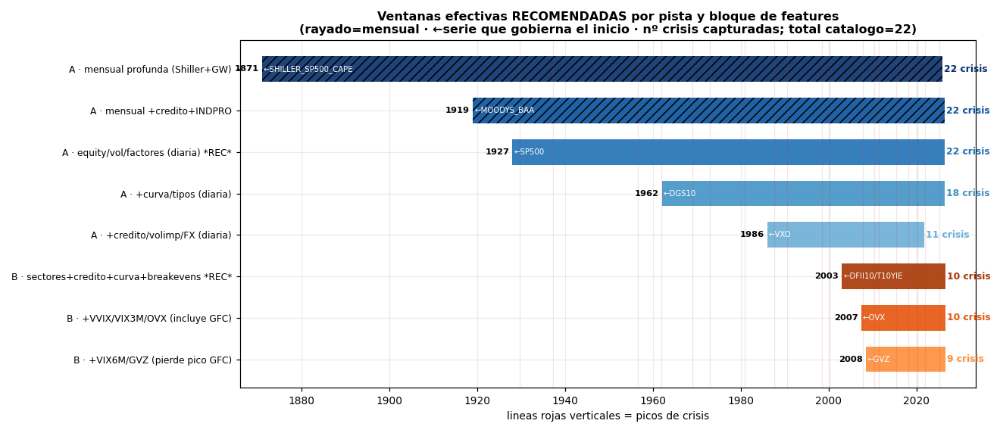

La intersección "ingenua" de todas las series de una pista es **inservible**:
- **Pista A diaria** (39 series): intersección = **1991-01-02 → 2016-10-07** (la gobiernan `BCOM`
  al inicio y `EURODOLLAR_TBILL_SPREAD`, descontinuada, al final). Solo 25 años y pierde todo el
  propósito de A.
- **Pista B diaria** (85 series): intersección = **conjunto VACÍO** — `IORB` no arranca hasta
  **2021-07-29**, después de que `EURODOLLAR_TBILL_SPREAD` haya muerto el **2016-10-07**. Es
  literalmente imposible exigir todas las series de B a la vez.

Por eso la ventana efectiva debe definirse **por bloque de features**, no por intersección total.
Recomendación (número de crisis del catálogo = 22):

| Pista | Ventana recomendada | Gobierna inicio | Gobierna fin | Nº crisis |
|---|---|---|---|---|
| **A — diaria (equity/vol/factores)** | **1927-12-30 → 2026-05-29** | `SP500` (1927-12-30) | `FF_FACTORS_3_DAILY` (2026-05-29, lag académico) | **22 / 22** |
| A — mensual profunda (valoración) | 1871-01-01 → 2025-12-01 | `SHILLER_SP500_CAPE` | `GW_PREDICTORS_MONTHLY` | 22 / 22 |
| A — diaria + curva/tipos | 1962-01-02 → 2026-05-29 | `DGS10` (1962-01-02) | `FF_FACTORS_3_DAILY` | 18 / 22 |
| **B — panel core (sect+créd+curva+breakevens)** | **2003-01-02 → 2026-07-10** | `DFII10`/`T10YIE` (2003-01-02) | `MOVE` (2026-07-10) | **10 / 22** |
| B — + vol-of-vol/term-structure (mantiene GFC) | 2007-05-10 → 2026-07-10 | `OVX` (2007-05-10) | `MOVE` | 10 / 22 |
| B — + OVX/GVZ vol de oil/oro (pierde pico GFC) | 2008-06-03 → 2026-07-10 | `GVZ` (2008-06-03) | `MOVE` | 9 / 22 |

Esto reproduce con números la lógica de ADR-001: **A da potencia** (22 crisis con equity/vol
diario desde 1927), **B da riqueza** (panel multi-activo denso, pero solo ~10 crisis).

---

## 1. Inventario y política sin-imputar (verificada)

- **160 series** cargadas OK/CACHE; **8 ERROR** descartadas. Reparto por pista:
  - Pista A (A + `ambas`): **76 series** (39 diarias, 37 mensuales).
  - Pista B (B + `ambas`): **96 series** (85 diarias, 11 mensuales).
  - Validación externa: **22 series**. Dual-uso (`pista: ambas`): **34 series**.
- **Política sin-imputar CONFIRMADA a nivel de almacenamiento:** las 160 series tienen
  **0 valores NaN**. Los huecos NO se rellenan con NaN: las fechas ausentes simplemente **no
  existen en el índice** (p.ej. `DGS30` tiene `n=12349` filas, todas con valor). Cualquier
  missingness es por lo tanto **fecha ausente**, no valor nulo — hay que medirla contra una
  rejilla esperada, no con `.isna()`.
- Las **8 ERROR**: `SP500_STOOQ_FALLBACK` y `DOW_STOOQ_DEEP` (stooq bloqueado por challenge JS),
  `JST_MACROHISTORY_R6` y `JST_CRISIS_GROUNDTRUTH` (xlsx JST no accesible),
  `GH_SP500_CONSTITUENTS_PIT`/`_NOW` (no son series temporales),
  `GW_PREDICTORS_QUARTERLY` (parse de fecha "18711"), `PHILLY_ANXIOUS_INDEX` (motor Excel).
  Ninguna es spine crítico salvo el ground-truth JST, que queda cubierto por `crisis_catalog`.

---

## 2. Mapa de missingness por serie (left-truncation domina)

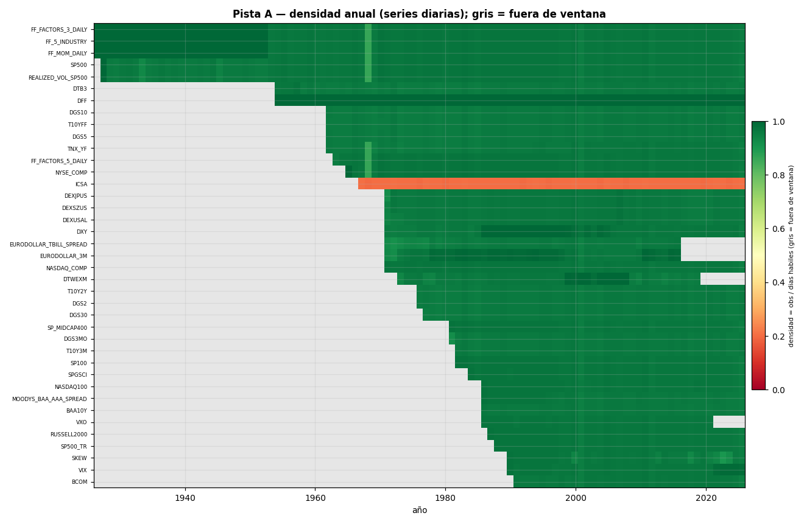

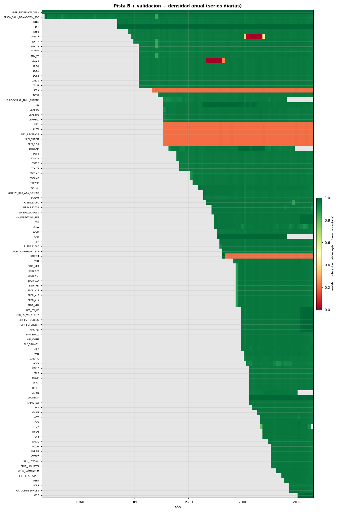

Densidad anual = obs / días hábiles esperados. **Verde=1.0, gris=fuera de ventana.** Lectura:

- El patrón dominante es **escalera de left-truncation**: cada serie arranca en su fecha real y
  sube a densidad ~1.0. No hay missingness interno relevante en las series diarias sanas: su
  densidad de régimen es **~0.958 vs `bdate_range`** (p.ej. `DGS10` 16119 obs), y ese ~4.2% que
  falta son los **~10 festivos/año de EE. UU.** — es el baseline normal, no un defecto.
- **Banda anómala 1968** (tenue, en `SP500`/`FF_*`): densidad baja ese año porque la NYSE
  **cerró los miércoles de jun–dic 1968** (crisis de papeleo). Es real, no un error de descarga.
- **Right-truncation** visible en gris al borde derecho: `EURODOLLAR_TBILL_SPREAD` y
  `EURODOLLAR_3M` (fin 2016-10), `DTWEXM` (fin 2019-12), `VXO` (fin 2021-09).

Los diagramas Gantt completos (todas las series, ordenadas por inicio, coloreadas por rol, con `x`
roja marcando series descontinuadas):

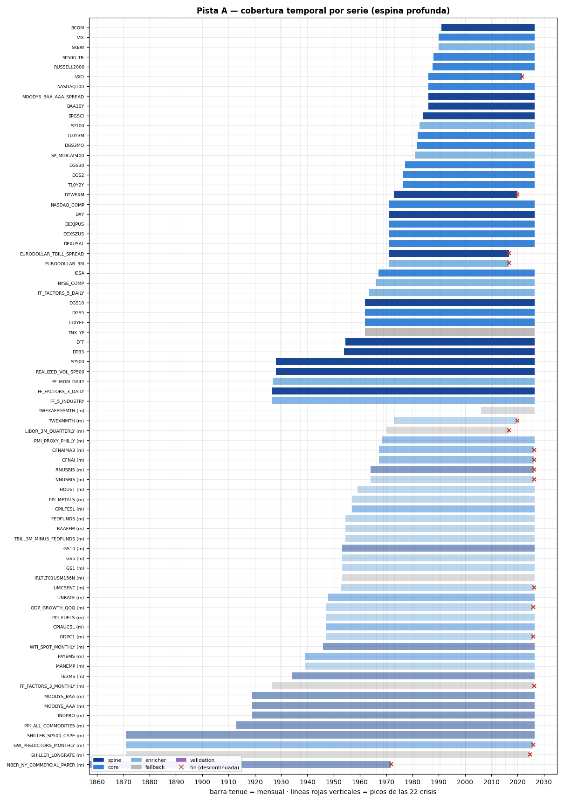

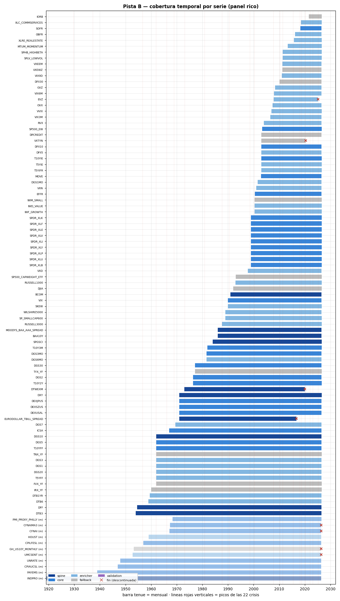

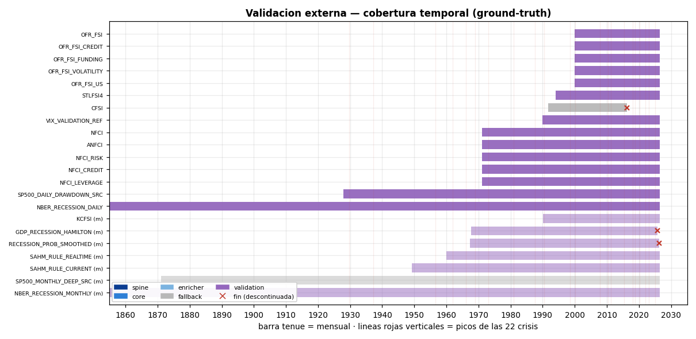

---

## 3. Ventanas comunes efectivas — qué serie gobierna cada inicio

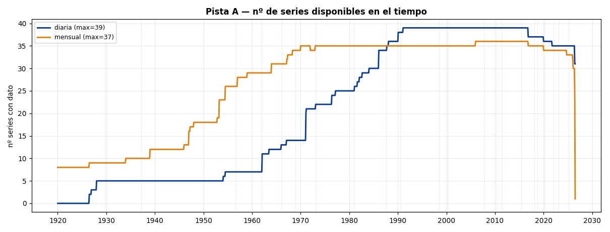

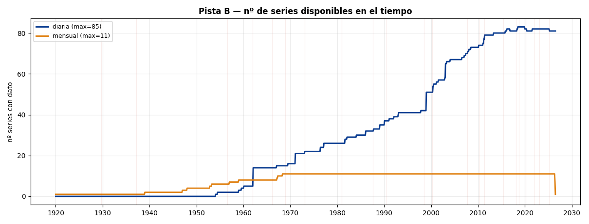

La escalera de "nº de series disponibles en el tiempo" muestra los saltos. Los **inicios que
gobiernan** cada bloque (max de los `inicio`) y el **nº de crisis** que captura cada corte
(pico ∈ [inicio, fin], catálogo = 22):

**Pista A (diaria), por bloque acumulado de features:**

| Bloque | Inicio efectivo | Serie que gobierna | Fin efectivo | Nº crisis |
|---|---|---|---|---|
| equity + vol realizada + factores FF | **1927-12-30** | `SP500` (FF_daily desde 1926-07) | 2026-05-29 | **22** |
| + curva/tipos diarios | 1962-01-02 | `DGS10`,`DGS5`,`T10YFF` | 2026-05-29 | 18 |
| + crédito diario + vol implícita + FX | 1986-01-02 | `VXO`,`MOODYS_BAA_AAA_SPREAD`,`BAA10Y` | 2021-09-23 (`VXO`†) | 11 |
| + `BCOM` (commodities) | 1991-01-02 | `BCOM` | — | 9 |

† `VXO` gobierna a la vez el inicio (1986) y el fin (descontinuada 2021-09-23) de ese bloque;
sustituirla por `VIX` (1990→hoy) extiende el fin pero retrasa el inicio a 1990.

**Pista A (mensual), profundidad secular:**

| Bloque | Inicio | Gobierna | Nº crisis |
|---|---|---|---|
| Shiller CAPE + Goyal-Welch | **1871-01-01** | `SHILLER_SP500_CAPE` | 22 |
| + PPI commodities | 1913-01-01 | `PPI_ALL_COMMODITIES` | 22 |
| + crédito Moody's + INDPRO | 1919-01-01 | `MOODYS_BAA`/`MOODYS_AAA` | 22 |

**Pista B (diaria):**

| Bloque | Inicio efectivo | Serie que gobierna | Fin | Nº crisis |
|---|---|---|---|---|
| sectores SPDR (9) + crédito + curva + breakevens TIPS + MOVE + VIX | **2003-01-02** | `DFII10`/`T10YIE`/`DFII5` (breakevens) | 2026-07-10 (`MOVE`) | **10** |
| + `VVIX`,`VIX3M`,`OVX` (mantiene pico GFC 2007-10) | 2007-05-10 | `OVX` | 2026-07-10 | 10 |
| + `VIX6M`,`GVZ` (vol de oro) | 2008-06-03 | `GVZ` | 2026-07-10 | 9 (pierde GFC) |

**Nota crítica sobre el punto ciego 2013 (taper tantrum):** NO es un problema de cobertura.
En 2013-07-01 hay **91/96 series de B con dato** (80 diarias) y **75/76 de A**. El panel B está
totalmente poblado en 2013; la dificultad del 2013 es de *señal* (régimen sutil, no marcado como
crisis profunda), no de datos. B puede atacarlo desde cualquier ventana que empiece ≤ 2013.

---

## 4. Gaps estructurales — la hipótesis DGS30 2002-2006 es FALSA

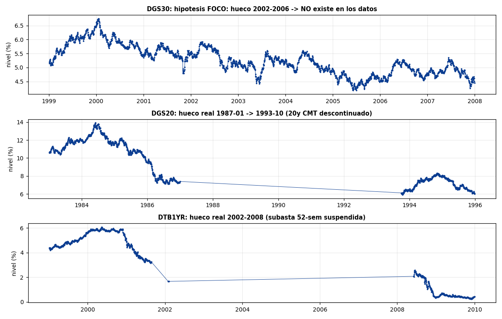

- **DGS30 2002-2006: el hueco NO existe en estos datos.** `DGS30` tiene **250 obs en 2002, 250 en
  2003, 250 en 2004, 250 en 2005** (continuo). Alrededor del 2002-02-19 —fecha de la suspensión
  del bono a 30 años por el Tesoro— la serie pasa de 5.37 (2002-02-15) a 5.54 (2002-02-19) **sin
  interrupción**. FRED sirve el tramo 2002-2006 con su serie extrapolada. `max_gap = 5 días`. La
  hipótesis del FOCO queda **refutada empíricamente**.
- **Gaps estructurales diarios que SÍ existen** (los únicos > 31 días en series diarias):
  - **`DGS20`**: hueco de **1986-12-31 → 1993-10-01 (2466 días, ~6.75 años)** — el 20-year CMT
    estuvo descontinuado. Densidad global 0.857.
  - **`DTB1YR`**: hueco de **2002-02-05 → 2008-06-03 (2310 días)** más otro de 159 días
    (2001-08 → 2002-01) — suspensión de la subasta de letras a 52 semanas. Densidad 0.861.
- El resto de series diarias no tiene gaps internos: todas las demás tienen `max_gap ≤ 13 días`
  (fines de semana + festivos largos). `MOVE` tiene un único hueco de 10 días; `SKEW` uno de 13.

---

## 5. Series SEMANALES mal etiquetadas como "diaria" (trampa de calendario)

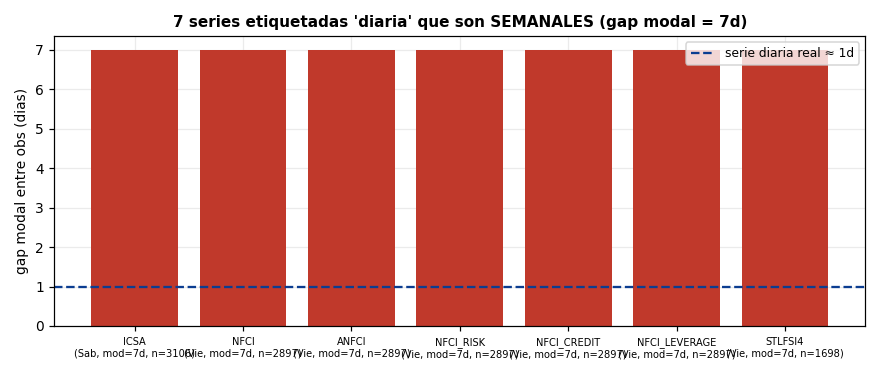

**7 series** llevan `granularidad: diaria` en `coverage_report.csv` pero son **semanales**
(gap modal = 7 días, todas las obs caen el mismo día de la semana):

| Serie | Día de release | n | Densidad vs día hábil |
|---|---|---|---|
| `ICSA` (peticiones de paro) | Sábado | 3106 | 0.20 |
| `NFCI`,`ANFCI`,`NFCI_RISK`,`NFCI_CREDIT`,`NFCI_LEVERAGE` (Chicago Fed) | Viernes | 2897 | 0.20 |
| `STLFSI4` (St. Louis stress) | Viernes | 1698 | 0.20 |

Aparecen como banda naranja (~0.20) en el heatmap. **No están incompletas** — están completas a
frecuencia semanal. Consecuencia práctica: si se alinean a una rejilla diaria hay que
**forward-fill causal hasta el siguiente release** (nunca interpolar hacia atrás), o tratarlas en
su propia rejilla semanal. Casi todas son de rol `validation` (no features), salvo `ICSA`
(`ambas`, core macro): esa sí es feature y su naturaleza semanal debe respetarse.

---

## 6. Festivos y calendarios desalineados (NYSE vs bonos vs académico)

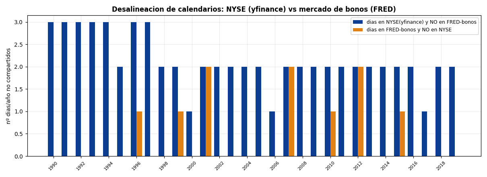

Al combinar fuentes en un panel diario chocan **tres calendarios**: NYSE (yfinance, equity),
mercado de bonos/SIFMA (FRED tipos), y CRSP/académico (Fama-French). Mismatch típico **2-3
días/año**, verificado:

- **Días en NYSE(yfinance) que NO están en FRED-bonos** (~2-3/año): el mercado de bonos cierra
  **Columbus Day** y **Veterans Day**, cuando la bolsa abre. Verificado 2015: **2015-10-12**
  (Columbus), **2015-11-11** (Veterans). En 2012: **2012-10-08**, **2012-11-12**.
- **Días en FRED que NO están en NYSE** (~1-2/año): **Good Friday** (la bolsa cierra;
  FRED/H.15 publica algunos años) — 2015-04-03, 2012-04-06 — y **cierres de emergencia** como el
  **huracán Sandy, 2012-10-29** (NYSE cerrada, FRED con dato).

**Implicación sin-imputar:** en una unión de fechas (outer join) sin imputar, ~3-5 filas/año
tendrán algún NaN por puro desfase de festivos. Recomendación: construir el panel sobre el
**calendario NYSE** (el más denso para equity, que es la espina), y para las series FRED alinear
por **último valor disponible ≤ t** (merge_asof / ffill causal), nunca interpolando.

---

## 7. Borde derecho irregular (ragged edge) — el "hoy" no es único

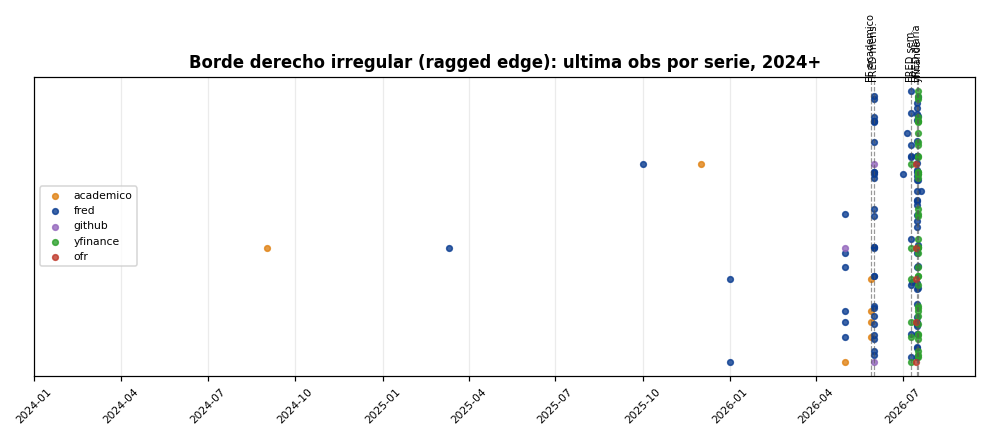

La última observación disponible **depende de la fuente**, lo que crea un borde escalonado:

| Fuente / tipo | Último dato | Ejemplos |
|---|---|---|
| yfinance diaria | **2026-07-17** | `SP500`, sectores SPDR |
| FRED diaria | **2026-07-16** | `DGS*`, `VIX`, spreads |
| FRED semanal | **2026-07-10/11** | `NFCI*`, `ICSA`, `STLFSI4` |
| FRED mensual | **2026-06-01** | macro FRED |
| académico diaria (Fama-French) | **2026-05-29** | `FF_FACTORS_3_DAILY`, `FF_MOM_DAILY` |

**Consecuencia:** si se exige la última fila del panel A sin NaN, los factores Fama-French
(`FF_FACTORS_3_DAILY`, fin 2026-05-29) **truncan el panel ~7 semanas** respecto al edge de
yfinance/FRED. Por eso la ventana A recomendada cierra en **2026-05-29** (gobernada por FF); si
se prescinde de los factores FF y se deriva el retorno de mercado de `SP500`, el fin se extiende
a 2026-07-17.

**Series feature descontinuadas** (fin < 2026-06; 24 en total). Las que eran `spine`/`core`:

| Serie | Rol | Fin | Sustituto vivo (catálogo) |
|---|---|---|---|
| `NBER_NY_COMMERCIAL_PAPER` | spine | 1971-12-01 | (histórica; solo pre-1971) |
| `EURODOLLAR_TBILL_SPREAD` | spine | 2016-10-07 | `PAPER_BILL_SPREAD`, `CP_FFR_SPREAD` |
| `DTWEXM` | spine (FX) | 2019-12-31 | `DXY` (yfinance, vivo), `TWEXAFEGSMTH` |
| `VXO` | core (vol) | 2021-09-23 | `VIX` (1990→hoy) |
| `EURODOLLAR_3M` | enricher | 2016-10-07 | `SOFR`, `EFFR` |
| `TWEXMMTH` | enricher | 2019-12-01 | `TWEXAFEGSMTH` |
| `VXTYN` | fallback | 2020-05-15 | `MOVE` |
| `EVZ` | enricher | 2025-03-11 | — |

---

## 8. Recomendaciones operativas (para las fases siguientes)

1. **Nunca hacer intersección total de una pista** (A diaria → 25 años; B diaria → vacío). Definir
   la ventana **por bloque de features** con el árbol de las tablas de §3.
2. **Ventana A por defecto (potencia):** diaria **1927-12-30 → 2026-05-29**, equity + vol realizada
   + factores FF → **22/22 crisis**. Añadir curva solo si se acepta bajar el inicio a 1962 (18
   crisis) y crédito diario solo si se acepta 1986 (14 crisis).
3. **Ventana B por defecto (riqueza):** diaria **2003-01-02 → 2026-07-10**, sectores + crédito +
   curva + breakevens TIPS + MOVE + VIX → **10 crisis**, panel denso en 2013. Añadir el bloque de
   vol-of-vol/term-structure **empezando en 2007-05-10** (`OVX`) para no perder el pico de la GFC;
   evitar exigir `GVZ`/`VIX6M` como ancla (empujan el inicio a 2008-06 y sacrifican la GFC).
4. **Etiquetar bien la granularidad:** reclasificar como *semanales* `ICSA`, `NFCI*`, `STLFSI4`
   (hoy marcadas "diaria"); alinearlas por ffill causal, no interpolar.
5. **Panel diario sobre calendario NYSE**; series FRED por `merge_asof`/ffill causal; asumir
   ~3-5 filas/año con NaN por desfase de festivos (sin imputar).
6. **Vigilar el ragged edge:** truncar el panel al min de los `fin` de las series exigidas, o
   sustituir las descontinuadas por sus reemplazos vivos (tabla §7) antes de fijar la ventana.

---

*Reproducibilidad: figuras y estadísticas generadas con scripts en el scratchpad de sesión
(`cc_figs.py`, `cc_figs2.py`, `cc_figs3.py`, `cc_tiers.py`); solo lectura sobre `data/`.*
