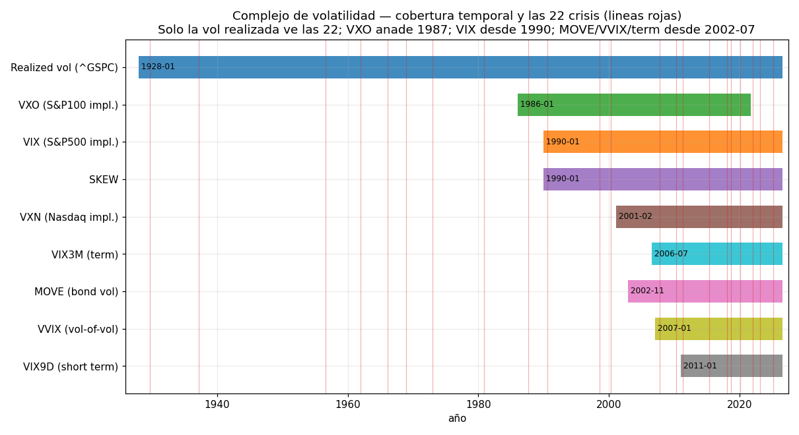
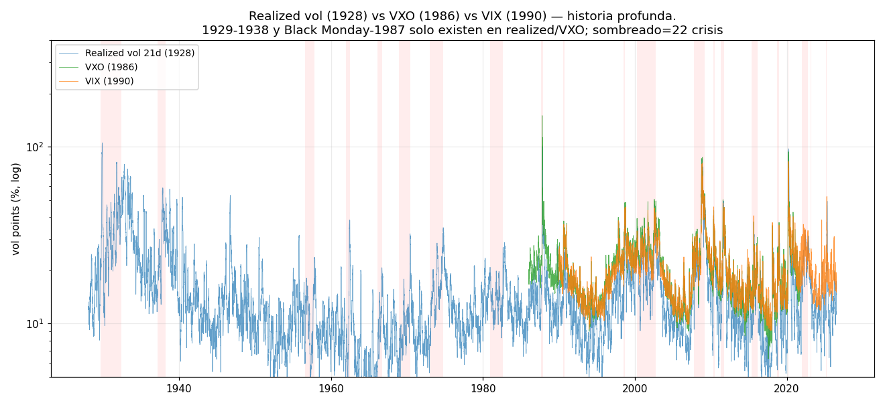
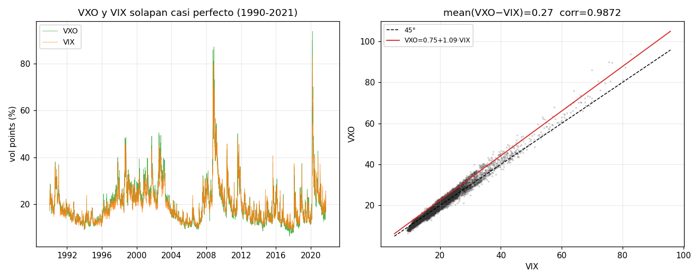
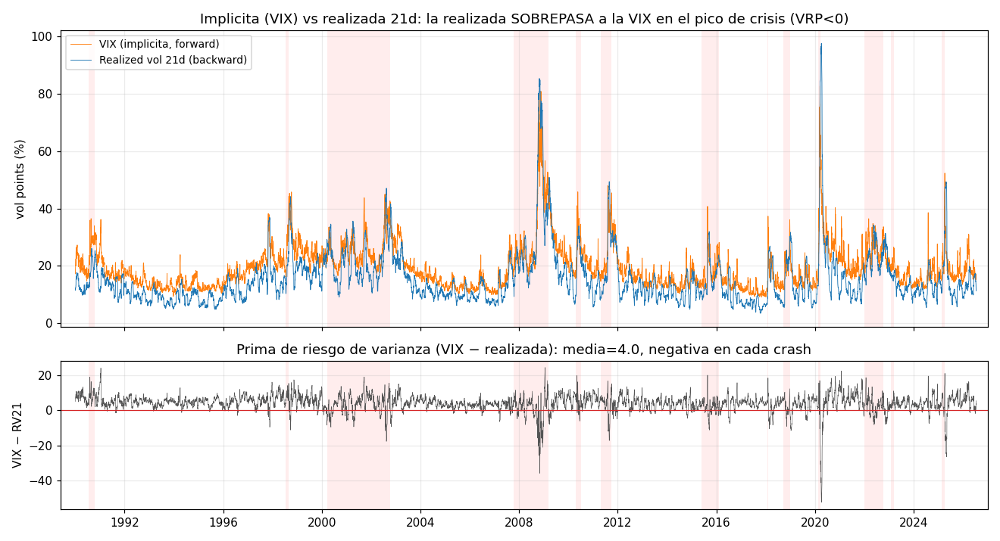
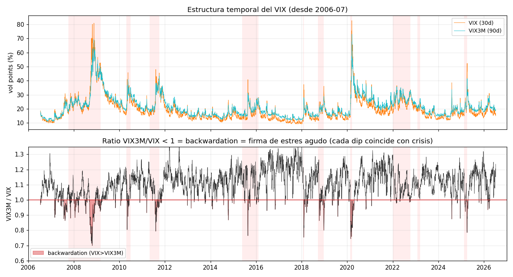
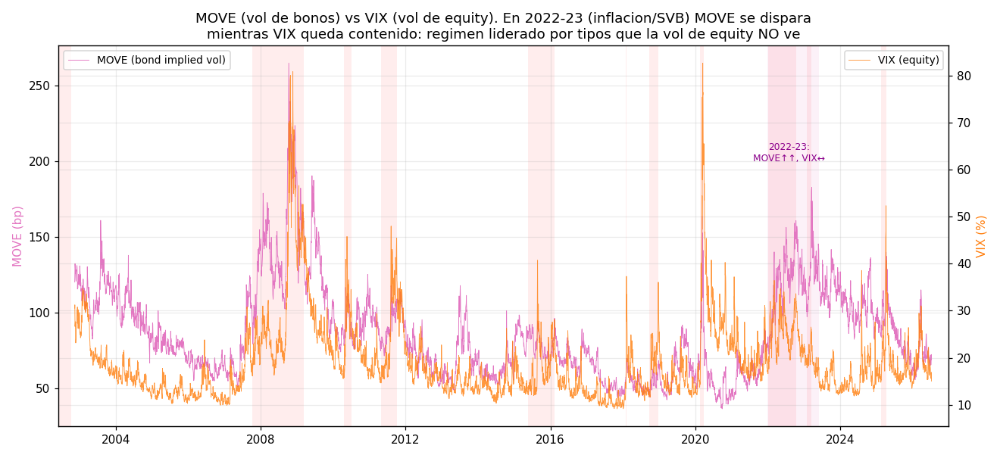
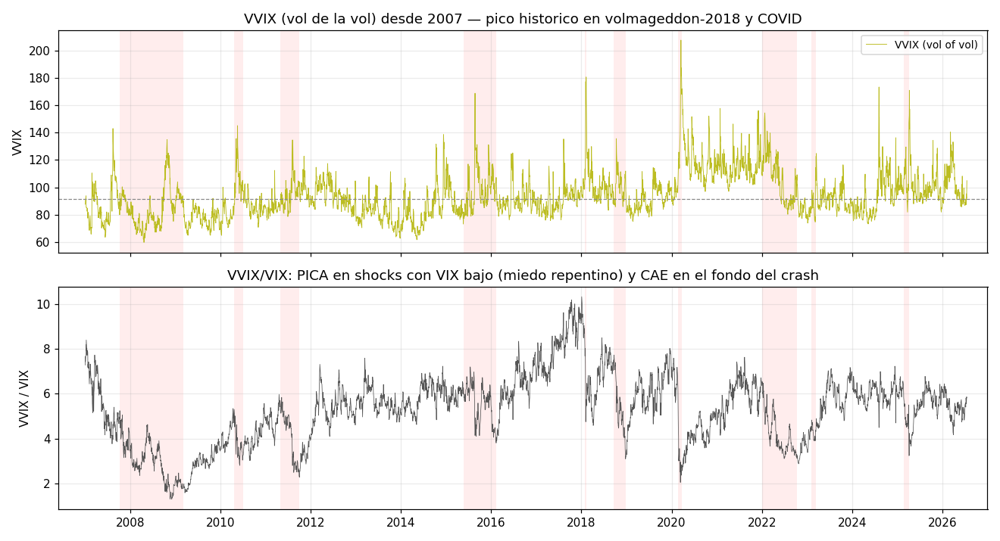
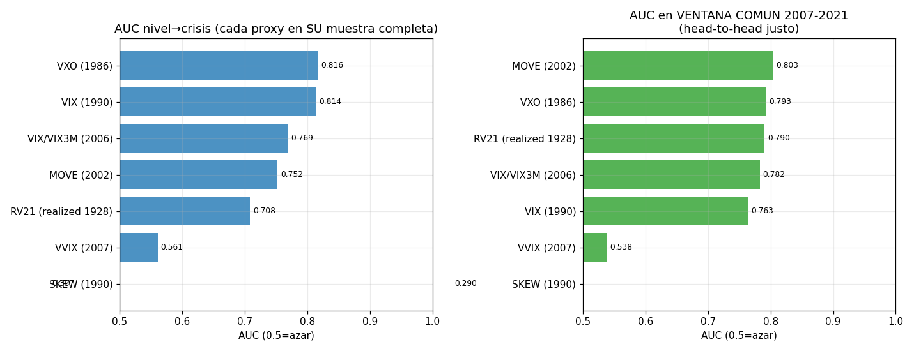

# EDA v2 — El complejo de volatilidad

**Slice:** `complejo_volatilidad` · **Proyecto:** detección de regímenes de mercado (TFM), Fase 3 (EDA profundo)
**Foco:** VIX vs VXO (1986) vs volatilidad realizada (1928), MOVE (vol de bonos), VVIX (vol de la vol), estructura temporal (VIX3M/VIX, backwardation en crisis). Nivel de cada proxy en las **22 crisis del catálogo**. Qué vol-proxy es el mejor **sensor de régimen** y **desde cuándo**.
**Datos:** `data/raw/<fuente>/<nombre>.parquet`, solo lectura. Series usadas (todas `status=CACHE`): `REALIZED_VOL_SP500`/`SP500` (^GSPC, 1928+), `VXO` (VXOCLS, 1986+), `VIX` (VIXCLS, 1990+), `MOVE` (^MOVE, 2002+), `VVIX` (2007+), `VIX3M`/`VIX6M`/`VIX9D`, `SKEW`, `VXN`. Crisis = `crisis_catalog.eventos` (22 eventos peak→trough).
**Causalidad:** los niveles pico por crisis y los estadísticos descriptivos caracterizan el proceso histórico (correcto sobre muestra completa). El único score comparativo de "sensor" (AUC nivel→crisis) es rank-based sobre el nivel crudo; para despliegue en tiempo real se estandarizaría con `causal_zscore` (expanding), como marca la REGLA DE ORO.

---

## TL;DR — las 7 cifras que hay que retener

1. **Solo la volatilidad realizada ve las 22 crisis.** Calculada de ^GSPC (std rolling 21d anualizada ×√252), arranca en **1928-01** y cubre desde el **Gran Crash de 1929 (RV pico = 105,2% el 1929-11-21)** hasta hoy. Es la **única** vol disponible antes de 1986 → es la espina de vol de la Pista A (10+ crisis para tener potencia).
2. **VXO es el puente único al Lunes Negro.** El VIX no existe hasta 1990, así que **el pico de vol implícita más alto de la historia — VXO = 150,19 el 1987-10-19 — solo lo ve el VXO** (y la realizada, 100,6%). Ningún otro proxy implícito alcanza 1987.
3. **VXO y VIX son casi el mismo instrumento.** En el solape 1990-2021 (n=7.990): **media(VXO−VIX) = +0,27**, **corr = 0,987**, recta VXO = −1,44 + 1,09·VIX. El empalme VXO⊕VIX da una **vol implícita continua desde 1986** casi sin costura.
4. **La implícita cotiza cara… salvo en el crash.** VIX > realizada 21d el **88% de los días** (prima de riesgo de varianza media = **+4,0 puntos**), pero en cada capitulación la **realizada SOBREPASA a la VIX** (VRP < 0): COVID RV=97,6 vs VIX=82,7. La realizada es un sensor *coincidente y persistente*; la VIX es *anticipada y mean-reverting*.
5. **La backwardation de la term structure es la firma del pánico agudo de equity — pero tiene un punto ciego.** VIX3M/VIX < 1 en GFC (mín **0,70**), COVID (0,74), volmageddon (0,75), tariff-2025 (0,79). **Pero en 2022 apenas bajó de 1 (mín 0,98) y en la crisis SVB-2023 NUNCA invirtió (mín 1,005).**
6. **MOVE es la dimensión que la vol de equity NO ve.** En 2022-23 el MOVE (vol de bonos) se disparó — **160,7 (2022), 182,6 (SVB-2023)** — mientras el VIX quedó contenido en **36,5 y 26,5**. En el head-to-head justo 2007-2021, **MOVE es el proxy con más AUC (0,803)**, por delante de VXO (0,793) y VIX (0,763).
7. **SKEW no es un sensor coincidente de estrés (es casi contrario).** AUC nivel→crisis = **0,29-0,39** (por debajo del azar): el SKEW está **alto en la complacencia** (demanda de cobertura de cola) y **se hunde en el crash real**. Sirve como aviso adelantado, no como termómetro del régimen en curso.

**Consecuencia para el TFM.** No hay un único "mejor" proxy: hay una **jerarquía por horizonte histórico y por dimensión de riesgo**. Para maximizar el nº de crisis (Pista A) → **realizada (1928) + VXO⊕VIX (1986)**. Para el panel rico (Pista B, ataca el punto ciego) → **VIX + term structure (equity) + MOVE (tipos)**, porque MOVE es el **único** sensor que enciende en 2022-2023.

---

## 0. Cobertura honesta del complejo — qué existe y desde cuándo

El complejo de volatilidad es un **abanico que se abre hacia atrás en el tiempo**: cuanto más nos alejamos del presente, menos sensores quedan. Fechas de inicio verificadas (`coverage_report.csv`) y nº de crisis del catálogo que cada proxy puede *ver* (peak dentro de su cobertura):

| proxy | qué mide | desde | nº de las 22 crisis que cubre |
|---|---|---|---|
| **Realized vol 21d** (^GSPC) | vol pasada realizada del S&P500 | **1928-01** | **22 / 22** |
| **VXO** (VXOCLS) | implícita S&P100, metodología VIX vieja | **1986-01** | 14 (desde 1987; muere 2021-09) |
| **VIX** (VIXCLS) | implícita S&P500 30d | **1990-01** | 13 (desde gulf-war-1990) |
| **SKEW** | precio del riesgo de cola izq. | 1990-01 | 13 |
| **VXN** | implícita Nasdaq-100 | 2001-02 | ~10 |
| **MOVE** | implícita de Treasuries ("VIX de bonos") | **2002-11** | 10 (desde GFC) |
| **VIX3M** (term) | implícita S&P500 90d | **2006-07** | 10 |
| **VVIX** | vol de la vol (implícita sobre VIX) | **2007-01** | 10 |
| **VIX9D** | implícita 9 días (extremo corto) | 2011-01 | ~7 |

> **Nota sobre `REALIZED_VOL_SP500.parquet`.** El fichero contiene el **precio** de ^GSPC (idéntico a `SP500.parquet`, head 17,66 / tail 7457,69), no una vol precomputada. La volatilidad realizada se calcula aquí con las primitivas causales de `src/features.py`: `realized_vol(log_returns(SP500), window=21)*√252*100`, en puntos de vol (%) para ser comparable con la VIX.

---

## 1. Historia profunda: realizada (1928) vs VXO (1986) vs VIX (1990)

En escala log se ve la razón de ser de la Pista A: **el 90% de la historia de vol solo existe como vol realizada**. Los dos mayores estallidos de volatilidad del siglo XX —el Gran Crash (**RV = 105,2% en nov-1929**) y el Lunes Negro (**RV = 100,6%, VXO = 150,2 en oct-1987**)— caen en la zona donde la VIX aún no existía. Cualquier detector entrenado solo con VIX (1990+) **no ha visto nunca** un crash tipo-1987 ni un colapso tipo-1929/1937.

- **1929-1938** (Gran Depresión + recesión del 37): RV pico 105,2% y 58,6%. Solo realizada.
- **1987 Lunes Negro**: VXO 150,19 (1987-10-19) — **el registro de vol implícita más alto jamás**, un 82% por encima del pico VIX de COVID (82,69). Solo VXO y realizada.
- **2020 COVID**: primer pico donde *todos* los sensores coexisten (VIX 82,7 · RV 97,6 · MOVE 163,7 · VVIX 207,6).

---

## 2. Nivel de cada proxy en las 22 crisis — la tabla maestra

Pico de cada proxy dentro de la ventana **[peak, trough + 21 días]** (la extensión de 21 días captura el pico de la realizada 21d, que por ser retrospectiva se retrasa hasta la capitulación). Celda vacía = el proxy no existía. RV21 y VIX/VXO en puntos de vol (%); MOVE en pb; VVIX y SKEW en sus unidades; VIX3M/VIX mínimo (< 1 = backwardation).

| crisis | tipo | depth | RV21 | VXO | VIX | MOVE | VVIX | VIX3M/VIX mín | SKEW |
|---|---|---:|---:|---:|---:|---:|---:|---:|---:|
| great_crash_1929 | crash | −0,86 | **105,2** | — | — | — | — | — | — |
| recesion_1937_38 | bear | −0,55 | 58,6 | — | — | — | — | — | — |
| recesion_1957_58 | bear | −0,22 | 23,7 | — | — | — | — | — | — |
| kennedy_slide_1962 | bear | −0,28 | 38,5 | — | — | — | — | — | — |
| credit_crunch_1966 | bear | −0,22 | 20,7 | — | — | — | — | — | — |
| bear_1969_70 | bear | −0,36 | 32,3 | — | — | — | — | — | — |
| oil_stagflation_1973 | bear | −0,48 | 34,9 | — | — | — | — | — | — |
| volcker_1980_82 | bear | −0,27 | 27,0 | — | — | — | — | — | — |
| **black_monday_1987** | crash | −0,34 | 100,6 | **150,2** | — | — | — | — | — |
| gulf_war_1990 | correction | −0,20 | 26,1 | 38,1 | 36,5 | — | — | — | 137,9 |
| ltcm_russia_1998 | correction | −0,19 | 41,9 | 48,3 | 45,3 | — | — | — | 136,3 |
| dotcom_2000_02 | bear | −0,49 | 47,1 | 50,5 | 45,1 | — | — | — | 124,6 |
| **gfc_2007_09** | bear | −0,57 | 85,4 | 87,2 | 80,9 | **264,6** | 134,9 | **0,70** | 129,4 |
| flash_crash_2010 | correction | −0,16 | 33,9 | 43,6 | 45,8 | 116,7 | 145,1 | 0,80 | 129,3 |
| us_downgrade_2011 | correction | −0,19 | 49,4 | 50,1 | 48,0 | 117,8 | 134,6 | 0,79 | 129,2 |
| china_oil_2015_16 | correction | −0,14 | 32,0 | 37,7 | 40,7 | 96,3 | 168,8 | 0,76 | 151,2 |
| volmageddon_2018q1 | vol_spike | −0,10 | 26,4 | 35,9 | 37,3 | 69,9 | **180,6** | 0,75 | 148,0 |
| fed_tightening_2018q4 | correction | −0,20 | 31,7 | 37,3 | 36,1 | 68,3 | 135,6 | 0,80 | 144,8 |
| **covid_2020** | crash | −0,34 | 97,6 | 93,9 | **82,7** | 163,7 | **207,6** | 0,74 | 141,8 |
| **inflation_bear_2022** | bear | −0,25 | 34,3 | — | 36,5 | 160,7 | 154,4 | **0,98** | 151,5 |
| **svb_banking_2023** | credit_event | −0,08 | 18,6 | — | 26,5 | **182,6** | 124,8 | **1,005** | 136,6 |
| tariff_selloff_2025 | correction | −0,19 | 49,3 | — | 52,3 | 139,9 | 170,9 | 0,79 | 178,6 |

**Lecturas de la tabla:**
- **Ranking de severidad por vol implícita:** 1987 (VXO 150) ≫ COVID (VIX 83) > GFC (VXO 87 / VIX 81) > 2025 tariff (VIX 52) > dotcom/LTCM/2011 (~45-50).
- **El VXO muere en 2021-09:** las tres últimas crisis (2022, SVB-2023, tariff-2025) **no tienen VXO**. Para una serie implícita continua hasta hoy hay que empalmar VXO→VIX (§3).
- **Divergencia equity-vs-bonos en 2022-23:** son las dos únicas crisis donde **MOVE ≫ VIX en términos relativos** (SVB: MOVE 183 vs VIX 27; ratio de percentiles disparado). Ver §6.
- **SKEW alto ≠ crisis peor:** los SKEW pico más altos son de *correcciones suaves* (tariff 178,6 · china 151,2 · volmageddon 148,0), no de los crashes profundos (GFC 129,4). El SKEW mide *demanda de cobertura*, no realización de estrés (§8).

---

## 3. VXO como puente al 1987: el empalme VXO⊕VIX

VXO (S&P100, metodología VIX vieja) y VIX (S&P500, metodología nueva) **miden lo mismo con una diferencia despreciable**. Solape 1990-01-02 → 2021-09-23, n=7.990 días comunes:

- **media(VXO − VIX) = +0,269** puntos (la cifra del catálogo, +0,27, se confirma exactamente), mediana −0,03, std 1,58.
- **corr(VXO, VIX) = 0,9872**; recta OLS **VXO = −1,44 + 1,09·VIX** (pendiente ≈ 1, sesgo casi nulo).

**Implicación operativa:** una serie implícita **VXO (1986-2021) ⊕ VIX (1990→hoy)** —usando VIX donde ambos existen y VXO para el tramo 1986-1989— da una **vol implícita cuasi-continua desde 1986** con la que se recupera el Lunes Negro sin renunciar a la VIX moderna. Es el candidato natural a "feature de vol implícita" de la Pista A.

---

## 4. Realizada vs implícita: prima de riesgo de varianza y qué sensor es más persistente

Sobre el solape VIX↔RV21 (n=9.198):

- **VIX > RV21 el 88,0% de los días**, prima de riesgo de varianza media **VIX−RV21 = +4,0** (mediana +4,4). En calma, la implícita cotiza una prima estructural (los vendedores de opciones cobran seguro).
- **En cada crash el signo se invierte (VRP < 0):** la vol *realizada* supera a la implícita porque los movimientos diarios ya materializados (−12%, +9%…) inflan la std 21d por encima de lo que el mercado de opciones descuenta hacia delante. COVID: RV 97,6 > VIX 82,7.
- **Corr de niveles = 0,862.** Se mueven juntas, pero con **roles distintos como sensor**: la VIX es *anticipada y de reversión rápida* (pincha y baja aunque el bear siga); la realizada es *coincidente y persistente* (se queda alta durante todo el desgaste). Por eso, para etiquetar la **ventana completa** peak→trough de un bear largo, la realizada puntúa incluso mejor (§9).

---

## 5. Estructura temporal: backwardation = firma del pánico agudo (y su punto ciego)

En calma la curva de vol está en **contango** (VIX3M > VIX, ratio > 1: la incertidumbre a 3 meses supera a la de 30 días). El estrés agudo la vuelca a **backwardation** (VIX > VIX3M, ratio < 1): el mercado paga más por protección inmediata que por la lejana. Solo **el 11% de los días** desde 2006 están en backwardation → es una señal **rara y limpia**.

Mínimo de VIX3M/VIX por crisis (fecha del mínimo):

| crisis | VIX3M/VIX mín | fecha | % de días de la ventana en backwardation |
|---|---:|---|---:|
| GFC 2008 | **0,699** | 2008-10-24 | 44% |
| COVID 2020 | 0,744 | 2020-02-28 | alto |
| volmageddon 2018 | 0,754 | 2018-02-05 | alto |
| tariff 2025 | 0,785 | 2025-04-07 | alto |
| **inflation_bear 2022** | **0,978** | 2022-03-01 | **7%** |
| **svb_banking 2023** | **1,005** | 2023-03-13 | **0%** |

**El punto ciego (crítico para el TFM):** la term structure es un sensor **excelente para pánicos de equity** (GFC, COVID, volmageddon, 2025) pero **casi mudo en las crisis lideradas por tipos**: en 2022 apenas rozó la inversión y en **SVB-2023 no invirtió ni un solo día**. Un detector que dependa de la backwardation etiquetaría 2022-2023 como "no crisis" — exactamente el fallo que motiva la Pista B.

---

## 6. MOVE: la vol de bonos que el complejo de equity no ve

El MOVE (vol implícita de opciones sobre Treasuries) aporta una **dimensión de riesgo ortogonal** al eje de equity. Picos históricos: **264,6 (2008-10-10, GFC)** — el máximo absoluto — y **el clúster 2022-2023**:

- **2022 inflation_bear:** MOVE pico **160,7** con VIX solo **36,5**. Régimen de shock de tipos (Fed +525 pb), no de pánico de equity.
- **SVB-2023:** MOVE pico **182,6** (nivel comparable a un crash de equity) con VIX apenas **26,5** y term structure sin invertir. **El MOVE fue el único sensor de vol que "gritó"** en la crisis bancaria de marzo-2023.

Esto no es anecdótico: en el head-to-head justo 2007-2021 (§9) **MOVE es el proxy con mayor AUC (0,803)**. La vol de bonos es un **complemento no negociable** para cubrir el punto ciego 2013/2022-2023.

---

## 7. VVIX: la vol de la vol

VVIX (implícita de opciones sobre el VIX) mide la **convexidad / miedo al miedo**. Máximo histórico **207,6 el 2020-03-16** (COVID) y **180,6 en volmageddon-2018** (donde el VIX "solo" llegó a 37 pero la vol-de-vol se disparó por el desapalancamiento de productos short-vol).

- **Como NIVEL es un mal sensor coincidente** (AUC 0,54-0,56, casi azar): el VVIX vive en un rango estrecho (~80-150) casi siempre.
- **Como RATIO VVIX/VIX es un aviso adelantado:** el ratio es **alto cuando el VIX está bajo** (miedo latente con calma aparente) y **colapsa en la capitulación**. En COVID pasó de ~6,7 (pre-crash, feb-2020) a ~2,4 en el fondo (2020-03-16): cuando el VVIX/VIX cae es que el pánico *ya* está en precio en el VIX.

---

## 8. SKEW: no es un termómetro del régimen en curso

El SKEW mide el **precio del riesgo de cola izquierda** (demanda de puts OTM). Su AUC nivel→crisis es **0,29-0,39 — por debajo del azar** (fig. 9): estadísticamente, **niveles altos de SKEW se asocian a la calma, no a la crisis**. Mecánica: la cobertura de cola se compra *antes*, cuando el mercado sube tranquilo; en el crash real los puts ya están en el dinero y el SKEW se **desinfla**. Los SKEW pico de la tabla §2 lo confirman (los más altos son correcciones suaves). Uso correcto: **indicador adelantado/de complacencia**, nunca coincidente.

---

## 9. ¿Qué proxy es el mejor sensor de régimen — y desde cuándo?

AUC = P(nivel en día-de-crisis > nivel en día-de-calma), rank-based (Mann-Whitney), etiqueta = día dentro de alguna ventana peak→trough. **Panel izquierdo:** cada proxy sobre *su propia* muestra completa (premia el horizonte histórico). **Panel derecho:** ventana común **2007-2021** (head-to-head justo, todos coexisten y el VXO aún vive).

| proxy | AUC muestra completa | AUC común 2007-2021 |
|---|---:|---:|
| VXO (1986) | **0,816** | 0,793 |
| VIX (1990) | 0,814 | 0,763 |
| VIX/VIX3M (2006) | 0,769 | 0,782 |
| **MOVE (2002)** | 0,752 | **0,803** |
| RV21 realizada (1928) | 0,708 | 0,790 |
| RV63 realizada 63d | — | 0,750 |
| VVIX (2007) | 0,561 | 0,538 |
| SKEW (1990) | 0,387 | 0,290 |

**Conclusiones ordenadas:**

1. **No hay un ganador único; hay una jerarquía por horizonte y por dimensión.** El "mejor" depende de qué pista y qué tipo de crisis.
2. **Para máxima profundidad histórica (Pista A):** la **vol realizada (1928)** es la única opción antes de 1986 y **ve las 22 crisis**. Su AUC de muestra completa (0,708) parece baja, pero está penalizada por (a) el régimen de vol pre-guerra, distinto, y (b) su naturaleza *persistente* que "gana" en bears largos pero es retrospectiva. Es la **espina honesta**.
3. **El mejor sensor implícito con historia larga es el empalme VXO⊕VIX (desde 1986):** AUC 0,816 (el más alto de todos en muestra completa) y captura el Lunes Negro que ningún otro implícito ve. **Recomendación:** serie spliced VXO⊕VIX como feature de vol implícita profunda.
4. **En el head-to-head justo 2007-2021, MOVE gana (0,803).** La vol de bonos discrimina régimen tan bien o mejor que la de equity **y** cubre el punto ciego 2022-2023. **Entra sí o sí en la Pista B.**
5. **La term structure (VIX3M/VIX) es el discriminador más limpio del pánico *agudo* de equity** (AUC 0,78; señal rara, 11% de días), pero **ciega a los regímenes de tipos** (2022, SVB-2023).
6. **VVIX (nivel) y SKEW no son sensores coincidentes:** VVIX ≈ azar como nivel; SKEW < 0,5 (contrario). Su valor es como **ratios/adelantados**, no como termómetro del régimen en curso.

**Combinación recomendada para el detector (Pista B):** `VIX` (nivel, sensor forward canónico) + `VIX3M/VIX` (backwardation, pánico agudo de equity) + `MOVE` (régimen de tipos). Estos tres cubren las **dos dimensiones** (equity y bonos) y ninguna crisis del catálogo 2007+ se les escapa. Para la Pista A: `realizada 21d` (1928) ⊕ `VXO⊕VIX` (1986).

**Línea de tiempo del "desde cuándo":**

| desde | se añade | qué desbloquea |
|---|---|---|
| **1928** | realized vol 21d | las 22 crisis; espina de vol Pista A |
| **1986** | VXO | vol implícita + Lunes Negro 1987 (empalmable con VIX) |
| **1990** | VIX, SKEW | sensor forward canónico |
| **2002-11** | MOVE | dimensión de tipos → cubre 2022-2023 |
| **2006-07** | VIX3M (term structure) | firma de pánico agudo (backwardation) |
| **2007-01** | VVIX | vol de la vol / convexidad |

---

## 10. Limitaciones y notas

- **Ventana de nivel:** los picos por crisis usan `max` en `[peak, trough+21d]`. La extensión de 21 días es para que la realizada 21d (retrospectiva) capture su pico de capitulación; en las implícitas (que pican *en* el trough) apenas cambia el máximo. Con ventana estricta `[peak, trough]` los niveles implícitos son casi idénticos; la realizada baja ligeramente en recuperaciones en V (p. ej. COVID).
- **AUC sobre nivel crudo:** es descriptivo (discriminación histórica), no la señal desplegable. Para el detector real cada proxy se pasaría por `causal_zscore` (expanding) — REGLA DE ORO: en `t` solo estadísticos ≤ `t`. La AUC de muestra completa favorece a los proxies con historia más larga y más variada; por eso incluyo el head-to-head 2007-2021.
- **MOVE actualiza con ~1 semana de retraso** (nota del catálogo) y su fin de serie es 2026-07-10 vs 2026-07-17 del resto — irrelevante para niveles de crisis pasadas, a vigilar para señal en tiempo casi-real.
- **VXO descontinuado 2021-09-23:** las crisis 2022/2023/2025 no tienen VXO; para serie viva hay que empalmar con VIX (§3).
- **`REALIZED_VOL_SP500.parquet` es precio, no vol** (ver §0): siempre computar la realizada, nunca leer la columna como si fuera vol.
- **1971-73 del DXY y otros backfills** no afectan a este slice (solo vol). Las series de vol usadas arrancan todas en su fecha real sin imputación.
