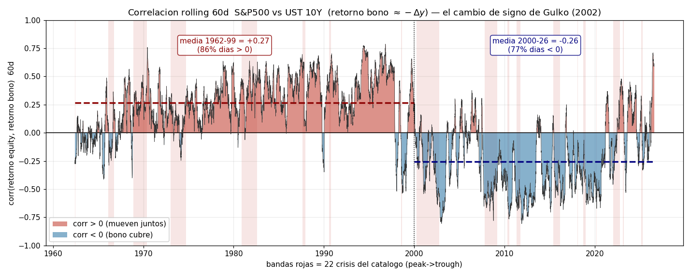
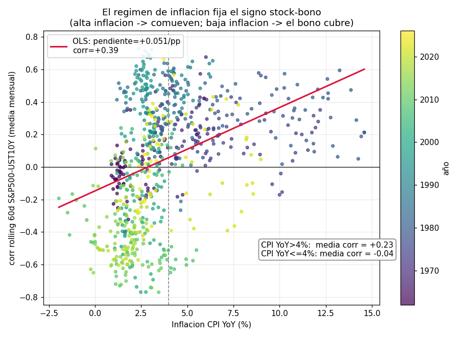
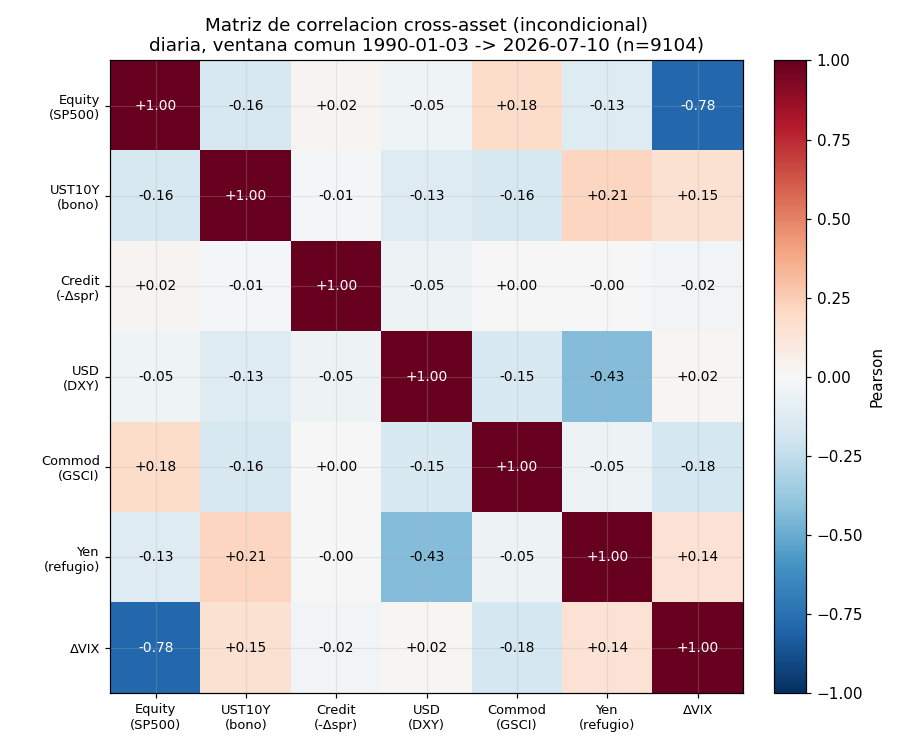
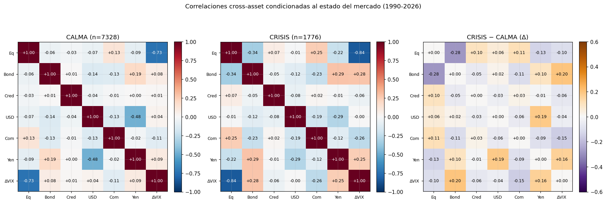
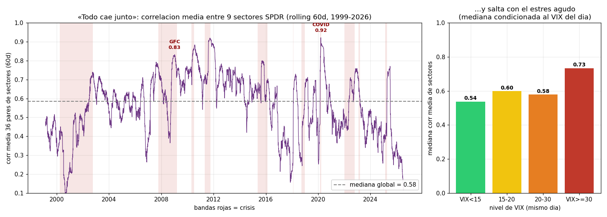
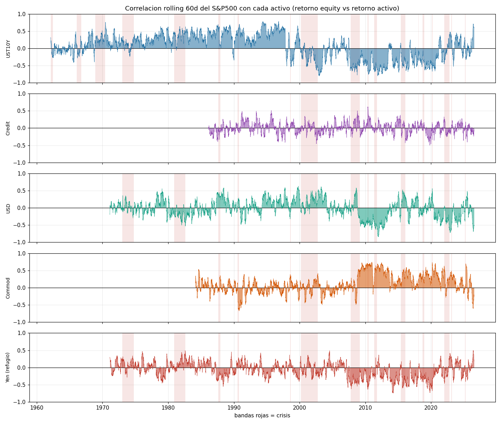
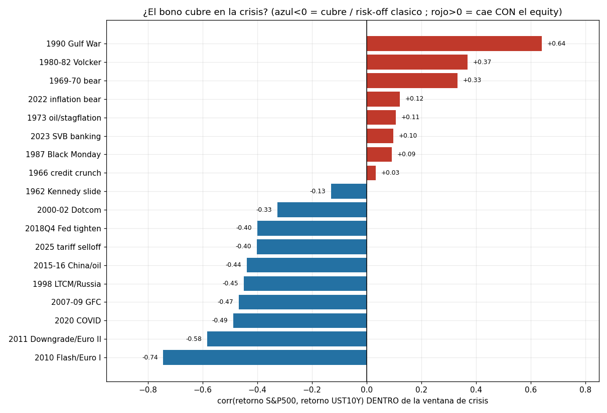

# EDA v2 — Correlaciones dinámicas cross-asset

**Slice:** `correlaciones_dinamicas` · **Proyecto:** detección de regímenes de mercado (TFM), Fase 3 (EDA profundo)
**Foco:** estructura de correlaciones cross-asset (equity / bonos / crédito / oro / dólar). Sobre todo: la **correlación rolling 60d S&P500–Treasuries y su cambio de SIGNO en el tiempo** (Gulko 2002), y cómo las correlaciones **colapsan/cambian en crisis** («todo cae junto»). Rolling 60d causal (ventana trasera).
**Datos:** `data/raw/<fuente>/<nombre>.parquet`. Series diarias del catálogo, `status=CACHE`. Solo lectura.

---

## TL;DR — las 7 cifras que hay que retener

1. **La correlación stock-bond cambió de signo, y no por poco.** Rolling 60d S&P500 vs UST 10Y: **media +0,27 en 1962-99** (85,7% de los días > 0) y **−0,26 en 2000-26** (77,2% de los días < 0). Muestra estática por eras: **+0,259** (1962-99, n=9.451) → **−0,286** (2000-26, n=6.625). Es el *decoupling* de Gulko (2002) medido en los datos. (fig 01)
2. **Lo que fija el signo es el régimen de inflación.** La correlación stock-bond mensual sube con la inflación: **corr(corr_SB, CPI YoY) = +0,39**, pendiente OLS **+0,051 por punto de CPI**. Con **CPI YoY > 4% la media es +0,23** (87,8% de meses positivos); con **CPI YoY ≤ 4% es −0,04**. Alta inflación → acciones y bonos caen juntos; baja inflación → el bono cubre. (fig 02)
3. **La matriz incondicional ESCONDE el régimen.** En 1990-2026 (n=9.104) la corr Equity-Bono estática es solo **−0,16** — un promedio engañoso de dos regímenes opuestos. Usar una matriz de correlación fija como feature es tirar la mitad de la señal. (fig 03)
4. **En crisis el bono cubre MÁS… de media.** Condicionando por estado: Equity-Bono pasa de **−0,06 (calma) a −0,34 (crisis)**; Equity-Yen de −0,09 a −0,22; Equity-Commodities de +0,13 a +0,25; Equity-ΔVIX de −0,73 a −0,84. La diversificación *entre* clases se reordena hacia flight-to-quality. (fig 04)
5. **…pero el hedge del bono FALLA justo en las crisis de inflación.** Correlación S&P500-UST10Y *dentro* de cada ventana de crisis: **negativa (cubre) en las crisis de crecimiento post-1998** (2010 Euro −0,74, 2011 −0,58, COVID −0,49, GFC −0,47, LTCM −0,45) y **positiva (el bono cae CON el equity) en las crisis inflacionarias** (1990 Gulf War +0,64, 1980-82 Volcker +0,37, 1969-70 +0,33, **2022 inflación +0,12**, 1973 estanflación +0,11). El «activo refugio» no es refugio en régimen inflacionario. (fig 07)
6. **«Todo cae junto» dentro del equity.** Correlación media entre los 9 sectores SPDR (36 pares, 60d) salta de **0,54 (VIX<15) a 0,73 (VIX≥30)**, con picos de **0,92 en COVID (16-mar-2020)** y **0,83 en la GFC (7-ene-2009)**. En el pánico agudo la diversificación intra-equity desaparece. (fig 05)
7. **El crédito diario de Moody's es un proxy muerto; su señal vive en baja frecuencia.** corr(Equity, retorno-crédito) = **+0,01 diaria → +0,07 semanal → +0,32 mensual**. El cambio diario del spread Baa-Aaa es demasiado *stale* para capturar co-movimiento; a nivel mensual el spread se abre cuando el equity cae (corr = **−0,32**, y −0,35 en meses de crisis).

**Consecuencia para el TFM:** la correlación cross-asset **no es un parámetro, es un estado**. Un detector que asuma una matriz de covarianza constante (o que la estime sobre toda la muestra) confundirá dos regímenes opuestos. La correlación stock-bono **rolling y con signo** (`corr_spx_bond`, ya en `src/features.py`) es una feature de primer orden: su signo separa el régimen inflacionario del de crecimiento, y su colapso a flight-to-quality (o su fallo) marca el tipo de crisis.

---

## 0. Universo analizado y honestidad sobre proxies

El foco pedía equity / bonos / crédito / **oro** / dólar. Contrastado contra `data/raw/` (`coverage_report.csv`, solo `status=CACHE`):

| pedido | disponible | qué se usó (signo: + = el activo gana) |
|---|---|---|
| **equity** | sí (`SP500` ^GSPC, 1927+; `SPDR_XL*` 9 sectores, 1998+) | retorno log de `SP500`; sectores para la correlación intra-equity |
| **bonos (Treasuries)** | solo **rendimientos** (`DGS10` 1962+); **no hay ETF/precio** (sin TLT/IEF) | **proxy retorno bono = −Δy** sobre `DGS10`. La duración es un escalar positivo → **irrelevante para el SIGNO de la correlación** (ver nota). |
| **crédito** | `MOODYS_BAA_AAA_SPREAD` (Baa-Aaa, 1986+); **no hay HYG** | **proxy retorno crédito = −Δ(spread)**. *Stale* en diario (§6). |
| **oro** | **NO** (ni `GLD` ni `GC=F`; solo `GVZ` = vol implícita del oro) | **no sustituible por oro**. Se usan dos *buckets* relacionados: **commodities** (`SPGSCI`, 1984+, activo real procíclico) y **yen** (`DEXJPUS`, 1971+, refugio clásico). Ver *Limitaciones*. |
| **dólar** | sí (`DXY` DX-Y.NYB, 1971+) | retorno log de `DXY` (+ = dólar fuerte) |
| — (añadido) | `VIX` (1990+) | ΔVIX como ancla del estado risk-on/off |

> **Nota sobre el proxy de bono y la robustez del signo.** El retorno de un bono ≈ −(duración modificada)·Δy. Como corr(r_equity, −k·Δy) = −corr(r_equity, Δy) para cualquier k>0, **el signo y la forma temporal de la correlación stock-bond NO dependen del valor de la duración**. El cambio de signo de Gulko (fig 01) es por tanto robusto a la ausencia de un precio de ETF de bonos. Solo las *magnitudes* de un retorno en % (no usadas aquí) requerirían fijar la duración.

> **Nota de causalidad.** Las correlaciones **rolling 60d son causales** (ventana trasera, `src.features.rolling_correlation`, `min_periods=30`): en `t` solo usan datos ≤ `t`. Las **matrices incondicional/condicional (figs 03-04, 07) son descriptivas del proceso** (correlación sobre la muestra completa o sobre subconjuntos por estado): caracterizan el DGP, no son features que entren al detector. La REGLA DE ORO (media/std causales) aplica a las features z-score de `src/features.py`, no a la descripción de la estructura de dependencia.

---

## 1. El cambio de signo de la correlación stock-bond (Gulko 2002)

La correlación rolling 60d entre el retorno del S&P500 y el retorno del UST 10Y (≈ −ΔDGS10) es el hallazgo central del slice. **Vivió en positivo casi todo 1962-1999 y volcó a negativo alrededor de 1998-2000**, donde se ha quedado mayoritariamente hasta hoy:

- **1962-1999: media = +0,27**, con el **85,7% de los días en positivo**. Acciones y bonos subían y bajaban *juntos* (ambos gobernados por sorpresas de inflación/tipos).
- **2000-2026: media = −0,26**, con el **77,2% de los días en negativo**. El bono pasó a ser cobertura: cuando el equity cae, los Treasuries suben (flight-to-quality).
- Muestra estática (una sola cifra por era): corr(r_equity, r_bono) = **+0,259** en 1962-99 vs **−0,286** en 2000-26.

Esto es exactamente el *decoupling* que Gulko (2002) documentó tras 1998. **Y no es permanente:** el tramo **2022-2023 vuelve a rojo (positivo)** en la figura — el shock inflacionario de 2022 reactivó el régimen «comueven». El signo es un *estado*, no una constante.

---

## 2. Qué gobierna el signo: el régimen de inflación

Cruzando la correlación stock-bond mensual con la inflación CPI YoY (`CPIAUCSL`), la relación es nítida y **explica el cambio de régimen de §1**:

- **corr(corr_SB, CPI YoY) = +0,39**; regresión OLS con **pendiente +0,051 por punto porcentual** de inflación.
- **CPI YoY > 4%: media de la correlación = +0,23** (87,8% de esos meses en positivo). En régimen inflacionario, un dato de inflación alta hunde a la vez bonos (suben yields) y acciones (sube la tasa de descuento) → **comueven**.
- **CPI YoY ≤ 4%: media = −0,04** (52,8% de meses en negativo). En régimen de inflación contenida domina el ciclo de crecimiento: mala noticia macro → equity abajo, bonos arriba → **el bono cubre**.

El coloreado por año lo confirma: los puntos pre-2000 (morado/azul, la Gran Inflación) pueblan la zona de correlación positiva; los 2000+ (verde/amarillo) la negativa. **La inflación es la variable de estado que enciende/apaga la cobertura del bono** — dato directamente relevante para etiquetar regímenes.

---

## 3. La matriz incondicional esconde el régimen

Matriz de correlación Pearson sobre retornos diarios, ventana común **1990-01 → 2026-07 (n=9.104)** (la limita el inicio del VIX):

- **Equity-Bono = −0,16.** Pero esta cifra única es la **media de +0,27 (pre-2000) y −0,26 (post-2000)**: describe un régimen que no existe. Es el argumento cuantitativo contra usar una matriz de covarianza fija en un detector.
- **Equity-ΔVIX = −0,78**: el eje risk-on/off más fuerte del panel (por construcción, el VIX es implícita del propio S&P).
- **Equity-Commodities = +0,18**, **Equity-Yen = −0,13**, **Equity-USD = −0,05**: los ejes cross-asset son *débiles en promedio* — precisamente porque su fuerza es **condicional al estado** (§4).
- **USD-Yen = −0,43** y **Bono-Yen = +0,21**: bloque de refugio (dólar y yen compiten como reserva; el yen acompaña al bono).
- **Crédito ≈ 0 con todo** (Equity-Crédito +0,02): artefacto del proxy diario *stale*, no un hecho económico (§6).

**Lectura:** salvo el par Equity-VIX, casi toda la estructura cross-asset interesante es invisible en la matriz incondicional. Hay que condicionar.

---

## 4. Correlaciones condicionadas: calma vs crisis

Partiendo los días 1990-2026 en **crisis** (dentro de alguna ventana peak→trough del `crisis_catalog`, n=1.776) vs **calma** (n=7.328), la estructura se reordena de forma sistemática (panel Δ = crisis − calma):

| par | calma | crisis | Δ | lectura |
|---|---:|---:|---:|---|
| Equity-Bono | −0,06 | **−0,34** | −0,28 | flight-to-quality se intensifica (de media) |
| Equity-Yen | −0,09 | **−0,22** | −0,13 | el yen refuerza su papel de refugio |
| Equity-Commod | +0,13 | **+0,25** | +0,11 | los activos reales caen más *con* el equity |
| Equity-ΔVIX | −0,73 | **−0,84** | −0,11 | el miedo se acopla más fuerte |
| Bono-ΔVIX | +0,08 | **+0,28** | +0,20 | el bono rallya cuando el VIX salta |
| USD-Yen | −0,48 | **−0,29** | +0,19 | dólar y yen dejan de competir: **ambos** se compran (los dos refugios suben) |
| Equity-USD | −0,07 | −0,01 | +0,06 | el dólar se desacopla del equity (flight-to-dollar) |
| Equity-Crédito | −0,03 | +0,07 | +0,10 | co-movimiento crédito↔equity emerge (débil, ver §6) |

El patrón medio es el de un régimen risk-off clásico: **los activos de riesgo (equity, commodities) se juntan; los refugios (bono, yen, dólar) se separan de ellos y se juntan entre sí.** Pero «de media» esconde la heterogeneidad por tipo de crisis — que es lo que revela §5.

---

## 5. «Todo cae junto»: colapso de la diversificación intra-equity

Correlación media por pares entre los **9 sectores SPDR** (XLK, XLF, XLE, XLV, XLI, XLY, XLP, XLU, XLB; 36 pares; rolling 60d, 1999-2026):

- Mediana global **0,58**, pero **condicionada al VIX salta con el estrés agudo**: VIX<15 → **0,54**, 15-20 → 0,60, 20-30 → 0,58, **VIX≥30 → 0,73**.
- **Picos en las crisis: 0,92 el 16-mar-2020 (COVID)** y **0,83 el 7-ene-2009 (GFC)**. En el pánico agudo la correlación media entre sectores se acerca a 1: no hay dónde esconderse *dentro* del equity.

> **Matiz honesto (echado a tierra).** La correlación media entre sectores **NO separa bien** crisis vs calma si se usa la ventana larga peak→trough (mediana 0,58 en ambos casos): esas ventanas incluyen tramos de recuperación con correlación ya normalizada. El colapso a ~0,9 es un fenómeno **de fase aguda** (días/semanas de VIX alto), no del bear market completo. Por eso el condicionamiento correcto es por **nivel de VIX**, no por «estar en un bear». Tampoco hay una tendencia secular limpia (medianas por bloque de 5 años: 0,48 en 1999-03, 0,74 en 2009-13, 0,40 en 2024-26): la correlación intra-equity es **cíclica/regímica, no monótona**.

---

## 6. Dinámica cross-asset en el tiempo y el crédito *stale*

Correlación rolling 60d del S&P500 con cada activo (misma construcción causal). Lecturas por panel:

- **UST10Y** — el ya conocido vuelco de signo ~2000 (§1), y el rebote positivo 2022-23.
- **Commodities** — pasa de oscilar en torno a 0 (pre-2008) a **persistentemente positiva (~+0,5) tras 2008**: la «financiarización» de las materias primas las metió en el eje risk-on/risk-off (media full-sample +0,12).
- **USD** — **se hunde a −0,6/−0,8 en la GFC (2008-09)** y de nuevo en varios episodios recientes: dólar arriba cuando el equity cae (flight-to-dollar), pero con signo inestable en calma (media −0,02).
- **Yen** — **persistentemente negativa tras 2007** (yen se aprecia en risk-off / unwind de carry; media −0,08).
- **Crédito (−Δspread Baa-Aaa)** — ruido en torno a 0 en toda la serie. **No es un hecho económico, es el proxy.**

**El crédito diario de Moody's es engañosamente plano.** Su co-movimiento con el equity es fuertemente **dependiente de la frecuencia**:

| frecuencia | corr(Equity, retorno-crédito = −Δspread) | n |
|---|---:|---:|
| diaria | **+0,010** | 10.158 |
| semanal | +0,072 | 2.115 |
| **mensual** | **+0,322** | 486 |

A nivel mensual, **el spread se abre cuando el equity cae** (corr(r_equity, +Δspread) = **−0,32**; y **−0,35 en meses de crisis** vs −0,24 en calma). La razón: los *yields seasoned* de Moody's son medias suavizadas; su primera diferencia diaria es casi todo microestructura/rezago. **Para un detector, el crédito no debe entrar como Δ diario de Moody's** — debe entrar a frecuencia semanal/mensual, o mejor con un instrumento cotizado a mercado (HYG/LQD), hoy ausente del universo.

---

## 7. El hedge del bono por crisis: cuándo el refugio falla

Correlación S&P500-UST10Y calculada **dentro** de cada ventana de crisis del catálogo (azul<0 = el bono cubre; rojo>0 = el bono cae *con* el equity). El resultado ordena las 22 crisis en dos familias que **coinciden con el régimen de inflación de §2**:

**El bono CUBRE (risk-off clásico) — todas post-1998, disinflación:**
2010 Euro I **−0,74**, 2011 Euro II −0,58, 2020 COVID −0,49, 2007-09 GFC −0,47, 1998 LTCM −0,45, 2015-16 −0,44, 2025 tariff −0,40, 2018Q4 −0,40, 2000-02 Dotcom −0,33.

**El bono FALLA (cae con el equity) — todas de régimen inflacionario:**
1990 Gulf War **+0,64**, 1980-82 Volcker +0,37, 1969-70 +0,33, **2022 inflación +0,12**, 1973 estanflación +0,11, 2023 SVB +0,10, 1987 Black Monday +0,09, 1966 credit crunch +0,03.

La línea divisoria es casi perfectamente cronológica/regímica: **antes de 1991 (y en 2022) el bono no cubrió; después de 1998 sí.** 2022 es el caso moderno de manual: la peor caída conjunta acción-bono en décadas ocurrió porque el shock era de inflación, no de crecimiento. *(Nota: 1987 y 2023-SVB son ventanas cortas y ruidosas; su +0,09/+0,10 es débil pero no contradice el patrón.)*

**Implicación:** el *tipo* de crisis (inflacionaria vs crecimiento) es separable observando el **signo de la correlación stock-bono contemporánea**. Un régimen «risk-off con bono cubriendo» y uno «risk-off con todo cayendo» son estados distintos que un detector debería distinguir — y la feature `corr_spx_bond` los distingue por construcción.

---

## 8. Implicaciones para la detección de regímenes

1. **La correlación es un estado latente, no un parámetro.** El signo de `corr_spx_bond` separa el régimen inflacionario (≥0) del de crecimiento (<0). Es una de las features más informativas del set base y debe entrar **con signo y rolling** (ya está así en `src/features.py`, `window=60`). No colapsarla a un promedio.
2. **Prohibido usar una matriz de covarianza de muestra completa.** El −0,16 incondicional Equity-Bono (§3) es la media de dos regímenes opuestos. Un HMM/GMM con emisión gaussiana debe estimar **covarianzas por estado** (correlación stock-bono positiva en el estado inflación, negativa en el estado crecimiento), no una global.
3. **Añadir una feature de «correlación media intra-equity» (VIX-condicionada).** El salto de 0,54→0,73 (fig 05) y los picos 0,83/0,92 son un termómetro de pánico agudo distinto del nivel del VIX. Candidata: `mean_pairwise_corr_sectors_60d` (o su versión sobre un basket amplio). Discrimina la fase aguda del bear largo.
4. **El crédito entra en baja frecuencia o no entra.** El Δ diario del spread Baa-Aaa es ruido (§6). Reamostrar a semanal/mensual, o descargar HYG/LQD para un retorno de crédito cotizado. La `credit_spread_z` declarada en `src/features.py` (basada en HYG-IEF) **hoy no es construible** con el raw actual.
5. **El régimen de inflación es una variable de estado macro de primer orden.** CPI YoY (o su nivel/aceleración) condiciona el signo de la cobertura del bono (§2, §7). Incluirla como feature macro de baja frecuencia ayuda a *anticipar* si la próxima crisis será de las que el bono cubre o de las que no.

**Features candidatas que salen de este slice** (a construir causalmente en `src/features.py`):
`corr_spx_bond` (ya existe; mantener con signo) · `mean_pairwise_corr_sectors_60d` (colapso intra-equity, VIX-condicionable) · `corr_spx_dxy_60d` y `corr_spx_yen_60d` (fuerza del refugio FX) · `credit_spread_change_weekly_z` (crédito a frecuencia útil) · `cpi_yoy_regime` (estado inflacionario que fija el signo stock-bono) · `n_assets_falling_together` (proxy de dispersión cross-asset).

---

## 9. Limitaciones y deuda

- **No hay oro en el universo.** El foco pedía oro explícitamente y **no existe ninguna serie de precio** de oro en `data/raw/` (solo `GVZ`, vol implícita, desde 2008). El oro es un refugio *sui generis* (real + monetario) que no equivale ni a commodities (procíclico) ni al yen. Se han usado ambos como aproximación del *bucket* real/refugio, pero **la conclusión sobre oro específicamente queda pendiente**. **Recomendación:** descargar `GLD`/`GC=F` (yfinance) — cierra el hueco del refugio real, barato.
- **Bonos sin precio de ETF.** El retorno del bono es un proxy por duración (−Δy). Robusto para el **signo** de las correlaciones (nota §0), pero no da un retorno total exacto; sin TLT/IEF no se puede medir la *magnitud* del P&L de cobertura ni separar duración de carry.
- **Crédito diario *stale*** (§6): el Δ del spread Baa-Aaa infravalora el co-movimiento por 30× frente al mensual. Sin HYG/LQD, el crédito solo es fiable a baja frecuencia.
- **Ventana de la matriz incondicional limitada a 1990** por incluir el VIX. Sin VIX, crédito arrancaría en 1986 y el resto (bono/dólar/yen/commodities) en 1984 o antes. Las conclusiones de signo (§1) usan la historia completa 1962+ y no dependen de esta ventana.
- **El `crisis_catalog` mezcla tipos de crisis** (inflacionarias vs crecimiento, agudas vs bear largos). Por eso los promedios condicionales (§4) suavizan el patrón que §7 desagrega por evento. La lección es metodológica: para el detector, **condicionar por VIX/estado agudo separa mejor que condicionar por «bear market»**.
- **Correlaciones = dependencia lineal.** En colas (días de crash) la dependencia es no-lineal y más fuerte que Pearson (ver slice `hechos_estilizados`: ν≈2,5). La correlación de cola (tail dependence) sería un complemento; aquí se mide co-movimiento lineal rolling, apropiado como feature pero no como medida de riesgo de cola conjunto.

---

*Reproducibilidad: 7 figuras en `notebooks/eda_v2/figs/correlaciones_dinamicas/` (dpi=110). Cálculos sobre `data/raw/` en modo solo-lectura. Correlaciones rolling vía `src.features.rolling_correlation` (window=60, min_periods=30, causal); matrices vía `pandas.DataFrame.corr` (Pearson). Retorno bono = −ΔDGS10; retorno crédito = −Δ(Baa-Aaa); retorno yen = −Δlog(USDJPY). Ventanas de crisis: `data/catalog.yaml → crisis_catalog.eventos`.*
