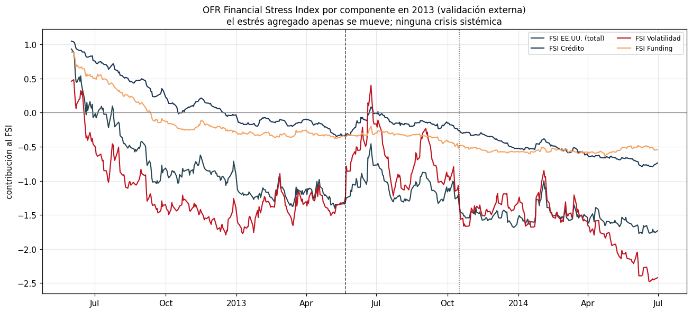
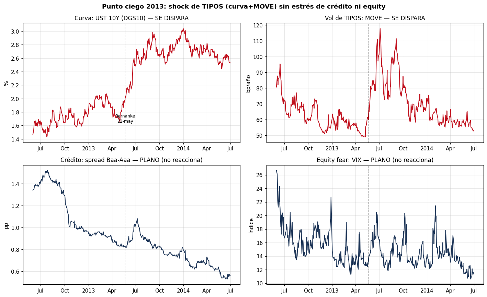
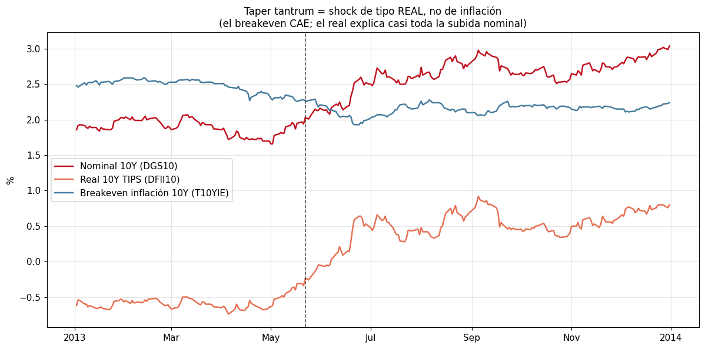
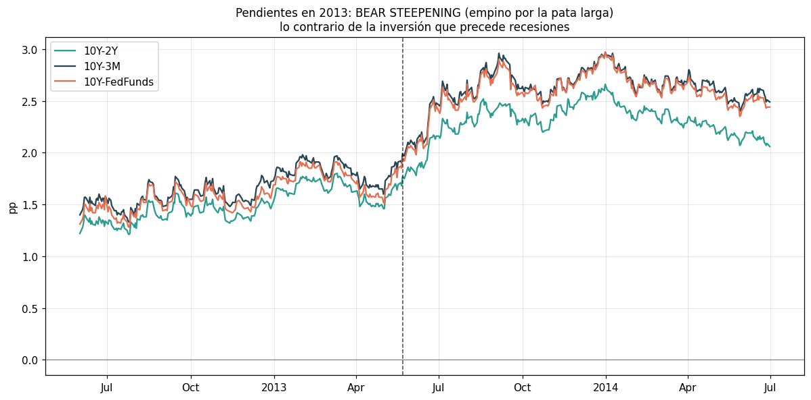
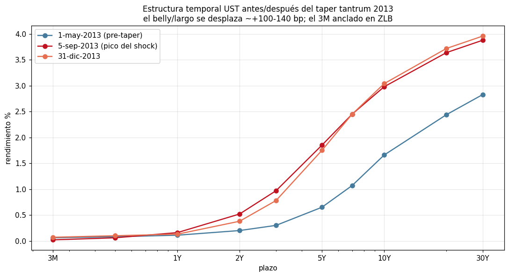
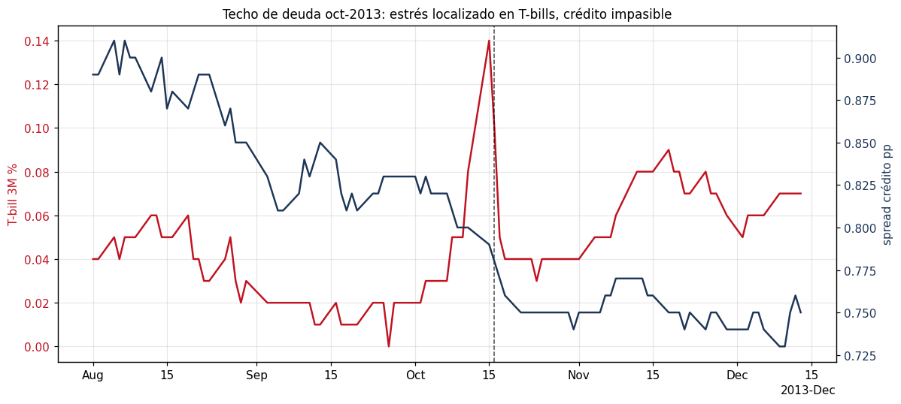
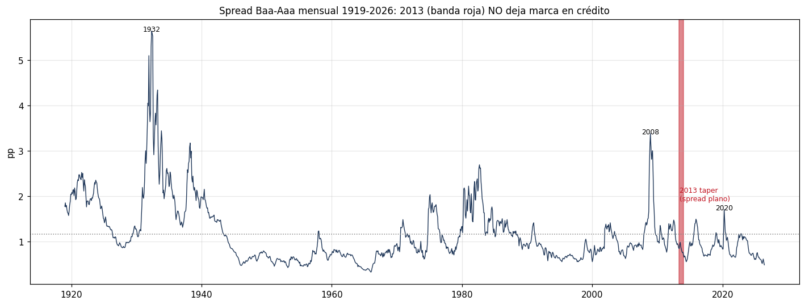

# EDA — Crédito y curva de tipos, con foco en el PUNTO CIEGO 2013

**Slice:** `credito_curva_2013` · **Fase 3 (EDA profundo)** · datos solo-lectura (`data/raw/`),
transformaciones causales (`src/features.causal_zscore`, expanding).

**Pregunta clave:** ¿marcan el crédito o la curva el año 2013 (taper tantrum)? ¿Y en qué se
diferencia 2013 de las crisis sistémicas?

**Respuesta corta:** **La CURVA marca 2013 con fuerza; el CRÉDITO no lo marca en absoluto.** El
taper tantrum de 2013 fue un **shock de TIPOS puro** (subida de rendimientos reales + volatilidad
de tipos) **sin estrés de crédito ni de equity**. Es la firma opuesta a la de una crisis sistémica,
donde los Treasuries *rallyan* (yields BAJAN, flight-to-quality) y los spreads de crédito se
disparan. Por eso la Capa 1 (equity/vol/crédito) no lo vio: **no hubo nada que ver en su espacio de
features**. La única señal causal que dispara en 2013 es la **velocidad de los tipos reales / MOVE**.

---

## 0. Por qué 2013 es un "punto ciego" — no está ni en el catálogo de crisis

`data/catalog.yaml → crisis_catalog.eventos` (22 crisis peak→trough del S&P500) **salta de
`us_downgrade_euro2_2011` (2011-04-29 → 2011-10-03) directamente a `china_oil_2015_16`
(2015-05-21)**. No hay ningún evento en 2013. Motivo: el drawdown del S&P500 en la ventana del taper
(2013-05-01 → 2013-09-13) fue de solo **−5.76%**, por debajo del umbral de cualquier etiqueta basada
en equity. El label de crisis del proyecto es, por construcción, ciego a 2013.

La validación externa lo confirma: el **OFR Financial Stress Index de EE.UU. (`OFR_FSI_US`) se
mantuvo NEGATIVO todo 2013** (mín −1.68, máx −0.46), es decir, estrés por debajo de la media *todo el
año*. El componente de crédito (`OFR_FSI_CREDIT`) llegó a un máximo de **0.08** (esencialmente cero)
y el de volatilidad (`OFR_FSI_VOLATILITY`) a **0.40**. Ningún índice de estrés agregado marcó 2013.

---

## 1. El punto ciego en cuatro paneles: la curva se dispara, crédito y equity ni se enteran

Ventana 2012-06 → 2014-06. Línea vertical = testimonio de Bernanke, **2013-05-22** (disparo del taper).

- **UST 10Y (`DGS10`)**: **1.66%** (mín 2013-05-01) → **2.98%** (máx 2013-09-05) = **+132 bp**.
- **MOVE (vol implícita de TIPOS)**: **49** (2013-05-01) → **117.9** (pico) = más que se **duplica**.
- **Spread crédito Baa-Aaa (`MOODYS_BAA_AAA_SPREAD`)**: **0.83 → 0.85 pp**, rango total del episodio
  solo **0.27 pp**. Plano.
- **VIX**: **14.5 → máx 20.5 → 14.2**. En **todo 2013 el VIX superó 20 solo 3 días de 252**.

La asimetría es el hallazgo central: el shock vive **entero** en el bloque de tipos (curva + MOVE) y
**cero** en el bloque de riesgo (crédito + equity).

---

## 2. Fue un shock de tipo REAL, no de inflación (descomposición nominal = real + breakeven)

Del 2013-05-01 al 2013-09-13:

- **Rendimiento real 10Y (`DFII10`, TIPS): −0.64% → +0.80% = +144 bp.**
- **Breakeven de inflación 10Y (`T10YIE`): 2.30% → 2.10% = −20 bp** (¡CAE!).
- Nominal 10Y: +124–132 bp.

El **rendimiento real hace TODO el trabajo** (+144 bp) mientras las expectativas de inflación
**bajan**. Esto es un re-precio de la política monetaria / term premium (fin de la expansión de QE),
no un susto inflacionario. Un detector que confunda "subida de tipos" con "régimen inflacionario" se
equivocaría de causa en 2013.

---

## 3. La curva hizo BEAR STEEPENING (empino), no inversión

La pata larga subió más que la corta (anclada por el ZLB / forward guidance de la Fed):

- **`T10Y2Y`: 1.46 → 2.52** (máx 2013-08-19), empino de **+106 bp** (concuerda con la nota del
  catálogo "empino en taper tantrum 2013 1.46→2.46").
- **`T10Y3M`: 1.60 → 2.96** (máx 2013-09-05).
- Por plazo: **DGS2 +32 bp**, **DGS5 +120 bp**, **DGS10 +132 bp**, **DGS30 +108 bp** — el golpe se
  concentra en el *belly* y el largo; el 3M sigue clavado en el ZLB.

Matiz de régimen importante: **la pendiente en 2013 era MUY POSITIVA y se empinaba** — señal que un
modelo de curva leería como "expansión / risk-on", lo contrario de una alarma. La *inversión* (señal
de recesión) no aparece por ningún lado. Por eso el **nivel** de la pendiente es una feature engañosa
para 2013; lo informativo es la **velocidad** del empino, no su signo.

---

## 4. Coletazo de octubre: techo de deuda = estrés localizado en T-bills, crédito impasible

El impasse del techo de deuda (resuelto 2013-10-16) provocó un pico **local** en el T-bill 3M:
**`DTB3` 0.00% (2013-09-26) → 0.14% (2013-10-15)** — los bills con vencimiento en la zona de riesgo
de impago se abarataron/encarecieron puntualmente. El spread de crédito Baa-Aaa **no se movió**
(delta ≈ 0.00 pp en la ventana). Fue un micro-evento de *funding/soberano técnico*, no de crédito
corporativo.

---

## 5. 2013 vs crisis sistémicas: cuadrantes opuestos

Para cada ventana (peak→trough del catálogo, o taper custom): Δ del spread de crédito hasta su máximo,
Δ del 10Y con signo (negativo = flight-to-quality), pico de MOVE y VIX, y drawdown del S&P500.

| Evento | Tipo | Δ crédito Baa-Aaa (pp) | Δ 10Y (pp, con signo) | MOVE máx | VIX máx | Drawdown SPX |
|---|---|--:|--:|--:|--:|--:|
| **taper_2013** | shock tipos | **+0.25** | **+1.24** ↑ | 117.9 | **20.5** | **−5.8%** |
| debtceiling_2013 | shock funding | +0.00 | −0.27 | 94.5 | 20.3 | −4.1% |
| gfc_2008 | sistémica | **+2.71** | **−1.78** ↓ | 264.6 | 80.9 | −56.8% |
| covid_2020 | sistémica | +0.68 | −0.80 ↓ | 163.7 | 82.7 | −33.9% |
| euro_2011 | sistémica | +0.50 | −1.52 ↓ | 117.8 | 48.0 | −19.4% |
| dotcom_2002 | sistémica | +0.75 | −2.59 ↓ | n/d | 45.1 | −49.2% |
| inflbear_2022 | bear tipos | +0.54 | **+2.28** ↑ | 160.7 | 36.5 | −25.4% |
| svb_2023 | crédito/banca | +0.08 | +0.15 | 173.6 | 26.5 | −7.8% |
| volmageddon_2018 | vol spike | +0.04 | +0.19 | 67.9 | 37.3 | −10.2% |

*(Datos: `notebooks/eda_v2/figs/credito_curva_2013/_comparativa.csv`.)*

**Lectura de la firma:**
1. **Crisis sistémicas → los Treasuries RALLYAN (Δ10Y NEGATIVO) y el crédito SE DISPARA.** GFC:
   crédito **+2.71 pp**, 10Y **−1.78**, VIX **81**. COVID, euro, dotcom: todas en el cuadrante
   "yields↓ / crédito↑".
2. **2013 está solo en el cuadrante "yields↑ / crédito plano"** (Δ10Y **+1.24**, crédito **+0.25**).
   El único vecino en la mitad derecha es **inflbear_2022** — que también fue un shock de tipos
   (Δ10Y +2.28), **pero ese sí hizo daño al equity (VIX 36, drawdown −25%)** y por eso *sí* está en
   el catálogo de crisis. 2013 es el caso puro: **la misma dirección de tipos, cero daño al riesgo**.
3. **`BAA10Y` (Baa − Treasury 10Y) incluso CAYÓ en el taper** (2.82 → 2.64 al 13-sep): como el 10Y
   subió más rápido que el yield Baa, el spread crédito-vs-tipo se *comprimió*. Otra confirmación de
   que el crédito estaba tranquilo mientras la curva se movía.

En perspectiva secular: el **spread Baa-Aaa mensual (1919+)** promedió **0.87 pp en 2013**, *por
debajo* de su media histórica de **1.16 pp** y muy lejos del máximo de **3.38** de 2008-09. En la
memoria larga del crédito, **2013 es un año por debajo de lo normal — invisible**.

---

## 6. ¿Dispararía un detector CAUSAL en 2013? Sí, pero solo si mira la VELOCIDAD de los tipos

Z-scores **causales** (expanding, `causal_zscore`), pico dentro del taper (2013-05-22 → 2013-09-30):

| Feature causal | z máx en el taper | ¿dispara? |
|---|--:|:--|
| **`DFII10` (real 10Y) cambio 20d** | **3.83** | **SÍ (fuerte)** |
| **`MOVE` cambio 5d** | **3.34** | **SÍ (fuerte)** |
| **Δ`DGS10` diario** | **3.11** | **SÍ** |
| `DGS10` nivel cambio 20d | 1.91 | débil |
| `T10Y3M` cambio 20d (empino) | 1.87 | débil |
| `MOVE` **nivel** | 0.64 | **NO** (base expanding ya alta tras 2011) |
| `T10Y3M` **nivel** (pendiente) | 0.97 | NO (y en dirección "benigna") |
| **`BAA10Y` cambio 20d (crédito)** | 0.93 | **NO** |
| **Baa-Aaa nivel (crédito)** | 0.21 | **NO** |
| **VIX nivel** | 0.02 | **NO** |

**Conclusiones para el diseño de features (Pista B):**
- Un detector con features de **crédito + equity/VIX** (estilo Capa 1) está **estructuralmente ciego a
  2013**: sus z-scores causales son ~0 (Baa-Aaa z=0.21, VIX z=0.02).
- **El MOVE por NIVEL tampoco basta** (z=0.64): tras la crisis del euro de 2011 su base expanding
  quedó elevada, así que el nivel de 2013 no destaca. **Lo que discrimina es la VELOCIDAD/CAMBIO**:
  cambio 20d del rendimiento REAL (`DFII10`, **z=3.83**), cambio 5d del MOVE (**z=3.34**) y Δ10Y
  diario (**z=3.11**).
- El **nivel de la pendiente** (`T10Y3M`) es engañoso en 2013 (z=0.97 y en la dirección "expansión");
  el **cambio** de la pendiente (empino, z=1.87) es más informativo pero más débil que el real-yield.

**Features candidatas recomendadas para capturar el régimen "shock de tipos"** (hoy `src/features.py`
solo tiene `MOVE_level_z` y `yield_slope_z` de *nivel*, ambas flojas en 2013):
`DFII10_change_z` (velocidad del tipo real), `MOVE_change_z` (aceleración de la vol de tipos) y
`DGS10_change_z` (velocidad del nominal). Estas tres son las que separan 2013 del ruido.

---

## 7. Limitaciones y notas de datos honestas

- **HYG-IEF no está descargado.** El prompt pedía el spread HYG-IEF, pero ni `HYG` ni `IEF` aparecen
  en `coverage_report.csv` (aunque `src/features.py` los referencia — deuda técnica: el `build_features`
  actual fallaría con el panel real). Como proxy de crédito uso las series verificadas del catálogo
  (`notas_globales`): **Moody's Baa-Aaa diario (1986+)** y **BAA10Y**. Para 2013 la conclusión es
  robusta a esta sustitución: el HY (JNK/HYG) en 2013 también estuvo tranquilo (fue año de "reach for
  yield"), así que un spread HY no cambiaría el diagnóstico de "crédito plano".
- **MOVE empieza 2002-11-12**, así que la comparativa de vol de tipos no cubre dotcom_2002 en su
  totalidad (MOVE_max = n/d ahí) ni crisis anteriores. La conclusión de "curva marca, crédito no" en
  2013 no depende de esto.
- Ventana del taper elegida a mano (2013-05-01 → 2013-09-13, del mínimo pre-Bernanke al entorno del
  pico de septiembre). Los picos exactos (10Y máx 2013-09-05; T10Y2Y máx 2013-08-19) están reportados
  con su fecha para que sean recomputables.
- Todas las transformaciones z son **causales** (expanding, `min_periods=60`); ningún estadístico usa
  la muestra completa.

---

## TL;DR (una frase por hallazgo)

1. **2013 no está en el catálogo de crisis** porque el S&P500 solo cayó −5.76%; el label equity es
   ciego a él.
2. **La curva SÍ marca 2013**: 10Y +132 bp (1.66→2.98), MOVE ×2.4 (49→118), real-yield +144 bp.
3. **El crédito NO marca 2013**: Baa-Aaa plano (+0.27 pp de rango, media anual 0.87 pp *por debajo*
   de su media histórica 1.16); BAA10Y incluso cae.
4. **Fue tipo REAL, no inflación** (DFII10 +144 bp; breakeven T10YIE −20 bp) y **bear steepening**, no
   inversión.
5. **Firma opuesta a las sistémicas**: en GFC/COVID/euro/dotcom los yields BAJAN (flight-to-quality)
   y el crédito SUBE; en 2013 los yields SUBEN y el crédito no se mueve.
6. **Un detector causal captura 2013 solo con VELOCIDAD de tipos** (DFII10_chg z=3.83, MOVE_chg
   z=3.34, Δ10Y z=3.11); crédito y VIX dan z≈0 → hay que añadir features de *cambio* de tipos/real/MOVE
   a la Pista B.
