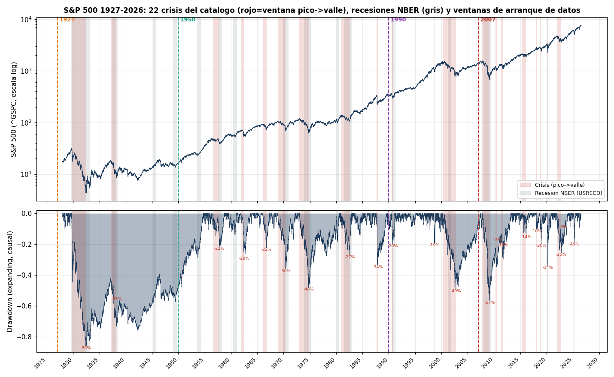
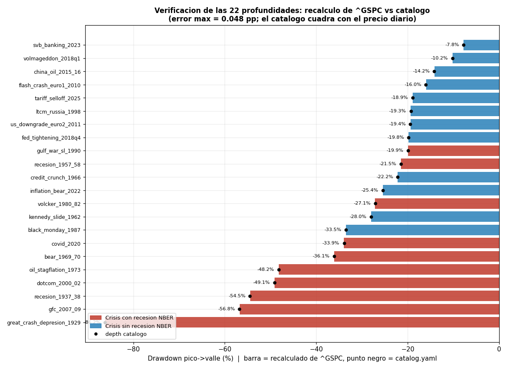
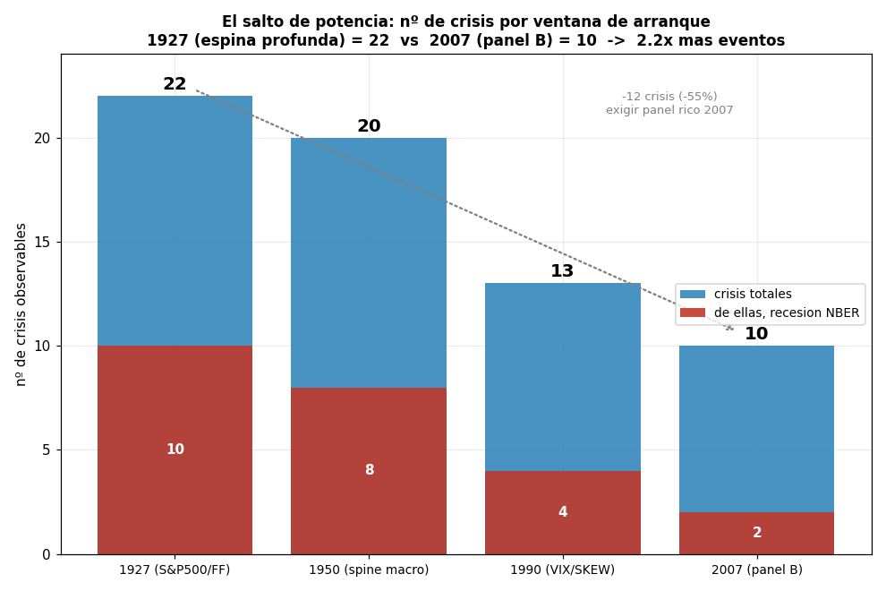
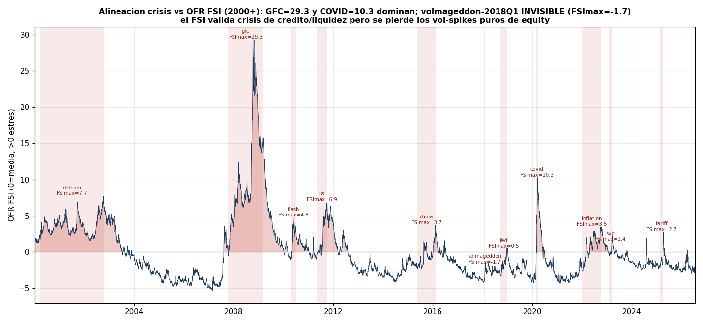
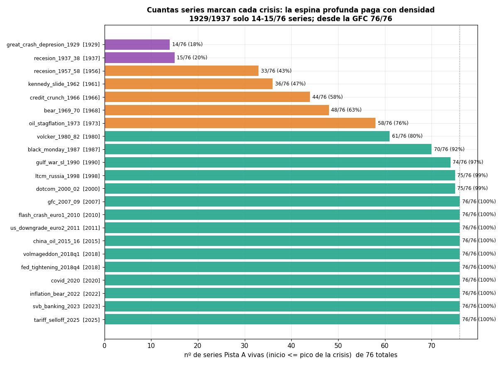
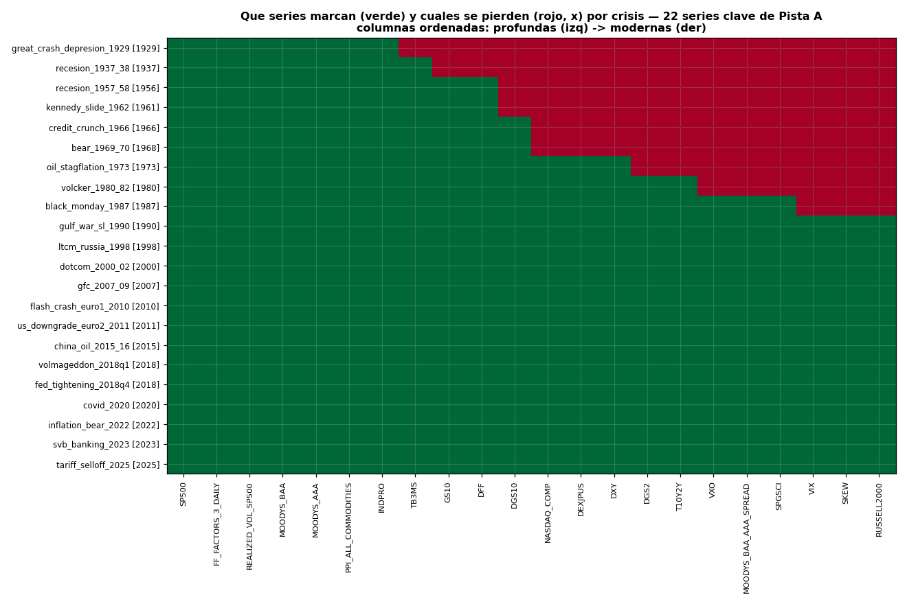

# Slice EDA — `crisis_espina_profunda`

**Foco:** PISTA A y el catálogo de 22 crisis. S&P 500 (`^GSPC`) desde 1927, drawdowns pico→valle,
alineación de cada crisis con NBER (`USRECD`) y OFR FSI (2000+), y el **salto de potencia**: cuántas
crisis ve cada ventana de arranque (1927 / 1950 / 1990 / 2007) y qué series marcan cada una.

**Datos usados (solo lectura):**
`data/raw/yfinance/SP500.parquet` (`^GSPC`, 24 752 filas, 1927-12-30 → 2026-07-17),
`data/raw/fred/NBER_RECESSION_DAILY.parquet` (`USRECD`, 62 674 filas desde 1854),
`data/raw/ofr/OFR_FSI.parquet` (6 715 filas, 2000-01-03 → 2026-07-15),
`data/catalog.yaml → crisis_catalog.eventos` (22 crisis) y `data/raw/coverage_report.csv` (inventario
de 76 series vivas de Pista A).

---

## TL;DR (echado a tierra)

1. **Las 22 profundidades del catálogo cuadran con el precio diario.** Recalculando el drawdown pico→valle
   directamente de `^GSPC`, el **error máximo es 0.048 pp** (peor caso `svb_banking_2023`: catálogo -7.8%
   vs recálculo -7.75%). El `crisis_catalog` es fiel al dato, no un pegado a mano.
2. **El salto de potencia es real y grande:** la espina 1927 ve **22 crisis**; el panel B de 2007 solo **10**.
   Ir profundo **2.2× los eventos** y, en recesiones NBER, **5×** (10 vs 2). Ver Fig. 3.
3. **Precio se paga en densidad de features:** 1929 y 1937 solo tienen **14–15 de 76 series** vivas (18–20%);
   desde la GFC-2007, **76/76 (100%)**. Las crisis profundas solo se pueden caracterizar con equity +
   spread de crédito mensual + macro mensual. Ver Fig. 4 y 5.
4. **NBER etiqueta 10 de 22 crisis**, pero el mercado **lidera** la recesión: en 3 crisis NBER la ventana
   pico→valle solapa <30% con `USRECD` (el S&P cae antes de que empiece la recesión oficial).
5. **OFR FSI solo puede juzgar 11 de 22 crisis** (arranca en 2000). Domina la GFC (**FSImax=29.3**) y COVID
   (**10.3**), pero **`volmageddon_2018q1` es INVISIBLE al FSI** (FSImax=**-1.7**, por debajo de la media):
   un vol-spike puro de equity no mueve un índice de estrés multi-mercado. Ver Fig. 6.

---

## 1 · S&P 500, drawdowns y las 22 crisis (1927–2026)

El panel superior es `^GSPC` en escala log; el inferior es el drawdown corriente (máximo *expanding*, causal —
`src.features.drawdown`). En rojo, las 22 ventanas pico→valle del catálogo; en gris, las recesiones NBER
(`USRECD`); las verticales marcan las 4 ventanas de arranque de datos.

- La escala del problema: **1929 (-86.2%)** y **1937 (-54.5%)** dominan cualquier estadístico de cola. Sin
  ellas, la peor crisis es la **GFC-2007 (-56.8%)** y luego **dotcom (-49.1%)** y **oil/stagflation-1973 (-48.2%)**.
- Depth media de las 22 = **-30.4%**; mínimo **-7.8%** (`svb_banking_2023`), máximo **-86.2%** (1929).
  Duración mediana pico→valle = **218 días**.
- Visualmente se ve por qué la espina profunda importa: **~2/3 de los episodios rojos ocurren antes de 1990**,
  justo la zona donde el panel rico moderno no existe.

## 2 · Verificación de las profundidades (¿el catálogo miente?)

Para cada crisis recalculo `min(precio en [peak,trough]) / precio(peak) - 1` sobre `^GSPC` (barra) y lo comparo
con `depth` del catálogo (punto negro). **Coinciden en las 22**: error máximo **0.048 pp**, error típico ~0.03 pp.
Conclusión: `crisis_catalog.eventos` está datado sobre el mismo `^GSPC` que tenemos en `raw/` y sirve como
etiqueta de evento sin reservas. (Las 4 crisis con `trough < 2000` no son calificables por OFR, ver §4.)

## 3 · El salto de potencia: nº de crisis por ventana

Contando crisis por **año del pico ≥ inicio de ventana**:

| Ventana de arranque | Series ancla | nº crisis | de ellas NBER |
|---|---|---:|---:|
| **1927** | `SP500` (1927-12-30), `FF_FACTORS_3_DAILY` (1926), `REALIZED_VOL_SP500` (1928) | **22** | 10 |
| **1950** | espina macro/curva/crédito mensual (`GS10` 1953, `DFF` 1954, `TB3MS` 1934) | **20** | 8 |
| **1990** | `VIX`, `SKEW` (1990-01-02) | **13** | 4 |
| **2007** | panel B rico (crédito/curva/vol multi-activo) | **10** | 2 |

- **1927 → 2007: -12 crisis (-55%)** y **-8 recesiones NBER (-80%)**. Este es el argumento cuantitativo de
  ADR-001: exigir el panel rico multi-activo tira a la basura más de la mitad de los eventos.
- El escalón más caro es **1950 → 1990**: se pierden **7 crisis** (1957, 1962, 1966, 1969-70, 1973, 1980-82,
  1987), es decir toda la textura de estanflación y el crash del 87, por depender de `VIX`/`SKEW`.
- Un detector de régimen que use el set diario "rico" de `src/features.py` (`VIX` 1990, `MOVE` 2002-11,
  `HYG`/`IEF`/`TLT` ETFs ~2002–2007) queda de hecho **atado a ≤13 crisis**; el `MOVE`/`HYG` lo bajan a ~10.
  La espina pura de equity (`SP500` + drawdown + vol realizada) ve **las 22**.

## 4 · Alineación con NBER y OFR FSI

**NBER (`USRECD`, diario).** El catálogo marca `nber: true` en **10 de 22** crisis. Pero la ventana de
drawdown del *mercado* y la ventana de recesión *económica* no coinciden — **el mercado lidera**:

| Crisis (NBER=true) | Solape ventana∩recesión | Lectura |
|---|---:|---|
| `recesion_1957_58` | **11.6%** | pico de bolsa (ago-1956) ~1 año antes de la recesión (ago-1957) |
| `dotcom_2000_02` | **26.2%** | bolsa cae mar-2000; recesión NBER solo mar–nov 2001 |
| `bear_1969_70` | **26.8%** | mercado se adelanta al techo del ciclo |
| `gfc_2007_09` | 83.8% | solape alto (recesión larga dic-2007→jun-2009) |
| `great_crash_1929` | 100% | drawdown cubre toda la Gran Depresión |

→ Implicación de diseño: **NBER como label de crisis introduce lag**; para regímenes de *mercado* la etiqueta
de drawdown del `crisis_catalog` es más puntual que `USREC`/`USRECD`. Úsense como labels complementarios, no
intercambiables.

**OFR FSI (2000+).**

Solo **11 de 22** crisis tienen `trough ≥ 2000-01-03` y son calificables por el FSI. Máximo del FSI dentro de
cada ventana (ordenado):

| Crisis | FSImax en ventana | ¿marca estrés? |
|---|---:|---|
| `gfc_2007_09` | **29.32** | sí, extremo |
| `covid_2020` | **10.27** | sí, extremo |
| `dotcom_2000_02` | 7.73 | sí (FSI ya empieza alto en 2000) |
| `us_downgrade_euro2_2011` | 6.89 | sí |
| `flash_crash_euro1_2010` | 4.76 | sí |
| `china_oil_2015_16` | 3.71 | sí, moderado |
| `inflation_bear_2022` | 3.47 | sí, moderado |
| `tariff_selloff_2025` | 2.74 | sí, leve |
| `svb_banking_2023` | 1.43 | leve (catálogo ya lo marca `sub_threshold_index`) |
| `fed_tightening_2018q4` | 0.47 | apenas roza la media |
| `volmageddon_2018q1` | **-1.74** | **NO — invisible al FSI** |

→ `volmageddon_2018q1` (drawdown -10.2%, `tipo: vol_spike`) es un shock de **vol de equity puro y brevísimo**
(13 días): el OFR FSI, construido de 33 variables multi-mercado, ni se entera. Confirma que **un FSI de crédito/
liquidez no es sustituto de un sensor de vol** (VIX/realized vol) para este tipo de evento. `fed_tightening_2018q4`
también queda casi mudo (0.47). Ambos son puntos ciegos del ground-truth de estrés que **la espina de vol de
Pista A sí captura**.

## 5 · Qué series marcan cada crisis y cuáles se pierden

Contando series de Pista A (`pista ∈ {A, ambas}`, status OK/CACHE = **76 series**) con `inicio ≤ pico`:

- **1929: 14/76 (18%)** · **1937: 15/76 (20%)** — data-desierto.
- Escalón grande en **1957 (33/76, 43%)** cuando entran la curva/crédito mensual.
- **≥ GFC-2007: 76/76 (100%)** — todas las features disponibles.

La escalera de disponibilidad de 22 series clave (verde=viva, rojo=aún no existe). **Lo que marca las crisis
profundas (1929/1937)** es un puñado de spines de baja frecuencia:

- **Vivas en 1929:** `SP500` (precio, 1927), `FF_FACTORS_3_DAILY` (Mkt-RF, 1926), `REALIZED_VOL_SP500` (1927),
  `MOODYS_BAA`/`MOODYS_AAA` (spread de crédito mensual, 1919), `PPI_ALL_COMMODITIES` (1913), `INDPRO` (1919).
  → equity (retorno + vol) + **spread Baa-Aaa mensual** + macro mensual. Nada más.
- **Se pierden en 1929/1937 (rojo):** toda la volatilidad implícita (`VXO` 1986, `VIX`/`SKEW` 1990), la curva
  diaria (`DGS10` 1962, `DGS2`/`T10Y2Y` 1976), el crédito diario (`MOODYS_BAA_AAA_SPREAD` 1986), FX
  (`DXY`/`DEXJPUS` 1971), commodities diarios (`SPGSCI` 1984), amplitud (`NASDAQ_COMP` 1971, `RUSSELL2000`
  1987) y **todos los validadores de estrés** (`OFR_FSI` 2000, `NFCI` 1971, `KCFSI` 1990, `STLFSI4` 1993).
- `TB3MS` (1934) es el primer refuerzo: existe para 1937 pero **no** para 1929.
- El frente moderno se completa hacia **1990** (`VIX`/`SKEW`) → el `gulf_war_1990` ya tiene 74/76 y desde
  la GFC no falta nada.

---

## Consecuencias para el TFM (decisión de features / benchmark)

1. **Pista A justificada numéricamente.** La profundidad no es cosmética: da **22 vs 10 crisis** y **10 vs 2
   recesiones NBER** frente al panel de 2007. Para tener potencia estadística (n de eventos) hay que aceptar
   un set de features pobre pre-1990.
2. **El set diario de `src/features.py` está sesgado hacia crisis modernas.** Al depender de `VIX`(1990)/
   `MOVE`(2002)/`HYG`(~2007) solo ve ~10-13 crisis. Para explotar la espina profunda hay que definir un
   **set reducido causal 1927+**: `SP500_ret_z`, `SP500_vol_z` (vol realizada), `SP500_drawdown`,
   `SP500_momentum` + spread **Baa-Aaa mensual** (forward-fill causal) + `INDPRO`/`PPI` YoY. Todo con
   primitivas ya existentes en `features.py`.
3. **Labels de crisis: usar `crisis_catalog` (drawdown) como primario** — es puntual y verificado a 0.05 pp —
   y `USRECD`/OFR FSI como *validación laxa*, sabiendo que (a) NBER llega tarde (mercado lidera, solape <30%
   en 3 casos) y (b) OFR solo cubre 2000+ y es ciego a vol-spikes de equity (`volmageddon` FSImax=-1.7).
4. **Punto ciego confirmado:** los eventos `vol_spike`/correcciones rápidas (`volmageddon_2018q1`,
   `fed_tightening_2018q4`) son los que peor detecta cualquier índice de estrés multi-mercado; son el caso de
   uso natural de un sensor de vol dedicado, no de un FSI.

## Reproducibilidad / límites

- Scripts: `scratchpad/analisis_crisis.py` (tabla de crisis, ventanas, cobertura) y
  `scratchpad/figuras_crisis.py` (6 figuras). Todo causal / solo lectura sobre `data/`.
- Ventanas contadas por **año del pico** (`peak.year ≥ inicio_ventana`); las anclas de cada ventana son series
  reales del catálogo, no fechas redondas arbitrarias.
- "76 series de Pista A" = filas con `pista ∈ {A, ambas}` y `status ∈ {OK,CACHE}` en `coverage_report.csv`
  (el catálogo declara 77; una candidata `SHILLER_LONGRATE`/errores quedan fuera).
- El drawdown de `^GSPC` es **precio, no total-return**; las profundidades pre-1988 no incluyen dividendos
  (irrelevante para datar picos/valles, relevante si se compara magnitud con series TR).
- OFR FSI arranca **2000-01-03**; para `dotcom_2000_02` el FSImax=7.73 puede estar truncado por la izquierda
  (el pico de estrés real del dotcom pudo ser previo al inicio de la serie).
