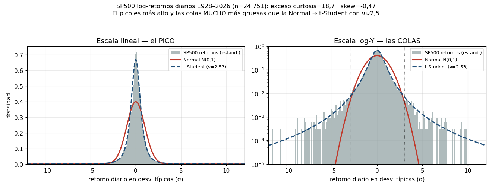
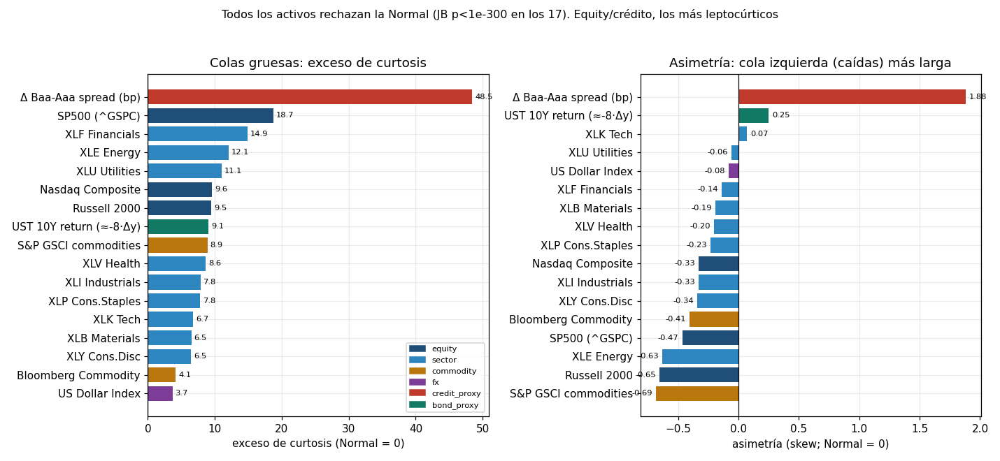
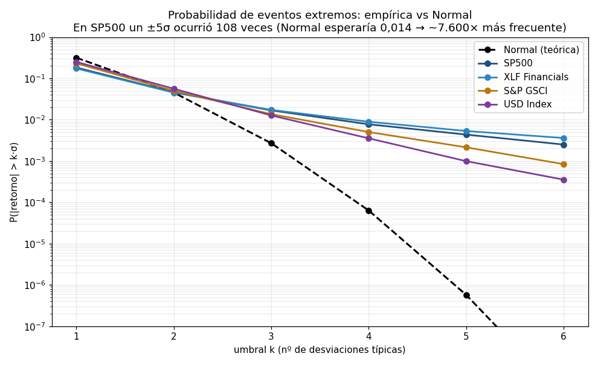
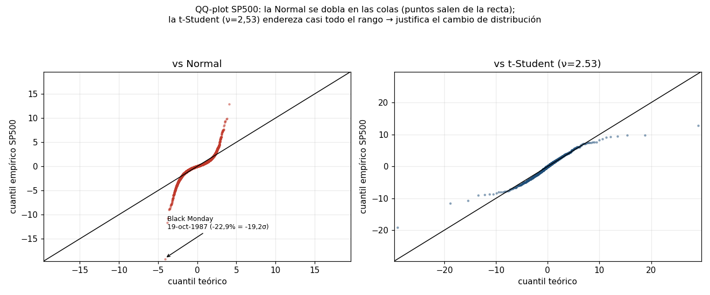
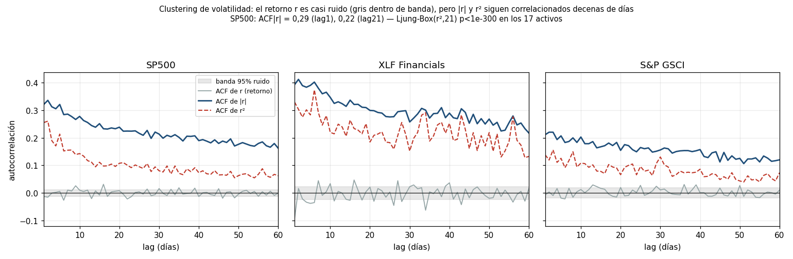
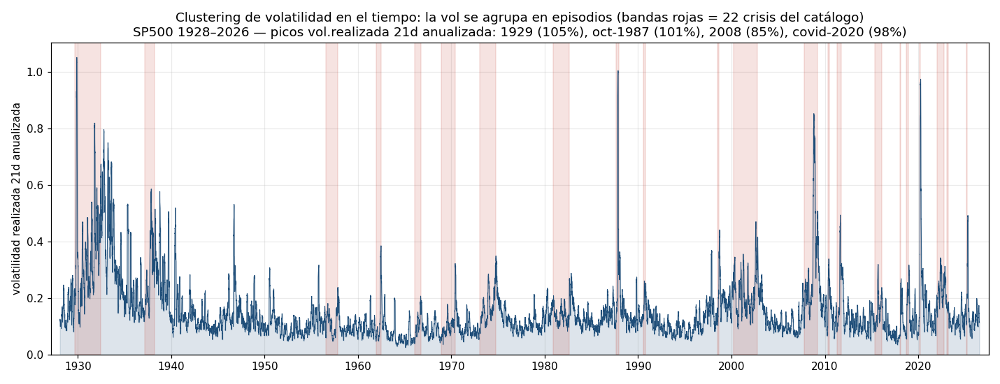
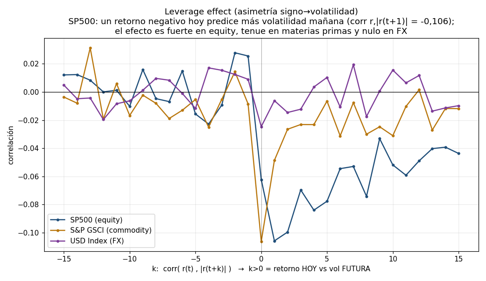
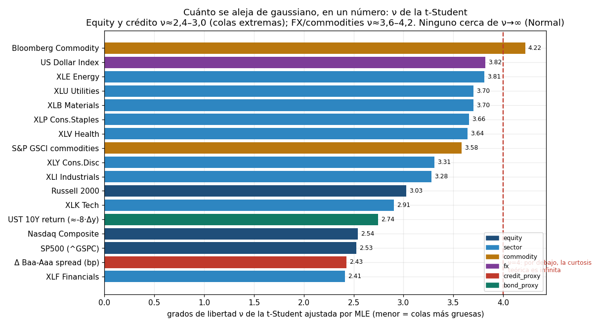

# EDA v2 — Hechos estilizados de los retornos

**Slice:** `hechos_estilizados` · **Proyecto:** detección de regímenes de mercado (TFM), Fase 3 (EDA profundo)
**Foco:** fat tails (curtosis/skew), no-normalidad (Jarque-Bera), clustering de volatilidad (ACF de |r| y r²), asimetría (leverage effect). Cuantificar *cuánto* se aleja de gaussiano → **motivar la t-Student**.
**Datos:** `data/raw/<fuente>/<nombre>.parquet`, retornos log diarios. 17 series, todas con status CACHE en `coverage_report.csv`. Solo lectura.

---

## TL;DR — las 6 cifras que hay que retener

1. **El S&P 500 NO es gaussiano, y no por poco.** Retornos log diarios 1928–2026 (n=24.751): **exceso de curtosis = 18,7**, **skew = −0,47**, **Jarque-Bera = 3,63·10⁵** (p < 1·10⁻³⁰⁰). Bajo la Normal ese JB tendría probabilidad prácticamente nula.
2. **Las colas son el problema.** Se observaron **108 días de |retorno| > 5σ**; la Normal predice **0,014** en 24.751 días → **≈7.600× más frecuentes de lo posible bajo gaussiana**. Y **416 días > 3σ** frente a **67** esperados (6,2×).
3. **El evento máximo rompe la escala gaussiana.** Black Monday (19-oct-1987) fue **−22,9%** log = **−19,2σ**. Un −19σ bajo Normal es imposible en la edad del universo; la Normal esperaría que el peor día en 24.751 fuese ~**4,1σ**.
4. **La t-Student lo captura con un solo número.** Ajuste MLE: **ν ≈ 2,5** para el S&P 500 (y 2,4–3,0 para índices/crédito). ν < 4 ⇒ curtosis teórica infinita: la distribución vive en el régimen de colas gruesas de verdad.
5. **La volatilidad se agrupa.** El retorno r es casi ruido (ACF₁ ≈ 0), pero **ACF de |r| = 0,32 en lag 1 y sigue en 0,22 a lag 21** (un mes). Ljung-Box(r², 21) rechaza independencia con **p < 1·10⁻³⁰⁰ en las 17 series**.
6. **Hay asimetría signo→volatilidad (leverage).** En equity, un retorno negativo hoy predice más volatilidad mañana: **corr(rₜ, |rₜ₊₁|) = −0,106** (S&P 500). El efecto es fuerte en equity, tenue en materias primas (−0,05) y **nulo en FX** (−0,006).

**Consecuencia para el TFM:** cualquier detector de regímenes que asuma normalidad (o que estandarice con media/σ constantes) malinterpretará sistemáticamente los días de crisis como imposibles. El modelo de emisión debe ser de **colas gruesas (t-Student) con volatilidad variable en el tiempo (clustering)** — exactamente la firma que distingue un régimen de estrés de uno de calma.

---

## 0. Universo analizado y honestidad sobre proxies

El foco pedía SP500, HYG, sectores, oro y bonos. Contrastado contra lo realmente descargado (`data/raw/`), la cobertura es:

| pedido | disponible como precio | qué se usó |
|---|---|---|
| **SP500** | sí (`SP500`, ^GSPC, 1927+) | retorno log directo — **espina del análisis** |
| **sectores** | sí (`SPDR_XLK/XLF/XLE/XLV/XLI/XLY/XLP/XLU/XLB`, 1998+) | 9 sectores, retorno log directo |
| **HYG** (high yield) | **NO** en el universo | **proxy:** Δ diario del spread Moody's Baa-Aaa (`MOODYS_BAA_AAA_SPREAD`, 1986+) en pb. Es un *cambio de spread*, no un retorno total → sirve para colas/curtosis, no para la columna vol.anual. |
| **oro** | **NO** (ni `GLD` ni `GC=F` descargados; solo `GVZ` = vol implícita del oro) | **proxy de materias primas:** `SPGSCI` (1984+) y `BCOM` (1991+). Ver *Limitaciones*. |
| **bonos** | solo **rendimientos** (`DGS10`, `TNX_YF`…), no precios/ETF (sin `TLT`/`IEF`) | **proxy:** retorno aproximado UST 10Y ≈ −8·Δy (duración modificada ≈ 8) sobre `DGS10` (1962+). |

Añadidos por profundidad histórica y contraste: `NASDAQ_COMP` (1971+), `RUSSELL2000` (1987+), `DXY` (FX, 1971+).

> **Nota de causalidad.** Los estadísticos de esta sección son **descriptivos de la distribución incondicional histórica** (curtosis, skew, JB, ACF sobre la muestra completa): describen el proceso, no son features que entren al detector. La REGLA DE ORO (todo estadístico en *t* usa solo datos ≤ *t*) aplica a las features derivadas de `src/features.py` (`causal_zscore`, etc.), no a la caracterización del data-generating process, que es correcto hacer sobre toda la muestra.

---

## 1. Fat tails — colas gruesas y pico apuntado (leptocurtosis)

El histograma de los retornos estandarizados del S&P 500 comparado con la Normal N(0,1) muestra los dos síntomas clásicos de la leptocurtosis: **pico más alto** (más días de calma cerca de 0 de lo que predice la Normal) y **colas mucho más gruesas**. En escala log-Y (panel derecho) la Normal (rojo) se desploma tras ±4σ, mientras que los datos empíricos y la t-Student (ν=2,53, azul) siguen poblados **hasta ±10σ y más allá**.

- No es un artefacto de un único crash: excluyendo la semana de Black Monday (15–30 oct 1987) el **exceso de curtosis del S&P 500 sigue siendo 13,7** (vs 18,7 con ella). Las colas son estructurales, no un outlier.
- La leptocurtosis es **universal en el panel**: exceso de curtosis > 0 en las 17 series (fig. 3), desde +3,7 (DXY, la más "mansa") hasta +48,5 (Δ spread de crédito).

**Asimetría (skew).** 14 de 17 series tienen skew negativo: la cola izquierda (caídas) es más larga que la derecha. Los más asimétricos son **S&P GSCI (−0,69)**, **Russell 2000 (−0,65)** y **XLE Energy (−0,63)**. El S&P 500 marca **−0,47**. Excepciones: el **Δ spread de crédito tiene skew +1,88** (los spreads *se abren* de golpe: el estrés de crédito es un salto al alza), y el retorno de bono UST +0,25 (por construcción, es el espejo del yield). La lectura financiera: *los mercados caen por las escaleras y en ascensor — pero bajan más rápido de lo que suben.*

---

## 2. Test de normalidad — Jarque-Bera y probabilidad de eventos extremos

**Jarque-Bera** (combina skew² y exceso de curtosis²) **rechaza la normalidad en las 17 series con p < 1·10⁻³⁰⁰**. Magnitudes del estadístico (χ² con 2 g.l., valor crítico al 1% ≈ 9,2):

- S&P 500: **JB = 3,63·10⁵** · XLF: 6,39·10⁴ · S&P GSCI: 3,64·10⁴ · DXY: 7,97·10³ · Δ spread crédito: **1,00·10⁶**.

Ninguna serie se acerca remotamente al umbral de no-rechazo. La normalidad no es "una aproximación imperfecta"; es un modelo falsado por márgenes de decenas de miles de sigmas.

**Dónde falla la Normal, cuantificado por umbral:**

La probabilidad empírica de |retorno| > k·σ se separa de la Normal (línea negra a trazos) desde k≈2,5 y la brecha explota en las colas. Para el S&P 500:

| umbral | observado | esperado bajo Normal | ratio |
|---|---:|---:|---:|
| > 3σ | 416 días | 67 | **6,2×** |
| > 5σ | 108 días | 0,014 | **≈7.600×** |

**QQ-plot** — la prueba visual definitiva:

Contra la Normal (izquierda) los cuantiles empíricos dibujan la **S invertida** característica de las colas gruesas: los puntos se despegan de la recta y se van a −19σ (Black Monday). Contra la t-Student ν=2,53 (derecha) el grueso del rango se endereza sobre la diagonal. *Matiz honesto:* con ν=2,53 la t es incluso **ligeramente demasiado pesada** en el extremo (> ~10σ los puntos caen por dentro de la recta), lo que sugiere que para el extremo puro un **ν≈3** sería mejor compromiso; en todo caso, la mejora sobre la Normal es enorme.

---

## 3. Clustering de volatilidad — la memoria está en |r|, no en r

Hecho estilizado de Mandelbrot (1963): *"large changes tend to be followed by large changes, of either sign"*. La firma cuantitativa:

- **El retorno r es casi impredecible en signo:** la ACF de r se queda dentro de la banda de ruido (±1,96/√n) salvo lag 1 diminuto. No hay momentum diario explotable — consistente con eficiencia débil.
- **Pero |r| y r² tienen memoria larga:** para el S&P 500 la **ACF de |r| = 0,32 (lag 1)** y aún **0,22 en lag 21** (un mes de trading); la ACF de r² decae más rápido pero sigue positiva. XLF Financials es el más persistente (**ACF|r| 0,39 → 0,30**). El más flojo, DXY (0,13 → 0,12), pero también significativo.
- **Ljung-Box sobre r² (21 lags) rechaza independencia con p < 1·10⁻³⁰⁰ en las 17 series.** La volatilidad no es constante ni i.i.d.: se agrupa.

**Visto en el tiempo** (el argumento visual para regímenes):

La volatilidad realizada a 21 días del S&P 500 alterna **largas mesetas de calma** (~10% anualizado) con **estallidos concentrados** que coinciden con las 22 crisis del catálogo (`crisis_catalog.eventos`, bandas rojas). Picos: **1929 (105%)**, **oct-1987 (101%)**, **2008 (85%, el 28-oct-2008)** y **covid — abril-2020 (98%)**. Que la vol viva en dos "modos" (calma persistente vs estrés persistente) **es precisamente lo que un modelo de regímenes debe capturar**: el clustering de volatilidad *es* la señal de régimen.

---

## 4. Leverage effect — asimetría signo → volatilidad futura

Correlación cruzada desfasada corr(rₜ, |rₜ₊ₖ|). Dos lecturas:

- **En k=0** (contemporánea) la correlación es negativa (S&P 500 −0,062; GSCI −0,107) — es el reflejo del skew negativo (los días grandes tienden a ser de bajada).
- **La asimetría k>0 vs k<0 es el leverage effect propiamente dicho:** para el S&P 500 el lado **futuro (k>0) se mantiene claramente negativo** (mínimo **−0,106 en k=+1**, y persiste negativo hasta k≈+10), mientras que el lado **pasado (k<0) ronda cero**. Es decir: una caída **predice** más volatilidad mañana, pero un aumento de volatilidad no predice el signo. Black & Christie (1976): las caídas suben el apalancamiento efectivo y la percepción de riesgo.

**El leverage discrimina por clase de activo** (columna `lev r,|r(t+1)|` de la tabla):

- **Equity/sectores: fuerte y negativo** — XLU −0,134, Nasdaq −0,117, Russell −0,113, S&P 500 −0,106, XLV −0,102.
- **Materias primas: tenue** — GSCI −0,049, BCOM −0,028.
- **FX: nulo** — DXY −0,006 (una divisa no tiene "caída": la debilidad de una es la fuerza de otra → sin asimetría). Los proxies de crédito/bono también ~0.

Implicación de modelado: el modelo de régimen debe permitir **volatilidad asimétrica (tipo GJR-GARCH / EGARCH)** al menos en el bloque de equity; imponer simetría dejaría fuera una señal que separa equity de FX/commodities.

---

## 5. Cuánto se aleja de gaussiano, en un solo número → t-Student

Ajustando una t-Student por máxima verosimilitud a cada serie estandarizada, **ν (grados de libertad) mide directamente el grosor de cola** (ν→∞ recupera la Normal; ν≤4 ⇒ curtosis infinita; ν≤2 ⇒ varianza infinita):

- **Equity y crédito, colas extremas:** XLF **ν=2,41**, Δspread crédito 2,43, **S&P 500 2,53**, Nasdaq 2,54, UST-bono 2,74.
- **FX y materias primas, colas gruesas pero menos:** GSCI 3,58, DXY 3,82, **BCOM 4,22** (la más "gaussiana", y aún así rechaza normalidad con JB).
- **Ninguna serie se acerca a ν grande.** Todo el universo vive por debajo de ν≈4,2, la mayoría del equity por debajo de ν=3.

**Este es el argumento cuantitativo para el TFM:** sustituir la emisión gaussiana por una **t-Student con ν≈3** (o ν estimado por régimen) no es un refinamiento cosmético — es pasar de un modelo falsado a uno que asigna probabilidad no nula a lo que de hecho ocurre 108 veces en el S&P 500. Un HMM/mixture con emisiones t capturará los días de crisis como *cola de un régimen de estrés* en vez de como *imposibles*.

---

## 6. Tabla resumen (17 series)

`n` = obs de retorno; `vol.anual` = σ diaria·√252 (solo series de retorno); `días>3σ (obs/esp)` frente a la Normal; `días>5σ` observados (Normal esperaría ~0,01); `ν t` = MLE t-Student; `ACF|r|(1/21)` = autocorrelación de |r| en lags 1 y 21; `lev` = corr(rₜ,|rₜ₊₁|).

| activo | n | inicio–fin | vol.anual | skew | exc.curt | JB p | ν t | días>3σ (obs/esp) | días>5σ | ACF&#124;r&#124;(1/21) | lev r,&#124;r(t+1)&#124; |
|---|---:|---|---:|---:|---:|---:|---:|---|---:|---|---:|
| SP500 (^GSPC) | 24751 | 1928–2026 | 18.9% | -0.47 | 18.7 | <1e-300 | 2.53 | 416/67 (6.2×) | 108 | 0.32/0.22 | -0.106 |
| Nasdaq Composite | 13977 | 1971–2026 | 20.2% | -0.33 | 9.6 | <1e-300 | 2.54 | 240/38 (6.4×) | 43 | 0.32/0.25 | -0.117 |
| Russell 2000 | 9785 | 1987–2026 | 21.6% | -0.65 | 9.5 | <1e-300 | 3.03 | 140/26 (5.3×) | 31 | 0.33/0.23 | -0.113 |
| XLK Tech | 6932 | 1998–2026 | 26.0% | +0.07 | 6.7 | <1e-300 | 2.91 | 106/19 (5.7×) | 14 | 0.28/0.23 | -0.092 |
| XLF Financials | 6932 | 1998–2026 | 28.3% | -0.14 | 14.9 | <1e-300 | 2.41 | 120/19 (6.4×) | 37 | 0.39/0.30 | -0.087 |
| XLE Energy | 6932 | 1998–2026 | 28.7% | -0.63 | 12.1 | <1e-300 | 3.81 | 85/19 (4.5×) | 20 | 0.24/0.21 | -0.100 |
| XLV Health | 6932 | 1998–2026 | 17.9% | -0.20 | 8.6 | <1e-300 | 3.64 | 94/19 (5.0×) | 17 | 0.26/0.13 | -0.102 |
| XLI Industrials | 6932 | 1998–2026 | 21.1% | -0.33 | 7.8 | <1e-300 | 3.28 | 103/19 (5.5×) | 20 | 0.24/0.17 | -0.082 |
| XLY Cons.Disc | 6932 | 1998–2026 | 22.7% | -0.34 | 6.5 | <1e-300 | 3.31 | 99/19 (5.3×) | 14 | 0.24/0.20 | -0.068 |
| XLP Cons.Staples | 6932 | 1998–2026 | 15.2% | -0.23 | 7.8 | <1e-300 | 3.66 | 96/19 (5.1×) | 19 | 0.28/0.14 | -0.104 |
| XLU Utilities | 6932 | 1998–2026 | 19.2% | -0.06 | 11.1 | <1e-300 | 3.70 | 92/19 (4.9×) | 21 | 0.33/0.17 | -0.134 |
| XLB Materials | 6932 | 1998–2026 | 23.6% | -0.19 | 6.5 | <1e-300 | 3.70 | 96/19 (5.1×) | 17 | 0.25/0.18 | -0.078 |
| S&P GSCI commodities | 10716 | 1984–2026 | 20.8% | -0.69 | 8.9 | <1e-300 | 3.58 | 146/29 (5.0×) | 23 | 0.21/0.18 | -0.049 |
| Bloomberg Commodity | 8917 | 1991–2026 | 14.9% | -0.41 | 4.1 | <1e-300 | 4.22 | 119/24 (4.9×) | 12 | 0.17/0.15 | -0.028 |
| US Dollar Index | 14101 | 1971–2026 | 7.8% | -0.08 | 3.7 | <1e-300 | 3.82 | 179/38 (4.7×) | 14 | 0.13/0.12 | -0.006 |
| Δ Baa-Aaa spread (bp) | 10169 | 1986–2026 | n/a (bp) | +1.88 | 48.5 | <1e-300 | 2.43 | 169/27 (6.2×) | 33 | 0.26/0.14 | -0.018 |
| UST 10Y return (≈-8·Δy) | 16118 | 1962–2026 | 8.2% | +0.25 | 9.1 | <1e-300 | 2.74 | 269/44 (6.2×) | 49 | 0.28/0.24 | +0.017 |

*Notas de la tabla:* (i) todas las p de Jarque-Bera son numéricamente 0 (< 1·10⁻³⁰⁰). (ii) `Δ Baa-Aaa spread` es un cambio de spread en pb, no un retorno: su vol.anual no es comparable (por eso `n/a`) pero su curtosis/skew/JB sí son informativos. (iii) `UST 10Y return` es una aproximación por duración (≈−8·Δy sobre DGS10), no un precio de ETF.

---

## 7. Implicaciones para la detección de regímenes (y qué hacer con esto)

1. **Emisión de colas gruesas obligatoria.** Con ν≈2,5–3 en equity, un modelo generativo gaussiano (k-means, GMM estándar, HMM gaussiano) tratará cada día de crisis como outlier extremo y **sesgará las medias/covarianzas de régimen**. Usar **t-Student multivariante** (o mixtura t) en la emisión. Esto conecta directamente con `src/features.py`: las features z-score son causales, pero **la escala del z-score debe leerse con cola t, no normal** (un z=−5 no es "1 en 3 millones", es un martes de crisis).
2. **El clustering de volatilidad ES la señal de régimen.** La persistencia de |r| (memoria de ~1 mes) implica que los regímenes tienen **duración**: las transiciones no son día a día. Favorece modelos con **persistencia de estado** (matrices de transición HMM con diagonal alta, o duración explícita tipo HSMM) frente a clasificadores sin memoria. La feature `SP500_vol_z` (vol realizada 21d, ya en el set base) es candidata natural y de alta señal.
3. **Asimetría → features de leverage.** El leverage effect en equity (pero no en FX) sugiere features que exploten el **signo del retorno reciente × su magnitud** (semivarianza de caídas, downside vol) como discriminador de régimen de estrés. Distingue estrés de equity de estrés de FX/commodities.
4. **La cola izquierda importa más.** El skew negativo casi universal justifica **métricas de riesgo asimétricas** (downside/semidesviación, no σ simétrica) tanto en features como en evaluación.

**Features candidatas que salen de este slice** (a construir causalmente en `src/features.py`):
`SP500_vol_z` (vol realizada 21d) · `abs_ret_persistence` (media móvil de |r| = proxy de clustering) · `downside_semivol_z` (σ solo de retornos negativos, captura leverage) · `tail_count_63d` (nº de días |z|>3 en ventana rodante, proxy de "estamos en régimen de cola") · `rolling_kurtosis_252d` · `credit_spread_change_z` (salto de crédito, skew +1,88).

---

## 8. Limitaciones y deuda

- **`HYG`, `TLT`/`IEF` y oro (`GLD`/`GC=F`) NO están en el universo descargado**, pese a estar declarados en `src/features.py` (`HYG_ret_z`, `TLT_ret_z`, `GOLD_ret_z`) y en las notas del catálogo como sustitutos verificados. **`build_features` fallaría hoy** con el raw actual. Se han usado proxies (Δspread Baa-Aaa para crédito; SPGSCI/BCOM para materias primas; retorno por duración de DGS10 para bonos). **Recomendación:** descargar `HYG`, `IEF`, `TLT`, `GLD` (yfinance) antes de construir features — son baratos y cierran el hueco crédito/refugio/duración con precios reales.
- **El proxy de crédito es un cambio de spread, no un retorno total.** Su curtosis (48,5) y skew (+1,88) son reales y muy informativos del riesgo de salto, pero no es directamente comparable con los retornos de equity en la columna de volatilidad.
- **El proxy de bono** asume duración constante ≈8; el retorno real de un bono/ETF varía con la duración a lo largo del ciclo. Sirve para caracterizar colas, no para P&L exacto.
- **Sesgo de supervivencia/composición histórica:** el S&P 500 pre-1957 es reconstruido (índice compuesto Cowles/S&P); los niveles de curtosis de 1928–1932 están dominados por la Gran Depresión (vol realizada 105%). Excluyendo 1987 la curtosis baja de 18,7 a 13,7 pero **sigue siendo enorme** → conclusión robusta.
- **Todos los estadísticos son incondicionales (muestra completa)**, apropiados para caracterizar el DGP. La versión condicional/causal (cómo cambian curtosis y clustering *dentro* de cada régimen) es trabajo del modelado en la fase siguiente, no de este EDA.

---

*Reproducibilidad: figuras en `notebooks/eda_v2/figs/hechos_estilizados/` (8 PNG, dpi=110). Cálculos sobre `data/raw/` en modo solo-lectura; skew/curtosis vía `scipy.stats`, Jarque-Bera vía `scipy.stats.jarque_bera`, ACF y Ljung-Box vía `statsmodels`, ν por `scipy.stats.t.fit`. Retornos log diarios `log(Pₜ/Pₜ₋₁)`.*
